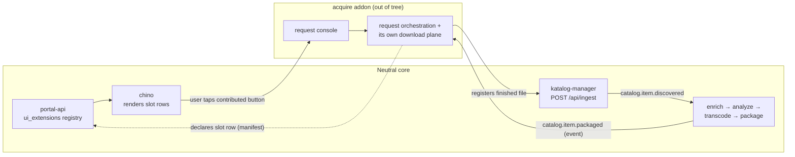

# ADR-0001: Neutral core and addon seams

**Status:** Accepted · recorded retrospectively (decision from 2026-07)

## Context

The zaentrum core owns files, catalogs them, and plays them: the product apps (chino for video, musig for music, tv), the catalog services, and the enrich → analyze → transcode → package pipeline. Nothing in that set needs to know how a file came to exist.

Acquisition-shaped capability — searching for a title you don't have, requesting it, downloading it — is different in kind. It drags in integrations and vocabulary the core never needs, and its presence in a client is what makes media apps undistributable. This isn't cosmetic. A media client/server is distributable on app stores precisely because it is content-neutral. The same neutrality is what lets the core be published and carried under its own brand: the codebase itself must not associate the product with content-obtaining tooling.

Two obvious alternatives fail the same way. Building acquisition into the core and maintaining a stripped "store" build, or forking the core into a full-fat variant, both produce two builds that drift — and the neutral one is neutral only by subtraction, provable only by diffing. A seam makes neutrality structural: one build, and the difference between a neutral install and a full one is data and deployment, not code.

An earlier internal decision pushed request intake into the product clients and wanted-state into the core catalog schema. That was reversed: it would have committed the core's schema and UI to acquisition vocabulary permanently, for a capability many installs never want. The durable principle that survived is the folding itself — requests, wanted-state, and fulfilment belong together. They fold into an addon, not the core.

## Decision

The core stays content-neutral by construction. It exposes exactly two extension seams, plus one hosting mechanism, and nothing else. Anything acquisition-shaped lives out of tree as an addon; the worked example is [acquire](https://github.com/laedeli/acquire).

**Seam 1 — UI extension slots.** `portal-api` keeps a `ui_extensions` registry: one row is a contribution (link or action — label, icon, URL, order, enabled) to a **named slot** in a product app. Writes are gated on the admin or `zaentrum-addon` role. Rows arrive when an admin installs the addon and the platform reads its manifest ([ADR-0009](./0009-pull-based-addon-installation.md) — originally the addon's service account self-registered them). Any authenticated user can read a slot via `/api/portal/slots/{slot}`; product apps fetch the enabled rows for their slots and render them as native buttons. chino's search-empty state is such a slot: with the addon installed, a "Request this" button appears there; without it, the slot renders nothing.

**Seam 2 — neutral ingest.** `katalog-manager` exposes `POST /api/ingest`: register a staged file as a catalog item (`{path, type, title, year?, description?}`; the path must resolve under the media or packages root; idempotent on the path). It is the scanner's create-path published as a machine contract, and it knows nothing about how the file got there. It creates the item plus its primary playback asset and emits `catalog.item.discovered` — the same entry event the scanner emits — so ingested files flow the normal pipeline. The invariant: the item creator owns the `discovered` emit; addons are consume-only on catalog events.

**Hosting.** The portal can host an addon's console by loading its remote module at runtime (module federation), discovered through the same registry. No addon code enters the core build; adding or dropping a console is a deployment, not a rebuild.

**The core must not know addon names.** A compiled-in addon name is both a coupling and a distribution liability: once the core carries the string, the neutral build and the full build differ only by a flag, and anyone reviewing the product is right to treat them as one. So the core's vocabulary is the slot names it owns; addon identity exists only in registry rows, discovered at runtime. A render test in the core's CI fails the build if acquisition vocabulary appears in core UI output — neutrality is enforced, not aspirational.

How the seams compose, using acquire as the example:

The addon crosses into the core at exactly two points: a registry row and an ingest call. The core reaches the addon only through rows it renders and events it already emits for everyone. The addon brings everything else itself — its request UI, its download plane behind its own gateway, its own database, its own auth clients — and consumes pipeline events to mark a request fulfilled once the item is packaged and playable. Verified end-to-end in a live environment, July 2026: search miss → contributed button → request → download → ingest → pipeline → plays in chino.

## Consequences

- One build of the core serves every install. A store-distributed client and a self-hosted full setup run the same code; the difference is registry rows and deployed addon services.
- The uninstall property holds by construction: removing an addon removes its rows and its pods. Slot reads return empty lists, products render nothing, and no dormant menu item or feature flag remains. **Zero rows means zero UI** — there is no `if addon installed` branch to leave behind.
- Addons can be public, auditable projects in their own homes (acquire lives in its own org) without the core ever linking to or defaulting to them. Discovery of addons is the operator's act, not the product's suggestion.
- The seams are a contract the core must keep stable: slot semantics, the ingest body, and the `discovered`/`packaged` events are now public API. Breaking them breaks addons the core cannot see.
- Indirection has a cost. An addon carries its own state, auth, and deployment instead of borrowing the core's, and a capability that spans both sides (request → ingest → fulfilled) needs events, not function calls, to close the loop.

### What this rules out

- The core will never search for, request, or download content it does not have. No indexer, tracker, usenet, or torrent integration will ever land in a core repository — that entire capability class is addon territory.
- No compiled-in addon names, no bundled addon code, no "recommended addons" screen, no default addon endpoints shipped in core config.
- No forked or flag-stripped "full edition" of the core.
- No acquisition tables in the core schema. Wanted-state and request history live in the addon's own database; the core catalog only ever learns about a file that already exists.
- No addon emitting `catalog.item.discovered`. Files enter the catalog through the ingest seam or the scanner — the creator of the item owns that event.
