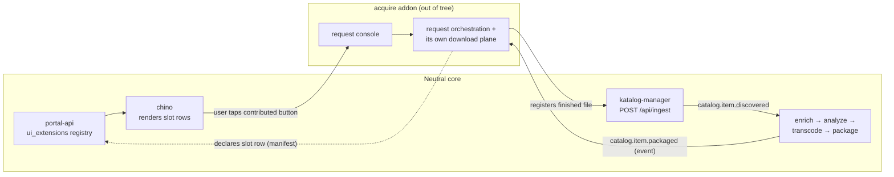
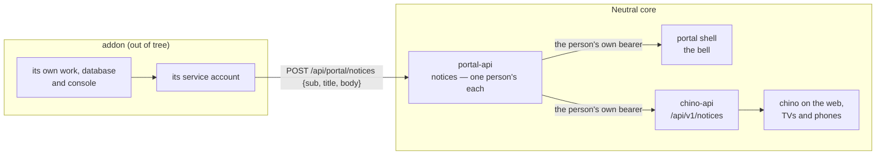

# ADR-0001: Neutral core and addon seams

**Status:** Accepted · recorded retrospectively (decision from 2026-07) · amended by the [addendum of 2026-10-05](#addendum-2026-10-05--notices-a-third-seam) (a third seam: notices)

## Context

The zaentrum core owns files, catalogs them, and plays them: the product apps (chino for video; musig for music and tv for live TV, both planned), the catalog services, and the enrich → analyze → transcode → package pipeline. Nothing in that set needs to know how a file came to exist.

Acquisition-shaped capability — searching for a title you don't have, requesting it, downloading it — is different in kind. It drags in integrations and vocabulary the core never needs, and its presence in a client is what makes media apps undistributable. This isn't cosmetic. A media client/server is distributable on app stores precisely because it is content-neutral. The same neutrality is what lets the core be published and carried under its own brand: the codebase itself must not associate the product with content-obtaining tooling.

Two obvious alternatives fail the same way. Building acquisition into the core and maintaining a stripped "store" build, or forking the core into a full-fat variant, both produce two builds that drift — and the neutral one is neutral only by subtraction, provable only by diffing. A seam makes neutrality structural: one build, and the difference between a neutral install and a full one is data and deployment, not code.

An earlier internal decision pushed request intake into the product clients and wanted-state into the core catalog schema. That was reversed: it would have committed the core's schema and UI to acquisition vocabulary permanently, for a capability many installs never want. The durable principle that survived is the folding itself — requests, wanted-state, and fulfilment belong together. They fold into an addon, not the core.

## Decision

The core stays content-neutral by construction. It exposes exactly two extension seams, plus one hosting mechanism, and nothing else. Anything acquisition-shaped lives out of tree as an addon; the worked example is [acquire](https://github.com/laedeli/acquire).

**Seam 1 — UI extension slots.** `portal-api` keeps a `ui_extensions` registry: one row is a contribution (link or action — label, icon, URL, order, enabled) to a **named slot** in a product app. Writes are gated on the admin or `zaentrum-addon` role. Rows arrive when an admin installs the addon and the platform reads its manifest ([ADR-0009](./0009-pull-based-addon-installation.md) — originally the addon's service account self-registered them). Any authenticated user can read a slot via `/api/portal/slots/{slot}`; product apps fetch the enabled rows for their slots and render them as native buttons. chino's search-empty state is such a slot: with the addon installed, a "Request this" button appears there; without it, the slot renders nothing.

**Seam 2 — neutral ingest.** `katalog-manager` exposes `POST /api/ingest`: register a staged file as a catalog item (`{path, type, title, year?, description?}`; the path must resolve under the media or packages root; idempotent on the path). It is the scanner's create-path published as a machine contract, and it knows nothing about how the file got there. It creates the item plus its primary playback asset and emits `catalog.item.discovered` — the same entry event the scanner emits — so ingested files flow the normal pipeline. The invariant: the item creator owns the `discovered` emit; addons are consume-only on catalog events.

**Hosting.** The portal can host an addon's console by loading its remote module at runtime (module federation), discovered through the same registry. No addon code enters the core build; adding or dropping a console is a deployment, not a rebuild.

**The core must not know addon names.** A compiled-in addon name is both a coupling and a distribution liability: once the core carries the string, the neutral build and the full build differ only by a flag, and anyone reviewing the product is right to treat them as one. So the core's vocabulary is the slot names it owns; addon identity exists only in registry rows, discovered at runtime. A render test in the core's CI fails the build if acquisition vocabulary appears in core UI output — neutrality is enforced, not aspirational.

How the seams compose, using acquire as the example:

```mermaid
flowchart LR
    subgraph core ["Neutral core"]
        reg["portal-api<br/>ui_extensions registry"]
        chino["chino<br/>renders slot rows"]
        ingest["katalog-manager<br/>POST /api/ingest"]
        pipe["enrich → analyze →<br/>transcode → package"]
    end
    subgraph addon ["acquire addon (out of tree)"]
        spa["request console"]
        orch["request orchestration +<br/>its own download plane"]
    end
    orch -. "declares slot row (manifest)" .-> reg
    reg --> chino
    chino -- "user taps contributed button" --> spa
    spa --> orch
    orch -- "registers finished file" --> ingest
    ingest -- "catalog.item.discovered" --> pipe
    pipe -- "catalog.item.packaged (event)" --> orch
```

The addon crosses into the core at exactly two points: a registry row and an ingest call. The core reaches the addon only through rows it renders and events it already emits for everyone. The addon brings everything else itself — its request UI, its download plane behind its own gateway, its own database, its own auth clients — and consumes pipeline events to mark a request fulfilled once the item is packaged and playable. Verified end-to-end in a live environment, July 2026: search miss → contributed button → request → download → ingest → pipeline → plays in chino.

## Consequences

- One build of the core serves every install. A store-distributed client and a self-hosted full setup run the same code; the difference is registry rows and deployed addon services.
- The uninstall property holds by construction: removing an addon removes its rows and its pods. Slot reads return empty lists, products render nothing, and no dormant menu item or feature flag remains. **Zero rows means zero UI** — there is no `if addon installed` branch to leave behind.
- Addons can be public, auditable projects in their own homes (acquire lives in its own org) without the core ever linking to or defaulting to them. Discovery of addons is the operator's act, not the product's suggestion.
- The seams are a contract the core must keep stable: slot semantics, the ingest body, and the `discovered`/`packaged` events are now public API. Breaking them breaks addons the core cannot see.
- Indirection has a cost. An addon carries its own state, auth, and deployment instead of borrowing the core's, and a capability that spans both sides (request → ingest → fulfilled) needs events, not function calls, to close the loop.

### What this rules out

- The core will never search for, request, or download content it does not have. No indexer, tracker, usenet, or torrent integration will ever land in a core repository — that entire capability class is addon territory.
- No compiled-in addon names, no bundled addon code, no "recommended addons" screen, no default addon endpoints shipped in core config.
- No forked or flag-stripped "full edition" of the core.
- No acquisition tables in the core schema. Wanted-state and request history live in the addon's own database; the core catalog only ever learns about a file that already exists.
- No addon emitting `catalog.item.discovered`. Files enter the catalog through the ingest seam or the scanner — the creator of the item owns that event.

## Addendum (2026-10-05) — notices, a third seam

### Context

Requests live in an addon, as decided above: the core offers seams, on every
client, and nothing more, and approving a request stays in the addon's own
console. That leaves one thing the two seams cannot do. An addon that works
for a person over time — a request fulfilled hours later is the case that
prompted this — has to tell that person, in whichever client they use,
without the core learning what was done.

- A **slot row** is the same for everyone and appears only where a product
  app renders its slot; it cannot say something to one person.
- The **event bus** carries pipeline facts to services, not messages to
  people, and no client reads it.
- The addon's **console** is where a person goes to look. It cannot reach a
  person watching on a TV.

### Decision

**Seam 3 — notices.** portal-api keeps `notices` (migration 015): one row is
one notice for one person — the subject of their token, as the People page
knows them — from one installed addon. A notice is plain text: a title of at
most 80 characters and a body of at most 280; optionally a link, held to the
rule a slot row's link is held to (one function decides both: a path on the
instance or a URL on its own origin, never `javascript:` or another host);
and optionally the id of a catalog item a client can open. The text is the
addon's. The core's vocabulary is the seam's own — notice, read, from — and
it never interprets what a notice says.

- **An addon posts with its service account**, `POST /api/portal/notices`
  with `{sub, title, body, link?, itemId?}`: the addon is the one its token
  binds — the client named after it, the `zaentrum-addon` role, as for its
  slot rows — never one the body names, and it must be installed.
- **A person reads their own and nobody else's**: `GET`, mark read, read all
  and delete under `/api/portal/me/notices`. Someone else's notice is as one
  there is not. The portal shell shows them in a bell in its header; the
  product apps read them through chino-api's `/api/v1/notices`, best effort
  — when portal-api does not answer, an app's home shows no notices rather
  than an error.
- **A notice to oneself** needs no credential: `POST /api/portal/me/notices`
  with a person's own bearer posts to that person only — the body names no
  person — from an installed addon the body names. It is for an addon that
  holds no credential, as the reference addon holds none: its console posts
  with the bearer the shell hands it. Whoever holds a person's bearer can
  already act as that person, and this reaches nobody else, so it grants
  nothing new; it also proves nothing about which addon sent it. A notice
  for someone else, or for later, takes the service account.
- **Notices come and go with what they belong to.** A person keeps their
  newest 100; every notice goes after 90 days (`PORTAL_NOTICE_RETENTION`);
  deleting a person deletes theirs; removing an addon removes its notices
  with its rows — the uninstall property above holds for notices too. Each
  addon's posts and each person's posts to themselves are rate-limited, and
  every write is logged without what the notice says. An admin sees each
  addon's notices counted, never read.

```mermaid
flowchart LR
    subgraph addon ["addon (out of tree)"]
        work["its own work, database<br/>and console"]
        sa["its service account"]
    end
    subgraph core ["Neutral core"]
        notices["portal-api<br/>notices — one person's each"]
        bell["portal shell<br/>the bell"]
        bff["chino-api<br/>/api/v1/notices"]
        apps["chino on the web,<br/>TVs and phones"]
    end
    work --> sa
    sa -- "POST /api/portal/notices {sub, title, body}" --> notices
    notices -- "the person's own bearer" --> bell
    notices -- "the person's own bearer" --> bff
    bff --> apps
```

### Consequences

- The addon crosses into the core at three points now: a registry row, an
  ingest call and a notice. A request's whole loop closes without the core
  knowing it was one — the addon fulfils it with ingest, learns it is
  playable from the pipeline's events, and tells the person with a notice.
- Every client grows one surface, the same everywhere: an unread count, a
  list, read, delete. The portal's bell ships with the seam; the product
  apps follow.
- The notices API and the notice's fields are public API the core must
  keep stable, as the slot semantics are.
- An addon that tells people things later needs a service account, which is
  still made by hand ([identity](../extending/identity.md));
  platform-provisioned addon identity matters more than it did.

### What this rules out

- **Notices for everyone.** A notice is one person's; a message to all is a
  slot row, or the addon's own console.
- **Markup, scripts or actions in a notice.** A notice is plain text with at
  most one link, which leads somewhere on the instance; it never acts by
  itself.
- **Kinds of notices the core knows.** No categories, templates or states
  beyond read; what a notice is about stays the addon's business.
- **An addon reading or changing a person's notices**, or posting as
  another addon.
