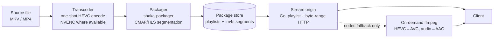

# ADR-0002: Transcode once at ingest, serve pre-packaged segments

**Status:** Accepted · recorded retrospectively (decision from 2026-05)

## Context

A legacy runtime-transcoding media server starts an encoder per playback
session: the client asks for a stream, the server launches a transcode
against the source file, and segments are produced just ahead of the play
head. The zaentrum platform started behind exactly such a server, and the
original migration plan assumed its transcoder was the one component worth
keeping — everything else would be replaced around it.

That premise did not survive contact with the build. Runtime transcoding
has structural costs that no amount of wrapping fixes:

- Compute is spent **per view**, at the worst possible time — the evening
  peak — and scales with concurrent sessions, not with library size.
- Startup and seeking wait on the encoder. A seek outside the transcoded
  window forces the encoder to restart at the seek point.
- A broken or exotic source file fails **at play time, in front of the
  viewer**, with nothing anyone can do about it in the moment.

By the time the first replacement catalog went live, the team had built a
complete ingest pipeline that never touches the legacy server at all. This
record makes that pipeline the explicit decision.

## Decision

Zaentrum transcodes exactly once, at ingest, and serves static segments at
playback time.

Three stages, three separate services:

1. **Transcoder** — a one-shot, GPU-accelerated encode (NVENC-capable; a
   software ffmpeg encode when no GPU is present) of the source file into
   an HEVC intermediate. Runs once per item, at ingest — never per session.
2. **Packager** — shaka-packager segments the intermediate into CMAF/HLS:
   playlists plus small `.m4s` segments, written to the package store.
3. **Stream origins** — small per-product Go services that answer playlist
   and byte-range segment requests. There is no encoder in the playback
   request path.

**Fallback, not default:** some clients cannot decode the packaged codecs
(HEVC video; DTS/AC3/TrueHD audio on older sources). For those, the stream
origin transcodes on demand with ffmpeg — HEVC→AVC, audio re-encoded to
AAC — hardware-accelerated where the node has a GPU, software otherwise.
This path exists for codec coercion only. It is instrumented, watched, and
expected to stay rare; if the fallback rate climbs, that is a packaging
bug, not a capacity problem to solve with more encoder hardware.

Live TV is explicitly outside this design: a live source cannot be
pre-packaged. That pipeline is a stream remux (`-c copy`) and shares
nothing with the catalog playback path.

## Consequences

**The trade is storage for CPU-per-view — and it's a good trade.** Every
item carries a transcoded intermediate plus a segment tree on disk. In
exchange, a view costs disk I/O and HTTP, nothing more: a single CPU core
serves many concurrent sessions, and the GPU budget is sized by ingest
rate — slow, bounded, schedulable overnight — instead of playback
concurrency, which is bursty and peaks exactly when everyone is watching.
HEVC softens the storage bill: the intermediate is roughly half the size
of a typical AVC source.

**Startup and seeking get faster.** The playlist and every segment already
exist. First frame is two static fetches — playlist, then first segment.
A seek is a byte-range read of an already-encoded segment at any point in
the timeline; no encoder restarts, no just-ahead-of-the-play-head window
to fall out of.

**Failures move to where they can be handled.** A corrupt or exotic source
fails inside the ingest pipeline — logged, retryable, quarantinable —
before the item is ever offered for playback. The catalog only lists what
packaged successfully. What remains at play time are network and client
problems, which are the problems a static HTTP origin is good at.

**Codec agility comes cheap.** Adopting a future codec (AV1, VVC) means
changing the transcoder/packager and re-running the pipeline; the playback
path — static segments over HTTP — does not change at all.

**The honest costs:**

- Storage is permanently higher than a serve-the-source design.
- Adding a codec or quality tier to an existing library means re-running
  the GPU pipeline over all of it. Expensive, but paid rarely and offline.
- Clients with poor codec support land on the slow fallback path; the
  fallback-rate metric has to stay on a dashboard, not in a log file.

### What this rules out

- **No runtime per-session transcoding as a primary path.** The platform
  never burns an encoder per viewer; on-the-fly transcode is a codec
  fallback, never the assumed way to play.
- **No embedded legacy transcoder.** The legacy runtime-transcoding media
  server is a retirement target, not a kept component; none of its
  transcode orchestration survives into zaentrum.
- **No encode decisions at session time.** What a client can receive is
  settled by what was packaged at ingest plus a narrow coercion fallback —
  not by a per-session quality negotiation that re-encodes on demand.
