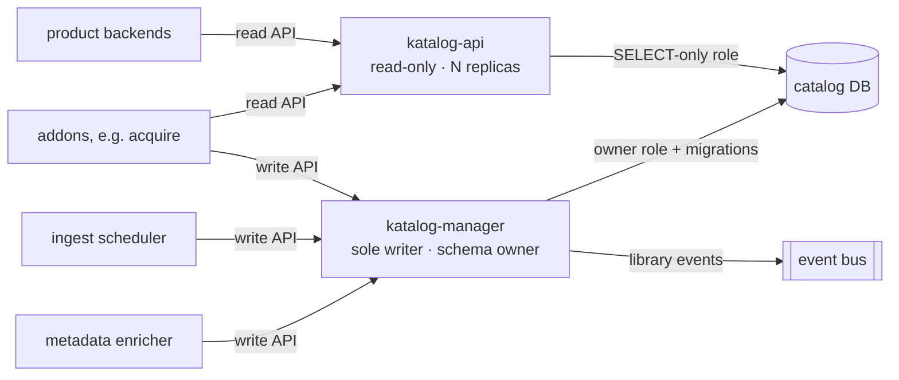

# ADR-0003: Catalog split into a read service and a sole writer

**Status:** Accepted · recorded retrospectively (decision from 2026-05)

## Context

The catalog is the busiest data in the platform, and it carries two very different traffic shapes. Product backends hit it on every playback start, search, and browse — high QPS, latency-sensitive, wants horizontal scale. Library management hits it rarely — scans, ingest step updates, metadata enrichment, wanted-state changes, operator edits — low QPS, but it needs transactions and it owns the schema.

One service serving both shapes fails both. Scaling up for read traffic scales the write path along with it, for nothing. Worse, a write-side schema migration blocks reads: a playback request stalls because someone is adding a column.

The monolith this platform replaced (a legacy runtime-transcoding media server, decomposed in an earlier ADR) had a third problem we refused to inherit: several processes opened their own connections to the catalog database. The schema became a de-facto shared interface across services in different languages on different release cadences, with no contract stopping one from breaking another on a migration. That is not an interface; that is a standing incident.

## Decision

Split the catalog along the read/write boundary (CQRS-light — one database, two services, no separate read model):

- **katalog-api** — read-only. Stateless, horizontally scaled, holds a SELECT-only database role, owns no schema, runs no migrations. Every service that needs catalog data reads here.
- **katalog-manager** — the **sole writer** and schema owner. Runs all migrations, holds the only role with write grants, and exposes the write API. Every mutation of catalog data, from any producer, goes through it.

**Nothing else touches the catalog database.** Enforced three ways: database grants (exactly two roles exist — read-only and owner), network policy (only the two catalog workloads may reach the database), and a CI check that fails any other repository's build if a database driver targets the catalog.

Media workers (transcode, package, analyze) never write at all — they publish results on the event bus, and the ingest scheduler translates results into write-API calls.

### Why a sole writer

**Schema evolution.** Migrations belong to exactly one release train. katalog-manager migrates expand-then-contract (add the new column, backfill, drop the old one a release later), and because the read service holds a SELECT-only role, reads keep flowing against pre-migration data while the migration runs. No cross-repo coordination, no "who deployed the incompatible query" hunts.

**Invariants live in code once.** A catalog item is not one row. It cascades into artwork, playback assets, processing steps, wanted-state and history. Deleting an item, or replacing its assets after a repackage, is a multi-table transaction with ordering rules. With one writer, that transaction is written once and is always right. With two writers it is written twice and eventually one copy is wrong.

**One writer, one write-ahead log.** Change-data-capture and the event stream observe a single producer. Every mutation also emits a library event (item created/updated/deleted, scan completed), which is how downstream caches invalidate — no consumer polls the database, because no consumer *can*.

### Addons go through the same door

This is the part that matters beyond operations. The write API is **neutral**: it accepts catalog facts — an item exists, an asset is attached, a wanted entry changed state — and validates them against the schema and the invariants. It does not know or care how a producer came by those facts.

An addon such as [acquire](https://github.com/laedeli/acquire) is exactly such a producer. It reads wanted-state through katalog-api and writes status changes and history through katalog-manager, authenticated like any other service — and it never sees a database credential. The core stays distributable because it contains no acquisition logic and no privileged side channel an addon could use to smuggle any in: the platform itself refuses to embed indexer, tracker, usenet, or torrent handling, and the sole-writer boundary is what makes that refusal structural rather than a code-review promise.

## Consequences

- Product playback survives a writer outage. Reads come from the read role; a down katalog-manager degrades library management only.
- The read path scales by adding replicas of a small stateless service, without dragging the JVM-of-the-day or the migration runner along.
- Every catalog mutation is auditable at one choke point, and cache invalidation events are trustworthy because no write can bypass the emitter.
- The costs: two services instead of one, and services that once wrote directly now pay an HTTP hop. In practice the write path is low-throughput, and single-writer consistency is what the hop buys.
- Eventual consistency between write and read visibility exists but is bounded — same database instance, no replication lag; typically well under 100 ms.

### What this rules out

- **No read-only database exceptions.** "Just a SELECT" from a third service recreates the shared-schema interface with a friendlier face. Everyone reads through katalog-api.
- **No addon ever receives catalog database credentials.** Not for bulk import, not for migration scripts, not temporarily. Bulk import is a write-API client like everything else.
- **No worker writes status directly.** Workers publish results; the scheduler writes.
- **No second writer, ever** — including a future "fast path" for high-volume producers. If the write API is too slow, fix the write API; do not fork the invariants.
