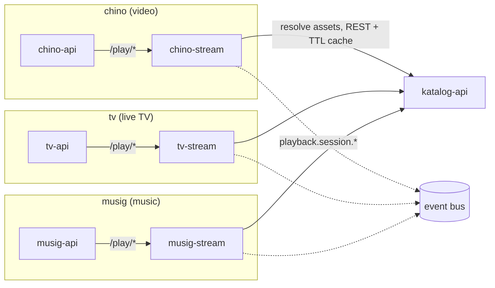

# ADR-0004: Streaming is a per-product concern

**Status:** Accepted · recorded retrospectively (decision from 2026-05)

## Context

The platform started with one streaming service: a Go HLS / byte-range origin
that served video and did on-the-fly HEVC → AVC transcode for browsers that
can't decode HEVC. It also opened its own connection to the catalog database
to resolve playback assets to file paths.

Then the product line grew, and the pipelines stopped having anything in
common:

- **chino** (movies + series): VOD HEVC in HLS/CMAF, GPU transcode to AVC as
  a browser fallback, byte-range serving for native players. Bursty,
  CPU/GPU-heavy, seconds of startup latency are acceptable.
- **tv** (live TV): an ISP's multicast MPEG-TS feed bridged per-channel into
  HLS with `-c copy`. No transcode, no random access, and a latency budget
  measured in single-digit seconds — a fundamentally different SLA.
- **musig** (music): audio-only HLS / Opus, gapless playback, loudness
  normalization. No video pipeline at all, and tiny resource needs.

Serving all three from one process means `if product == tv` branches in every
code path — codec selection, segment timing, caching, scaling policy. That is
the same shape of coupling the platform already paid to escape when the
original mega-repo was split into per-product services. A shared streamer
would also force one deployment cadence and one failure domain onto three
products with unrelated availability expectations: a video release should not
be able to take down live TV.

## Decision

Streaming is a **per-product** concern. Each product ships its own streaming
origin as its own repo and deployment:

| Service | Pipeline |
|---|---|
| `chino-stream` | HLS / CMAF video origin. On-the-fly HEVC → AVC transcode (GPU) for browser fallback; byte-range for native players. |
| `tv-stream` | Multicast MPEG-TS pull → per-channel HLS bridge (tsduck or ffmpeg `-c copy`). No transcode. |
| `musig-stream` | Audio HLS / Opus, gapless; optional loudness normalization. |

Every streamer follows the same four rules:

1. It deploys **with its product** and lives behind the product's API, which
   reverse-proxies `/play/*` to it. The product API is the only public face.
2. It resolves catalog data through **`katalog-api`** (REST, with a short
   per-pod TTL cache) — never by opening the catalog database directly. The
   catalog schema stays private to the service that owns it.
3. It publishes `playback.session.started` / `heartbeat` / `stopped` events
   to the event bus, so session tracking, watch history, and recommendations
   are consumers, not callers.
4. It authenticates clients with short-lived stream tokens minted by the
   product API — the streamer verifies, it never issues.

## Consequences

Each pipeline gets the right tool without dragging it into the others'
images: `tv-stream` doesn't ship ffmpeg's GPU stack, `musig-stream` doesn't
ship a TS demuxer. Scaling and sizing are per product — the video origin
wants CPU/GPU headroom for transcode, the TV bridge is near-zero-cost
passthrough, the music origin is tiny. Releases are independent: shipping a
chino change cannot touch live-TV playback.

The cost is three deployments instead of one — three sets of probes,
autoscaling policies, and disruption budgets to tune. Some logic (stream-token
verification, range-request handling) is duplicated across the three repos on
purpose; a shared Go module is worth extracting only when the duplication
actually hurts. Premature abstraction here is how the shared streamer happens
again by the back door.

Total CPU footprint likely grows slightly versus one shared service running
hot, but per-product scaling dominates cost anyway.

### What this rules out

- **A shared, product-aware streamer.** The pipelines share nothing but
  "HTTP serves bytes". One service with routing branches is the mega-repo
  anti-pattern at the process level.
- **Streaming inside the product API process.** Playback sessions run for
  hours and would eat the API's request budget; transcode wants GPU pinning
  the API has no business asking for.
- **A hosted streaming CDN.** The platform is self-hosted by design; media
  never leaves the operator's cluster.
- **Direct database access from streamers.** All catalog reads go through
  `katalog-api`. A streamer that grows its own SQL grows its own schema
  coupling, and the split dies quietly.
