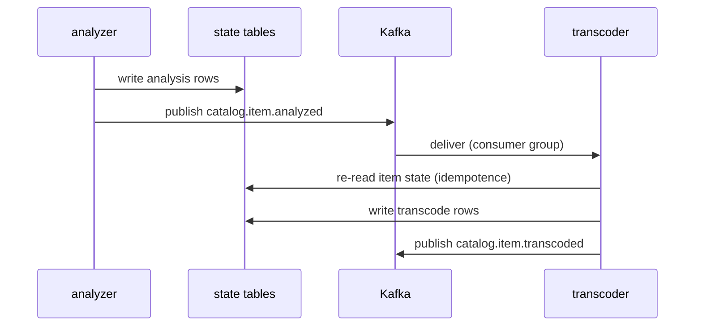

# ADR-0005: Kafka event bus and schema contracts

**Status:** Accepted · recorded retrospectively (decision from 2026-05)

## Context

The media pipeline is a chain of stages. A file is discovered, enriched with
metadata, analyzed, transcoded, packaged, and eventually removed. Early
versions coordinated those stages by polling: each worker asked the database
— or another worker's HTTP API — "anything for me yet?" on a timer.

Polling has predictable failure modes. Latency has a floor of the poll
interval. Load scales with catalog size, not with change rate. Every new
consumer means a new endpoint or query, and usually a deploy on the producer
side. And there is no history: a consumer added today cannot process what
happened last month.

The consumer set had also outgrown a simple chain. Several download-client
adapters with different message shapes report progress into the platform.
Watch-history analytics wants to replay months of playback and catalog
events. And addons run out of process by design, so they need an integration
surface that is neither "link against the core" nor "query the core's
database."

## Decision

**Stage handoffs are Kafka events; database rows record state.** When a
stage finishes an item it writes its result to its own state tables, then
publishes an event. The next stage consumes that event:

```
{prefix}catalog.item.discovered
{prefix}catalog.item.enriched
{prefix}catalog.item.analyzed
{prefix}catalog.item.transcoded
{prefix}catalog.item.packaged
{prefix}catalog.item.removed
```

Queries — what is in the catalog, which items still need packaging — go to
the state tables. Coordination goes over the bus. Delivery is at-least-once,
so consumers treat an event as a trigger, not as truth: they re-read state
before acting, which makes duplicates and replays harmless.



**Every bus asset carries a configurable tenant prefix, default `stube.`.**
Topics are `{prefix}{domain}.{event}` (`stube.catalog.item.analyzed`),
consumer groups `{prefix}{service}`. The prefix exists so that a deployment
can share a Kafka cluster it does not own — with another zaentrum instance,
or with unrelated workloads — without topic or group collisions. Bring your
own cluster and set the prefix, or let the operator provision a broker.

**Schemas are published contracts.** Events are Avro. The `.avsc` sources
live in [github.com/zaentrum/schemas](https://github.com/zaentrum/schemas),
organised by topic family, and are published to an Apicurio Registry with
`BACKWARD` compatibility enforced: a change that existing consumers cannot
read fails the schema repo's CI before it can merge. Additive changes are
free; a genuinely breaking change gets a new topic
(`{prefix}catalog.item.v2.*`). Generated Go and Python clients are built
from the same sources, so producers and consumers in both languages break at
build time, not at runtime.

**The bus is the public integration surface.** Addons integrate by
producing and consuming events under the same published contracts — nothing
more. The example acquisition addon,
[acquire](https://github.com/laedeli/acquire), publishes
`{prefix}download.client.*` progress events that the core consumes, and
consumes catalog events to learn what already exists. The core never links
against an addon, and no addon touches the core's database.

## Consequences

- New consumers are cheap. Subscribing to `catalog.item.packaged` needs no
  change to the packager — that is the property polling could never give us.
- Replay works. Retention on catalog topics lets a late-arriving consumer
  start from the beginning and re-derive its state; analytics and rebuilds
  stop being special cases.
- The row-then-event split means the bus is never the only copy of
  anything. Losing a topic loses notifications, not the catalog.
- Kafka is a heavy dependency for a small install. Accepted: the operator
  provisions a broker where none exists, and the tenant prefix makes
  sharing an existing cluster the escape hatch.
- Avro adds a codegen step to every producer and consumer build, and raw
  topic dumps are binary without a registry-aware deserializer. Accepted as
  the price of catching contract breaks in CI instead of production.
- Schema evolution is governed. "Just add a required field" is now a
  reviewed, versioned act — deliberately.

### What this rules out

- Timer-based polling between stages, or cron reconciliation as the primary
  coordination mechanism. Reconciliation may backstop the bus; it does not
  replace it.
- Addons reading or writing core database tables. The bus and the published
  schemas are the whole contract.
- Unregistered or schema-less messages on prefixed topics, and in-place
  breaking schema changes.
- Treating the bus as the source of truth. State lives in rows; events are
  handoffs, not an event-sourcing store.
- Acquisition mechanics in core contracts. `download.client.*` is a neutral
  progress contract; the core's schemas carry no indexer or tracker
  semantics — where content comes from is the addon's business, never the
  platform's.
