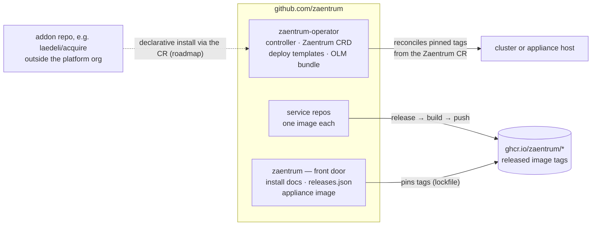

# ADR-0006: Operator-owned runtime on a polyrepo

**Status:** Accepted · recorded retrospectively (decision from 2026-06)

## Context

Zaentrum began as a single orchestrator repository that contained everything: the operator, the deploy templates, and buildable source for nine services. "It includes everything" was true in three different senses, and conflating them hurt all three:

- **Install / assembly** — one place should tell you how to run the whole platform.
- **Runtime** — one component should own what actually runs.
- **Source** — each service's code should live where it is developed and released.

A repo that does all three cannot version any of them cleanly. Fixing one service meant releasing everything. The operator deployed from in-tree source, so "what is running" was whatever the tree happened to contain — not something a release names. And the install story was a README in the middle of a source tree.

There is a second constraint. Zaentrum is content-neutral: it catalogs, processes, and streams files the user already owns. Anything that obtains content is not part of the platform — it is an addon, developed and shipped outside this org. That boundary is only credible if it is auditable, and a boundary that runs through the middle of one source tree is not.

## Decision

One rule, three repo shapes: **one repo = one container = one image = one release.**

**1. Polyrepo, with visibility as the only axis.** Every service gets its own repository in the `zaentrum` org and builds exactly one image, `ghcr.io/zaentrum/<service>`. Because a repository is wholly one visibility level, whether a component is part of the open platform is decided once — when its repo is created — and anyone can audit the boundary by reading the org page. No private path can hide inside a public tree, and CI can enforce the neutrality boundary with a grep instead of a policy document. Addons — the public example is [acquire](https://github.com/laedeli/acquire) — live in their own repos under their own owners and are never merged in.

**2. A front-door repo: [`zaentrum/zaentrum`](https://github.com/zaentrum/zaentrum).** This is the only repository that knows the *set*. It holds the install docs, `releases.json` (the release channel the operator's auto-update consumes), and the all-in-one appliance image `ghcr.io/zaentrum/zaentrum` — the `docker run` one-liner. The appliance **composes released image tags; it never builds service code.** A front door that built from source would be a second source of truth for every service and would drift from what the services actually released. Composing pins instead makes an appliance release a lockfile: reproducible, and rollback is the previous pin.

**3. An operator repo: [`zaentrum/zaentrum-operator`](https://github.com/zaentrum/zaentrum-operator).** The controller, the `Zaentrum` CRD, the deploy templates, and the OLM bundle. The operator is the runtime owner: a cluster declares one `Zaentrum` CR, and the operator reconciles the platform from **published image tags** — the same artifacts the appliance pins. Nothing else deploys anything the platform owns. The decision also reserves the CR as the future home of declarative addon installation (an `addons`/`plugins` list the operator reconciles like everything else) — **that part is not yet implemented**; the current, manual path is documented in [installing addons](../extending/installing.md). A stock platform is fully working with no addons at all.

This isn't tidiness for its own sake. When one repo is one container is one image, a release tag answers "what is this, where did it come from, what is running" with the same string — and the seam between platform and addon is a repo boundary, which is the one boundary everyone can see.

## Consequences

- **A service fix ships alone.** One repo releases, one image tag moves, the front door bumps one pin. Neighbors are untouched.
- **The set is defined once and enforced once.** Only `zaentrum/zaentrum` knows which tags make a platform release; only the operator turns that into running pods. `docker run` and a cluster install run the same bits.
- **Cross-service changes span PRs.** That is the polyrepo tax. It is paid down with a versioned `schemas` repo: consumers pin a contract version instead of editing N repos atomically, so an interface change is a version bump per consumer, on each consumer's schedule.
- **CI is meant to be shared, not duplicated.** The decision places reusable workflows (build-and-push, lint, the neutrality guard) in a shared `zaentrum/.github` repo — **not yet created**; today each repo carries its own copies, and the client repos plus the operator each run their own neutrality gate.
- **Pins go stale by design**, so a bot (Renovate-style) proposes tag bumps to the front door. A stale pin is visible and reviewable; an in-tree build drifting was neither.
- **The operator embeds its own copy of the deploy templates.** A change to the deploy contract must land both in `deploy/` and in the operator's embedded templates. Known cost, accepted: it keeps the operator image self-contained, so a cluster needs the operator and a CR — not a checkout.
- **Addons are runtime composition, not source integration.** An installation adds capability by referencing a plugin image in the CR. The platform's repos never gain the code; the running system gains the pod.

### What this rules out

- **No monorepo.** No shared tree where release units blur and a visibility boundary would have to run through directories.
- **No builds in the front door.** `zaentrum/zaentrum` pins released tags; it has no service source to build.
- **No deploys from source or floating tags.** The operator reconciles named releases. "Whatever is on main" is not a deployable state.
- **No content acquisition in the platform.** Nothing in the `zaentrum` org obtains content — no code that talks to indexers, trackers, usenet, or torrent sources. That capability exists only as addons loaded through the CR, maintained outside the platform, and a stock install ships with none.
