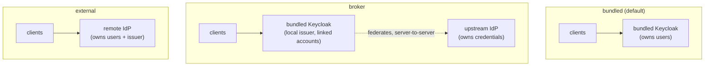

# ADR-0007: Identity modes — bundled, broker, external

**Status:** Accepted · recorded retrospectively (decision from 2026-06)

## Context

Zaentrum deployments span two populations that want opposite things from identity.
A household appliance must boot with working login and zero identity homework.
An operator who already runs an identity provider refuses — rightly — to maintain
a second user store just for a media platform.

Both populations share the same clients: one unified public OIDC client used by
the web app (authorization code + PKCE), mobile (AppAuth), and TV (device grant,
RFC 8628). All of them are public clients; exact redirect registration and
audience scoping are the real controls, not secrets.

And both trip over the same failure. The single most common self-host boot
failure in this class of software is the **issuer trap**: the identity provider
mints tokens for one hostname while services validate them against another —
an internal service address, `localhost`, or a stale name. Every service then
boots with OIDC broken and the operator sees an empty, unauthenticated app.
Whatever identity design we pick has to solve that trap once, centrally, not
once per service.

## Decision

One field on the platform custom resource decides who owns users:

```yaml
spec:
  hostname: media.example.org   # the ONE access host
  identity:
    mode: bundled               # bundled | broker | external
```



- **`bundled`** (default) — the operator renders a headless Keycloak as the sole
  user store. The management UI has full user CRUD: create, delete, passwords,
  MFA reset, roles, per-library access. The issuer is **derived from
  `spec.hostname`** (`https://<hostname>/auth/realms/…`) and pinned strictly, so
  it can never be taken from a spoofable Host header.
- **`broker`** — the bundled Keycloak stays, and additionally **federates an
  upstream IdP**. On first login it links a local account (explicit
  confirm-link flow; email trust is off by default because silent auto-link is
  an account-takeover hole), maps upstream claims to platform roles, and mints
  its **own locally signed token**. Clients never see the upstream IdP. The TV
  device flow keeps working even when the upstream does not support it, because
  it runs against the local Keycloak. Ownership is hybrid: the upstream owns
  credentials and MFA; the platform owns the linked record, roles, and a local
  break-glass admin.
- **`external`** — no bundled Keycloak is rendered at all. The platform is a
  pure OIDC relying party: it validates tokens directly against the remote
  issuer's discovery document and JWKS. Users live entirely upstream; the
  platform keeps only a thin authorization table. The management UI loses user
  CRUD and shows instead a read-only directory of principals it has actually
  seen, a claim-to-role mapping editor, per-principal grants, and connection
  health checks.

**The invariant that makes this safe:** in `bundled` *and* `broker`, every
client validates the **same stable local issuer**. The issuer trap is solved
exactly once, in the operator, keyed on `spec.hostname` — and turning on
external SSO via `broker` changes **zero** client configuration. This is why
`broker`, not `external`, is the recommended mode for anyone bringing their own
IdP.

In `external` mode the issuer is fixed by the remote IdP, independent of
`spec.hostname`. The operator never rewrites it from the hostname; the trap
moves to the one place it can live — **redirect-URI registration** on the
upstream client — and the operator validates that registration instead. Setting
`mode: external` or `broker` with an empty issuer is a hard reconcile error,
never a silent default.

**Authorization is keyed on `(iss, sub)` — never on email or username.** Those
are mutable; the issuer/subject pair is the only stable identity across all
three modes. The IdP owns authentication (credentials, MFA, sessions); the
platform owns app-level authorization (roles, per-library access). On every
login a deterministic claim-to-role resolution runs, with a fail-safe default
when nothing matches (plain user, no library access). Authentication failure is
a 401 at the IdP boundary; authorization failure is a 403 at the platform's
policy layer. Provisioning defaults to JIT-on-first-login; SCIM 2.0 sits behind
a flag for organizations that need pre-provisioning and automated offboarding.

Mode changes follow the same asymmetry: `bundled → broker` is additive and
allowed live; switching between `bundled` and `external` is a migration of a
populated user store and is gated behind an explicit destructive-switch flag.

## Consequences

- Setup asks one question. The default steers households to `bundled` and
  BYO-IdP operators to `broker`; `external` is a deliberate opt-in for someone
  running a mature IdP that supports every grant the clients need — including
  the device grant for TV.
- Renaming a user or changing their email never breaks their grants, in any
  mode, because nothing is keyed on either.
- Claims are a snapshot at token-issue time: a group change upstream applies on
  the next login or refresh, so access-token TTLs stay short.
- `external` trades away the local escape hatch: with no bundled Keycloak
  there is no local break-glass admin, so a misconfigured claim mapping can
  lock everyone out of administration. The CR therefore accepts an emergency
  admin pinned by `(iss, sub)` even in external mode.
- The management UI must show provenance per principal (local vs. federated),
  so an admin never believes they can reset a federated user's password here.

### What this rules out

- **Per-service identity configuration.** One deployment has one identity mode
  and one issuer; no service carries its own OIDC settings.
- **Auto-linking accounts by email.** Linking a federated login to an existing
  account requires an explicit confirmation flow, always.
- **Writing into someone else's directory.** In `external` mode the platform
  never creates, deletes, or modifies users upstream unless the operator
  explicitly grants an admin client for that purpose.
- **Deriving the external issuer from the access hostname.** The old
  localhost-issuer guessing is gone; a missing issuer fails loudly.
- **Inline secrets in the CR.** Client secrets and admin passwords live only in
  Secret references; rotation is a planned restart, not an edit.
