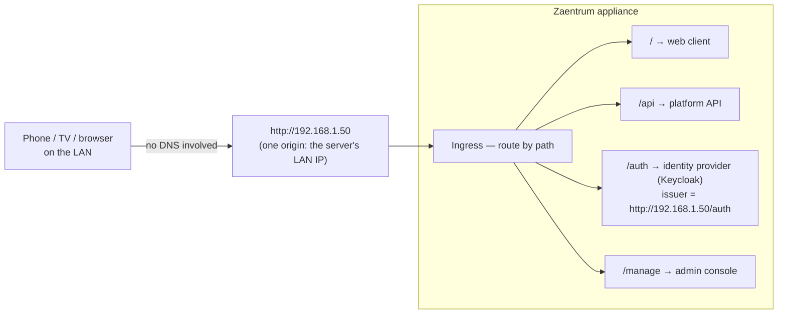

# ADR-0008: Single-origin deployment profiles

**Status:** Accepted · recorded retrospectively (decision from 2026-06)

## Context

A real self-hosted install is reached from a **phone and a TV on the LAN**, not just a browser on the machine running the containers. Those devices cannot edit a hosts file and cannot resolve `*.localhost`. Any scheme that starts with "first, set up DNS" has already lost most self-hosters.

There is a second, sharper trap. Zaentrum authenticates through OIDC, and OIDC validation is exact-string matching on the issuer URL. If the server minted tokens as `http://localhost/auth` but the phone reached it at `http://192.168.1.50`, every login fails — the platform is up, the catalog is served, and nobody can sign in. **A mismatched issuer host is the canonical self-host boot failure.** It happens whenever ingress routing and identity configuration are answered as two separate questions, because two separate questions can disagree.

## Decision

The appliance ships **deployment profiles**, chosen in the first-run wizard. A profile is one switch that sets the **ingress routing and the OIDC issuer/redirect URIs together**. They are never configured independently, so they cannot drift apart.

| Profile | How devices reach it | DNS needed | Use when |
|---|---|---|---|
| **A — This machine only** | `*.localhost` → `127.0.0.1` (browsers resolve this themselves) | none | quick single-box trial |
| **B1 — LAN, single origin** *(recommended default)* | one host = the server's LAN IP; route by **path** (`/`, `/api`, `/auth`, `/manage`); issuer = `http://SERVER-IP/auth` | **none** | most self-hosters; any phone or TV via `http://192.168.1.50` |
| **B2 — LAN, magic wildcard** | `zaentrum.192-168-1-50.nip.io` / `sslip.io` — public wildcard DNS resolves to the LAN IP | none (needs internet) | when subdomain routing must stay |
| **C — mDNS / Bonjour** | `zaentrum.local` broadcast on the LAN (mDNS has **no** wildcard subdomains, so aliases are flat) | none | `.local` single-origin on Mac/iOS/modern Windows/Linux |
| **D — Real DNS / TLS** | own domain, wildcard record + Let's Encrypt, or a local resolver with wildcard support | yes | permanent setups, external exposure |

**B1 — single-origin path routing — is the default**, for reasons that follow directly from the constraints above:

- Phones and TVs can type an IP address. They cannot edit hosts files, and their platform resolvers ignore `*.localhost`. One origin at the LAN IP works from every device with zero setup.
- No DNS anywhere — not on the network, not on the device, not on the internet.
- One origin means one issuer host by construction. The wizard's single answer ("what address will devices use?") derives both the routes and the issuer, so the canonical boot failure cannot occur.

B2, C, and D are offered as upgrades in the same wizard, and switching profiles reruns the same joint update — routing and issuer move together, always.

Clients stay out of the naming question entirely: the neutral **Add-Server** flow accepts whatever the user types (an IP, `zaentrum.local`, a domain). No client assumes a particular scheme, so every profile works with every client unchanged.

## Consequences

- One wizard question eliminates the most common self-host failure. There is no separate "identity URL" field to get wrong.
- Every service must be servable under a **path prefix**. No absolute-root assumptions in the web clients, no hardcoded subdomain fan-out. This is a standing constraint on all public services, checked at integration time.
- Switching profiles changes the issuer URL, which invalidates existing sessions. Acceptable: profile changes are rare, deliberate events, and re-login is the honest cost of a new address.
- B1 is plain HTTP on the LAN. Browser features gated on secure contexts are limited, and traffic is unencrypted on the local network. Users who need TLS take profile D; the wizard says so rather than pretending `http://IP` is more than it is.
- mDNS (profile C) cannot do wildcard subdomains, so profile C reuses the single-origin path layout with flat `.local` aliases — another reason path routing is the shared baseline rather than a special case.
- B2 depends on a third-party wildcard DNS service and on internet reachability; it exists for setups that genuinely need subdomains, not as a default.

### What this rules out

- Requiring a DNS server, a hosts-file edit, or a purchased domain to boot the platform.
- Subdomain routing as the baseline layout. Subdomains are an opt-in (B2/D), never a prerequisite.
- Configuring the OIDC issuer independently of ingress — the two are one setting, by design.
- Client-side assumptions about server naming. Clients take an address; the server owns its own layout.
