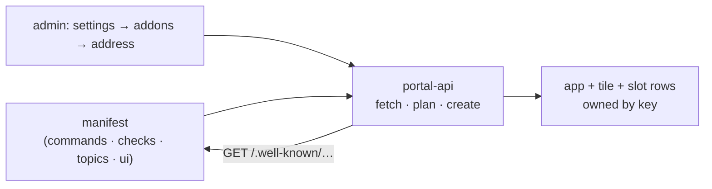

# ADR-0009: Addons are installed by pulling their manifest

**Status:** Accepted (2026-09-09)

## Context

[ADR-0001](./0001-neutral-core-and-addon-seams.md) made the core neutral by
construction: an addon reaches it only through registry rows the core renders
and events it already emits. The first implementation of "installing an addon
brings its UI" was **push**: the addon's service account minted a
client-credentials token and wrote its own slot rows to portal-api on start.

That worked for the one addon that existed, and it was the wrong shape.

- **Identity before UI.** An addon could not appear until an operator had
  created a confidential client, a realm role, a service account and a
  Secret — by hand, on every instance. The stock install path was a
  procedure, and every addon repeated the same retry loop and the same
  "the role is missing" diagnostics.
- **Half the install was still manual.** Slot rows self-registered; the app
  and its tile did not, because letting an addon write to the app registry
  means an addon can proxy anything. So an admin registered the app in
  settings anyway, and the addon's key had to agree with what the admin
  typed.
- **The wrong party knew things.** The addon had to carry the instance's
  public hostname to build an absolute URL for its button, and the platform
  had to trust that a token bearing a role was an addon and not a
  misconfigured client.
- **The audit trail pointed the wrong way.** What an instance shows its
  users was decided by whichever workloads happened to hold a valid token,
  not by an admin's action.

Meanwhile the [CLI capability descriptor](../extending/cli.md) had appeared:
one unauthenticated document per service, declaring what the service offers.
An addon already described itself; it just did not describe its UI.

## Decision

**Installation is pull.** An addon declares everything it contributes in its
capability manifest at `/.well-known/zaentrum-capability.json` — commands,
checks, topics, and now a `ui` section: the app, whether it has a console,
and its slot rows. An admin installs the addon in the portal's settings by
its in-cluster address. portal-api fetches the manifest and creates the app,
the tile and the rows itself, all owned by the addon's key.

The consequences the design must hold:

- **The addon needs no identity to appear.** Identity is for what an addon
  *does* — ingest, events, changing rows at runtime — not for existing.
- **Ownership is by construction.** The app key *is* the addon key, the tile
  is `addon.<key>`, every row carries `addon = key` and a key under it.
  Uninstall is "everything with this key" and cannot miss.
- **Refresh replaces, never merges.** Rows the addon no longer declares
  disappear, so an upgrade cannot leave a stale button behind.
- **The platform absolutises URLs.** Manifest URLs are portal-relative; the
  install request arrives on the portal's public origin, which is the one
  moment both facts are known in one place.
- **Same guard as the proxy.** The address is validated exactly like an embed
  target: in-cluster names only. portal-api never fetches a manifest from the
  internet, and nothing in a manifest is executed — it is data that becomes
  rows.

The runtime write API on `/api/portal/extensions` stays, gated on the addon
role, for addons that change their contributions while running. It is no
longer the install path, and the reference addon does not use it.

## Consequences

- An addon is one image, one manifest, one Deployment and one Service. The
  [sample addon](https://github.com/zaentrum/sample-addon) lost its whole
  registration package, its identity configuration and its Secret in the
  change, and gained fourteen lines of declaration.
- "What is installed here" is a question with an answer: settings → addons
  lists it, and `zae discover` agrees, because installing is what puts the
  addon on the discovery list.
- Declarative install on the CR (`spec.addons[]`) becomes a thin thing: the
  operator will call the same endpoint an admin's click calls. Nothing an
  addon declares today changes when it lands.
- Platform-provisioned addon identity is still roadmap, but it is now
  decoupled from installation and needed only by addons that call platform
  APIs.
- The manifest is the contract: `ui` joins commands, checks and topics as
  public API the core must keep stable.

### What this rules out

- **Addons writing to the app registry.** An addon that could register apps
  could point the portal's proxy anywhere. Apps are created by the platform
  from a manifest the admin chose to fetch, never by a token.
- **Self-registration as the install path.** The retry loop, the role
  diagnostics and the per-instance identity procedure are gone from the
  reference addon and should not return in new ones. An addon that needs
  a service account needs it for a call it makes, not to be seen.
- **Addons knowing the instance's public hostname.** The platform absolutises
  URLs at install; an addon that hard-codes or configures one is doing the
  platform's job with less information.
