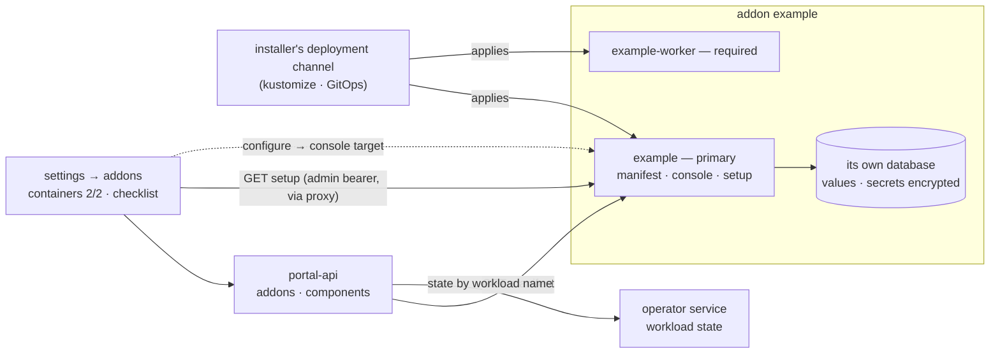

# ADR-0010: Addons are component groups that own their configuration

**Status:** Accepted (2026-09-14) · amends [ADR-0009](./0009-pull-based-addon-installation.md) · amended by [ADR-0011](./0011-addon-charts-installed-by-the-operator.md) (the addon's chart, not the installer's deployment channel, deploys the components)

## Context

[ADR-0009](./0009-pull-based-addon-installation.md) made installation pull:
the platform reads an addon's manifest and creates its UI, owned by key. It
also wrote down what an addon was — "one image, one manifest, one Deployment
and one Service". That held for the sample addon and stopped holding at the
first addon that did real work.

- **Addons are several containers.** One service serves the manifest and the
  console; next to it run the processes that do the work — a worker with a
  different scaling profile, a gateway to an external system that must
  restart on its own schedule. Folding them into one Deployment couples their
  lifecycles. Splitting them made them invisible: the platform knew one
  address per addon and nothing else.
- **"Installed" said nothing about "working".** Settings → addons listed an
  addon whose worker was crash-looping, or had never been deployed, exactly
  like a healthy one. The operator console grouped workloads by one
  namespace-wide label, so it could say a workload belonged to *an* addon —
  never to which one — and it could not notice a workload that was missing.
- **Installed is not configured.** An addon that talks to systems outside the
  platform needs endpoints, credentials and schedules an admin chooses after
  it is running. Until then it is up and useless, and nothing on the platform
  said so. The admin found out by trying.
- **Configuration had no home.** Environment variables and Secrets in the
  deployment repository work, and they make every change a redeploy by
  someone with cluster access, with no validation and no feedback. The
  platform could have offered a settings store: a table in portal-api and a
  form rendered from a schema in the manifest. That would put values into the
  core that it cannot interpret — credentials for systems it must never know
  about, in the addon's vocabulary, in the neutral core's database.

## Decision

**An addon is a group of components with exactly one primary.** The primary
serves the manifest, the console and the setup endpoint at the address the
admin installs from. The manifest declares the rest: each component names its
workload — the Deployment and the Service in the addon's namespace — its
role (`primary`, `required` or `optional`) and the topics it emits. The
Deployments carry `zaentrum.io/addon` and `zaentrum.io/component` labels, as
metadata, never as selectors.

**The addon owns its configuration.** Values are stored, validated, encrypted
and edited by the addon, in its own database, through its own console. The
platform stores none of them: not in the registry, not in a settings table,
not in transit through a form of its own.

**The platform shows state and links to where it is edited.** A manifest may
declare `setup`: a GET path on the primary that reports each section as
`ready`, `needs-setup` or `degraded` with a plain-text summary, and for each
section a target inside the addon's console. Settings → addons shows the
declared components against the workloads that actually run (*2/2 running*)
and the setup checklist; **configure** opens the console at the section.

**Deploying stays with the installer's deployment channel.** Components are
applied the way an addon always was — kustomize, a GitOps pipeline, the
installer's CI. The portal models the group and manages what it created; it
does not create, scale or delete workloads.

The consequences the design must hold:

- **The core still learns nothing it cannot render.** Component names, roles,
  summaries and section titles are display data. A setup summary is plain
  text, rendered as text, and never carries a credential.
- **State is read, not stored.** Workload state comes from the operator's view
  when the list is rendered; setup state comes from the addon when the admin's
  browser asks. The portal stores the manifest it installed from and the
  components it declared — the declaration, never the state and never a value.
- **The setup call carries the admin's own bearer**, from the browser, through
  the portal proxy. portal-api never calls an addon's setup endpoint on its
  own authority, so the addon authorises the check like any other admin
  request.
- **A workload is claimed once.** It belongs to at most one addon and never to
  the platform: install refuses a manifest that declares a Deployment the
  operator renders, or one another addon already declared, and refuses a
  service name that collides with an app an admin registered by hand. It does
  not move an installed addon to another address unless the admin confirms
  the move. Ownership by construction extends from rows to workloads.
- **Absent is valid.** A manifest without `components` is a group of one — its
  primary, at the install address. A manifest without `setup` shows no
  checklist. Every manifest that installed before this decision installs the
  same way after it, provided its `service` is a DNS-1123 label and its
  address names a Service, which the implicit primary needs for its name and
  workload. An app an earlier install created is adopted when it is installed
  again from the same address, even if no tile or slot row marks it as an
  addon.

## Consequences

- ADR-0009's "an addon is one image, one manifest, one Deployment and one
  Service" now reads: **one manifest, served by one primary component, plus
  the components the manifest declares — each one Deployment and one
  Service.** The rest of ADR-0009 stands: pull, ownership by key, refresh
  replaces, same address guard as the proxy.
- "Is it working?" gets an answer next to "is it installed?": running
  containers against declared ones, and whether the addon considers itself
  configured.
- The operator console groups by addon: a section per installed addon with its
  declared components (a *not deployed* placeholder where no workload runs),
  then addon-labelled workloads no manifest declares, then the unclaimed rest.
- Refresh notices drift. The portal keeps the manifest it installed from; when
  the live descriptor differs — the normal state right after a deploy — the
  addon row says a refresh is available.
- Removing an addon removes what the platform created and names the workloads
  still running. The portal does not delete them, because it did not create
  them.
- Every addon that needs configuration builds it: storage, validation,
  encryption at rest, write-only secrets, an audit trail and a status
  endpoint. That is real work, repeated per addon, and accepted —
  [configuration](../extending/configuration.md) describes the pattern so it
  is repeated the same way.
- `components`, `setup` and the status document behind `setup.path` join the
  manifest as public contract. They are additive and optional within schema
  v1; the discovery document's `capabilityVersion` stays `1`.

### If the platform deploys addons one day

This decision leaves deploying with the installer. One kind of install is not
served well by that — an instance whose only admin surface is the portal, like
the one-container appliance — and it may one day justify the platform
deploying addons itself. If it does, it takes one shape: **one namespaced
custom resource per addon**, in the addon's namespace, naming the images for
the components the manifest already declares, reconciled by the operator.

- **The operator already owns the runtime** ([ADR-0006](./0006-operator-owned-runtime.md)).
  portal-api creating Deployments from a click would be a second runtime owner,
  holding pod-creating rights behind a web UI.
- **One resource per addon** gives each addon its own RBAC, status and failure.
  A broken addon does not stall reconciling the platform, and uninstalling
  deletes one object whose deletion cascades to its workloads.
- **The resource says what to run; the manifest still says what it is.**
  Components, roles and setup do not change when it lands, and nothing the
  addon owns moves into the platform.

It is conditional, not scheduled, and nothing in this decision depends on it.
The declarative install reserved on the `Zaentrum` CR — the operator calling
the same install endpoint an admin's click calls — is a separate thing and is
unaffected.

### What this rules out

- **Configuration values in the platform.** No settings table, no generic
  secret store, no values in the manifest or the registry. The portal knows
  which sections an addon has and where they are edited, never what was
  entered.
- **A platform-rendered settings form.** The checklist links into the addon's
  console; the core never draws an addon's input fields. A form generated from
  a manifest schema would make the core carry the addon's vocabulary and its
  secrets in transit.
- **portal-api creating or deleting workloads.** Install, refresh and remove
  change registry rows. Workloads come from the installer's channel — or, if
  it ever lands, from the operator reconciling a per-addon resource.
- **Ownership by name pattern or label.** A workload belongs to an addon
  because an installed manifest declares it. Labels group what is displayed;
  a prefix or a label is not a claim the platform acts on.
- **An addon vouching for its own containers.** The addon reports its
  configuration; the operator's view of the workloads reports whether they
  run. A setup endpoint cannot paint an addon ready past a crash-looping
  worker.
