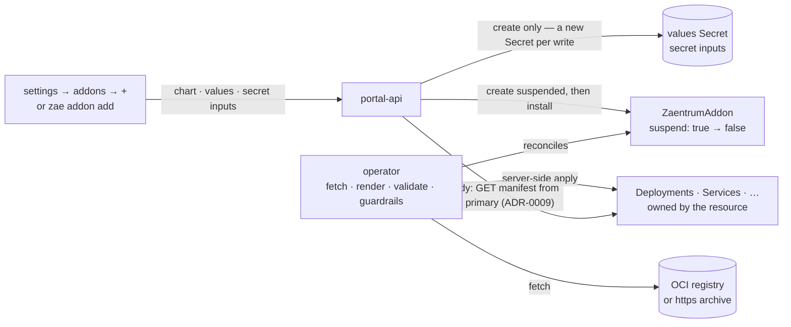

# ADR-0011: Addons are Helm charts installed by the operator

**Status:** Accepted (2026-09-15) · amends [ADR-0009](./0009-pull-based-addon-installation.md) (an addon can be installed from a chart, not only pulled from a running address) and [ADR-0010](./0010-addon-component-groups-and-setup.md) (the chart, not the installer's deployment channel, deploys the components)

## Context

[ADR-0010](./0010-addon-component-groups-and-setup.md) made an addon a group
of components and left deploying them with the installer — kustomize, a GitOps
pipeline, the installer's CI. The portal modelled the group and never created a
workload. That kept the platform out of running other people's containers, and
it made adding an addon a job for someone with cluster access.

- **Two steps, two people.** Someone writes manifests for every component into
  a deployment repository and runs its pipeline; then an admin types the
  primary's address in settings. The group is described twice — in the
  manifest's `components` and in the Deployments — and nothing notices that
  the two disagree until the settings row says *not deployed*.
- **An instance whose only admin surface is the portal cannot add an addon.**
  ADR-0010 named the one-container appliance as the install this serves badly.
  Any self-hosted instance whose admin runs no deployment pipeline is in the
  same place.
- **Install inputs had no path.** Before its console can store anything, an
  addon needs values only the installer can give: a database address, the key
  that [encrypts its settings](../extending/configuration.md#4-encrypted-at-rest),
  a replica count. They lived in hand-made Secrets next to the manifests,
  unvalidated and typed again per instance.
- **Removal was half a removal.** Settings → addons deleted what the portal had
  created and named the workloads still running; the admin deleted those
  somewhere else.
- **"Add an addon from a link" needs something at the end of the link.** The
  question was which package format.

ADR-0010 also sketched the shape a platform-managed deploy would take if it
ever came: one namespaced custom resource per addon, reconciled by the
operator, because the operator already owns the runtime
([ADR-0006](./0006-operator-owned-runtime.md)). What was open was the package
that resource installs, and whether something that already exists should
install it.

### What already exists

- **Helm charts** are the de facto package format for Kubernetes applications.
  Registries serve them as OCI artifacts or as plain archives, `helm template`
  renders them anywhere, `values.schema.json` gives a chart a validated input
  contract, and addon authors already know how to write one. The operator
  embeds the Helm SDK to render the platform itself.
- **Flux (`HelmRelease`) and Argo CD (`Application`)** install charts
  continuously from Git or a registry. Both are mature, and neither is part of
  a zaentrum instance — not the appliance, not most self-hosts. Requiring one
  would make a GitOps controller a prerequisite of adding an addon, and neither
  knows what an addon may create in the platform's namespace or shows a plan
  before it applies. Flux's `HelmRelease` is, though, the best-known way to say
  "this chart, these values, these Secrets".
- **Carvel packages** (kapp-controller's `PackageInstall`) add a package and
  repository layer with its own templating toolchain; a chart takes part only
  wrapped in a package. Authors would learn a second format to reach a
  controller the instance would also have to run.
- **KubeVela** models applications as components and traits on the Open
  Application Model — a platform of its own, far larger than the problem.
- **The Kubernetes SIG Apps `Application` resource** describes an
  application's parts for tools to display. It installs nothing, and the
  project is dormant.
- **Glasskube**, a package manager for Kubernetes with a catalogue and a UI,
  is archived.

## Decision

**An addon is a standard Helm chart.** `apiVersion: v2`, `type: application`,
from an OCI registry or an https archive, optionally pinned by the archive's
digest. There is no zaentrum package format. Three conventions make a chart an
[addon chart](../extending/charts.md):

- `Chart.yaml` says it is one — `zaentrum.io/addon: "true"` — and names its
  primary with `zaentrum.io/primary`: the Service that serves the addon's
  [manifest](../extending/cli.md#descriptor-schema-v1).
- `values.schema.json` declares the install inputs. `writeOnly` marks a secret
  input; `x-zaentrum-generate` marks a value the operator generates once.
- Templates read platform facts — namespace, hostname, issuer, pull secrets,
  event bus, media volume — from one reserved values key, `zaentrum`, which the
  operator sets last.

The chart's name is the release name and the addon's name, and it is the
manifest's `service`: the registry keys the addon by it.

**The operator installs it from one namespaced `ZaentrumAddon` resource per
addon.** A controller of its own, apart from the platform reconciler, fetches
the chart and renders it with the embedded Helm engine: in memory, without
cluster lookups, into the resource's namespace, with the addon's name as the
release name. It validates the values against the chart's schema, checks every
rendered object against the guardrails and applies with server-side apply.
Every applied object is owned by the resource. What a new render no longer
contains is pruned; deleting the resource deletes everything by garbage
collection.

**Plan, then apply.** `suspend: true` makes the resource plan-only: the
operator still fetches, renders and validates, writes the plan into the
resource's status — chart, workloads with their images and ports, objects,
changes against what runs, violations, values errors — and applies nothing.
Settings → addons and `zae addon` create every addon suspended, show that plan,
and install by clearing `suspend`. The portal refuses to install a plan with
violations or values errors, or one not written for the resource's current
generation.

**Any image may run; its pods may not do anything.** Before anything is
applied, the [guardrails](../extending/charts.md#3-guardrails) refuse kinds
other than Deployment, Service, ConfigMap, Secret, ServiceAccount, Job and
PersistentVolumeClaim in their own API versions — no RBAC, no CRDs, no
cluster-scoped objects, no Routes or Ingresses; objects in another namespace,
names reserved for addon values and owner references a chart sets itself;
service-account tokens, Services beyond ClusterIP and claims bound to existing
volumes; host paths, host ports and host namespaces, privileged or root
containers, privilege escalation, added capabilities, unconfined security
profiles, sysctls and placement on the control plane; volumes other than
configMap, secret, emptyDir, projected, downwardAPI and persistentVolumeClaim;
references to Secrets, ConfigMaps, claims and service accounts the chart does
not render, except those the platform hands over in `zaentrum`; and any object
of the same kind and name that this addon does not already own. Where a pod
spec says nothing, the operator mounts no service account token, sets
`runAsNonRoot`, the runtime-default seccomp profile and no privilege
escalation, and drops all capabilities. The chart archive itself is fetched
through a guard that refuses loopback, link-local and metadata addresses and
the cluster's API server.

**Values stay out of the portal's database.** Non-secret inputs are
`spec.values` on the resource. Secret inputs live in Secrets of the addon,
referenced from `valuesFrom`. portal-api may only *create* Secrets: every write
that sets secret inputs creates a new one, `zaentrum-addon-<addon>-values-…`,
and points the inputs at it, so it never reads, changes or deletes a Secret,
and every secret change is a new generation with a new plan. The operator
reads only values objects named and labelled for the addon, adopts them,
deletes the ones nothing references any more, and never regenerates the
generated inputs it keeps in a Secret of its own. Removing an addon removes its
values Secrets and generated values with it, unless the removal asks to keep
them — then a finalizer hands both back, and a new addon of the same name can
point its inputs at them. Precedence, lowest first: the chart's defaults,
generated values, `spec.values`, `valuesFrom` in order, and `zaentrum`.

**Registration is still ADR-0009's install.** Once a chart addon is Ready,
portal-api installs it from `http://<primary>` exactly as an admin installs an
address: manifest, app, tiles, slot rows, components, setup, owned by key — and
only when the manifest's `service` is the addon's name. An addon deployed any
other way is still installed from its address; a chart addon and an address
addon cannot share a key.

**Configuration stays with the addon.** Install inputs are what the containers
need to start. What an admin configures while the addon runs — its
connections, credentials for systems outside the platform, schedules — is still
edited in the addon's console and stored in its database, behind the setup
checklist of ADR-0010.

### How the operator renders

The operator uses Helm's template engine, not `helm install`, and applies the
result the way it applies the platform. Charts have to be written for that:

- **Rendered on every reconcile** — on every change to the resource, a values
  Secret, the platform or an owned Deployment, and at least every five minutes
  — and applied with server-side apply, with force, so fields the chart sets
  are taken back from any other writer.
- **No cluster and no release.** `lookup` returns nothing; `.Release.IsInstall`
  is always true and `.Release.IsUpgrade` always false; there is no release
  history.
- **Hooks are plain objects.** Test hooks are skipped; every other hook is
  applied as an ordinary object on every reconcile, without order or delete
  policy.
- **Jobs.** `ttlSecondsAfterFinished` is removed, because a Job the TTL
  controller deleted would be created — and run — again on the next reconcile.
  A Job whose template changes is deleted and created anew.
- **Nothing random.** `randAlphaNum` and its kind, or `lookup` to keep a value,
  would change a Secret and roll the pods on every render. A value generated
  once is `x-zaentrum-generate`.
- **Template errors report their location only**, because their message is the
  chart's own text and can carry a value.

### Trust boundary

The platform's namespace stays the boundary, and this decision does not move
it.

- **portal-api's new rights add no new level of trust.** It may create Secrets
  and manage `ZaentrumAddon` resources. It already patches the platform's
  Deployments and its `Zaentrum` resource for the operator console; whoever
  controls portal-api controls the namespace either way.
- **Addons share the platform's namespace.** Their pods can reach the
  namespace's Services over the network, as any workload there can. What the
  operator refuses is the chart reaching for platform objects: a pod may
  reference only the Secrets and ConfigMaps its chart renders, plus the ones
  the platform hands over in `zaentrum` — the event bus's TLS Secret and the
  pull secrets — and `valuesFrom` reads only the addon's own values objects.
- **A stronger boundary is future work:** a namespace per addon,
  NetworkPolicy between addons and the platform, and admission policy that
  restricts portal-api to `zaentrum-addon-*` Secrets.

### Why the resource mirrors HelmRelease

The resource is shaped like Flux's `HelmRelease` on purpose. `values`,
`valuesFrom` — `kind`, `name`, `valuesKey` defaulting to `values.yaml`,
`targetPath`, `optional`, applied in order — and `suspend` sit where they sit
there. It differs where one addon in one namespace calls for it:

- **The chart is inline** — `chart.ref`, `version`, `digest` — rather than a
  separate repository object the release points at. One addon is one object.
- **`suspend` plans instead of freezing.** A suspended `HelmRelease` is not
  reconciled; a suspended `ZaentrumAddon` is reconciled up to its plan and
  applies nothing, because the plan is what an admin reviews before installing.
- **The guardrails are part of reconciling,** not an admission policy the
  cluster would have to have.
- **`targetPath` takes the key's raw string.** Flux parses a `targetPath` value
  with Helm's `--set` rules unless the reference says `literal: true`; the
  operator never parses it, so a secret that looks like a number or a list
  stays a string.
- **There is no Helm release in the cluster.** The operator applies rendered
  objects and tracks them by owner and label, the way it applies the platform.

Moving to Flux later is mechanical: `values` carry over as written and
`valuesFrom` too, with `literal: true` on every entry that has a `targetPath`;
`chart` becomes a source object and a chart reference, and the guardrails
become admission policy. Nothing inside an addon chart changes.

The operator's addon controller, portal-api's chart API and `zae addon` are
built against this decision together;
[addon charts](../extending/charts.md) marks what a release ships.

## Consequences

- **An addon is added in one step, by an admin, from settings or `zae`.** A
  chart, its inputs, a plan, install. No deployment repository, no pipeline,
  no cluster access.
- **An addon ships as one artifact.** The chart carries the components'
  Deployments and Services and the schema of its inputs. The manifest still says
  what the addon is; the chart says how it runs.
- **Remove removes.** Deleting the resource deletes everything the chart
  applied, and the values Secrets and generated values with it — unless the
  removal keeps both, for a later install. The registry rows go too. A chart
  addon leaves no *remaining workloads*.
- **The operator runs other people's charts.** It gains pod-creating rights on
  their behalf, and the guardrails are the boundary that makes that acceptable.
  Its cluster role grows by `zaentrumaddons` and the verbs the allowed kinds
  need; the CRD and the cluster role are a one-time cluster-admin apply, like
  the operator's own install.
- **portal-api gains writes it never had:** `zaentrumaddons`, and `create` on
  Secrets — no get, list, watch, patch or delete. It stores a secret input once
  and never sees it again.
- **The plan is data.** It lives in the resource's status, so settings, `zae`
  and `kubectl` show the same plan.
- **GitOps is equally valid.** A `ZaentrumAddon` and its values Secret committed
  to a deployment repository install the addon exactly as a click does,
  reviewed as a pull request instead of a plan screen. A declarative install is
  therefore one resource per addon, not a list on the `Zaentrum` CR.
- **A form is rendered from a chart's schema.** ADR-0010 ruled out a
  platform-rendered settings form, and that stands for configuration. Install
  inputs are different in kind: the chart's own values, validated by Helm, whose
  secrets pass through portal-api once, into a Secret, and are never shown back.
- **ADR-0010's "if the platform deploys addons one day" is this decision**,
  with a Helm chart where it expected image names for the manifest's
  components.

### What this rules out

- **A zaentrum package format.** An addon package is a Helm chart. The platform
  adds annotations and one values key, not a format.
- **Requiring Flux, Argo CD, Carvel or KubeVela** to add an addon. An instance
  that runs one may use it to commit the resource; nothing assumes it.
- **Charts beyond the guardrails.** No RBAC, CRDs, cluster-scoped objects,
  Routes or Ingresses, host access, privileged or root containers, and nothing
  that takes over an object the addon does not own. An addon's UI is reached
  through the portal proxy.
- **Render-time cluster lookups.** A chart renders from its values alone, so
  what the plan shows is what applies.
- **Charts that guess the instance.** Hostname, issuer, pull secrets, the event
  bus and the media volume come from `zaentrum`. A chart that asks for them as
  inputs, or hard-codes them, does the platform's job with less information.
- **portal-api reading, changing or deleting Secrets, or generating values.** It
  creates a Secret per write and forgets it; cleaning up and generating are the
  operator's job.
- **Random values and lookups in addon templates.** A chart renders the same
  objects from the same values on every reconcile.
- **Configuration as install values.** What an admin changes while the addon
  runs stays in the addon's console and database
  ([configuration](../extending/configuration.md)).
- **portal-api creating workloads.** It still creates none: it writes one
  resource and new Secrets, and the operator applies the chart.
