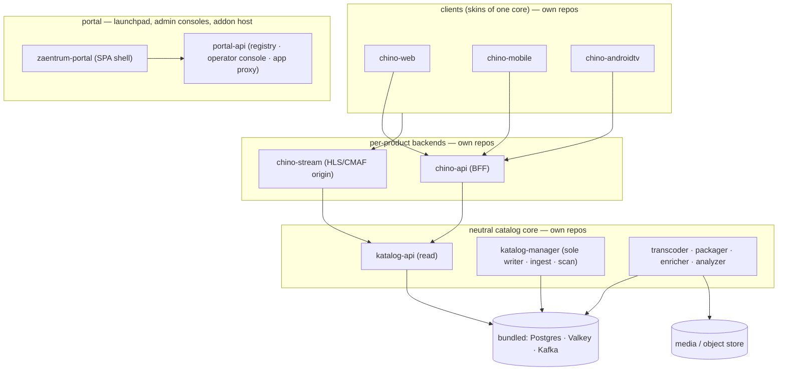

# Zaentrum architecture

## What Zaentrum is

A neutral, self-hostable media platform for a library **you own and are entitled
to stream**: a catalog core, an event-driven processing pipeline, per-product
streaming backends, clean clients, and a portal that fronts the whole thing. It
is content-neutral: you bring files you already have, and Zaentrum catalogs,
processes (transcode/package) and streams them. It never acquires content.

## The repo model — one repo, one container, one release

Zaentrum is a polyrepo: every service is its own repository in the
[`zaentrum` org](https://github.com/zaentrum) and builds exactly one image,
`ghcr.io/zaentrum/<service>`. Two repos are special:

- **[`zaentrum/zaentrum`](https://github.com/zaentrum/zaentrum)** (this repo) —
  the front door: install docs, `releases.json`, and the all-in-one appliance
  image. It **composes released image tags; it builds no service code.**
- **[`zaentrum/zaentrum-operator`](https://github.com/zaentrum/zaentrum-operator)**
  — the runtime owner: the `Zaentrum` CRD, the controller, and the platform
  chart it renders. A cluster declares one CR; the operator reconciles the
  platform from published images.

Addons live in their own repos under their own owners (the worked example is
[laedeli/acquire](https://github.com/laedeli/acquire)) and are never merged in.
The reasoning is recorded in [ADR-0006](./adr/0006-operator-owned-runtime.md).

## Front door and route map

One host fronts the product; the portal is the landing surface. The operator
renders this ingress (single-origin profile — subdomain routing is a CR option):

| Path | Backend | What it is |
|---|---|---|
| `/` and `/portal` | `zaentrum-portal` | the launchpad shell: tiles, admin consoles, hosted addon consoles |
| `/api/portal` | `portal-api` | registry, operator console API, the app proxy (`/api/apps/{key}/*`) |
| `/chino` | `chino-web` | the video product SPA |
| `/api` | `chino-api` | the product BFF |
| `/katalog` | `katalog-manager-ui` | catalog browse (admin) |
| `/katalog-manage` | `katalog-manage-ui` | catalog management (admin) |
| `/api/manage` | `katalog-manager-api` | the neutral management / write API — including [`/api/ingest`](./extending/ingest.md) in-cluster |
| `/auth` | bundled Keycloak | identity (in bundled/broker modes) |

## Scope — the neutral line {#scope}

Zaentrum ships **only** the neutral platform. The hard boundary: anything that
knows *how content was acquired* lives outside the platform's repos, as an
addon.

| In the platform (neutral) | Never in the platform |
|---|---|
| clients, `chino-api`, `chino-stream`, the portal | any tool that fetches or downloads content |
| `katalog-api` (read), `katalog-manager` (write/ingest) | any control plane that decides what to go and get |
| transcoder, packager, enricher, analyzer | anything that reaches out to indexers or trackers |

The catalog write path is the neutral `katalog-manager`: it registers and
manages library entries for files that are **already on disk**. How those files
got there is not Zaentrum's concern.

This isn't cosmetic. A media client/server is distributable on app stores
precisely *because* it is content-neutral. Bundling acquisition would re-import
the IP problem and is against store and host policy. The boundary is enforced
by CI (a neutrality gate greps for internal hostnames and acquisition
vocabulary), not just by review.

## Extending — code plugs into seams {#extending}

The neutral line does **not** mean Zaentrum can't grow capability. It means
capability beyond the neutral core arrives as an **addon**: out-of-tree code
that plugs into seams the core exposes — UI slots, portal-hosted consoles, the
neutral ingest API, the event bus. The core never learns an addon's name;
uninstalling one leaves no trace.

**[Extending zaentrum](./extending/README.md)** documents every seam and its
honest implementation status. The design rationale is
[ADR-0001](./adr/0001-neutral-core-and-addon-seams.md).

Operator-specific *configuration* remains data — your issuer, your library
path, your storage classes, supplied via the CR — never patches to platform
code. A private deployment consumes public releases read-only and layers its
config (and its addons) on top.

## The pipeline is event-driven

Stage handoffs are Kafka events (`catalog.item.*` under a tenant prefix);
database rows record *state* while events drive the *handoff*. The
[event bus page](./extending/events.md) documents the topics — they are a
public integration surface, not an internal detail. Rationale:
[ADR-0005](./adr/0005-kafka-event-bus-and-schema-contracts.md).

## License {#license}

**[MPL-2.0](https://github.com/zaentrum/zaentrum-operator/blob/main/LICENSE).**
The clients ship to mobile app stores, which constrained the choice: strong
copyleft (GPL/AGPL family) conflicts with store distribution terms, and
permissive licenses give the platform no protection. MPL-2.0 — file-level
copyleft — is the middle ground: it protects the platform while keeping the
clients store-distributable. Applies across the platform's repos.

## Decision records

Durable decisions and their reasoning live in [docs/adr/](./adr/README.md) —
start with the [index](./adr/README.md).
