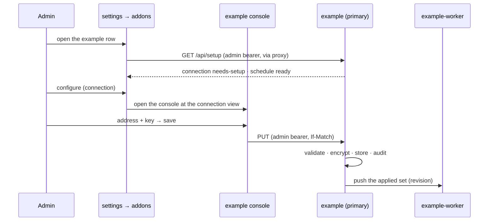

# Addon configuration — settings the addon owns

An addon that talks to anything outside the platform needs configuration an
admin enters after it is running: addresses, credentials, schedules. The rule
([ADR-0010](../adr/0010-addon-component-groups-and-setup.md)): **the addon
owns its configuration.** Values live in the addon's database, are edited in
the addon's console, and never reach the core. The platform shows *whether*
the addon is configured — the setup checklist in settings → addons — and
links to the view where it is edited.



## Who does what

| The platform | The addon |
|---|---|
| Shows the declared components against the workloads that run | Stores, validates and encrypts every value |
| Fetches the setup document with the admin's bearer and renders summaries as text | Decides what "configured" means and reports it per section |
| Links **configure** to a view inside the addon's console | Serves that view and the API behind it |
| Stores no value, receives no value, renders no input field | Hands no value to the core |

The platform side is described in [installing](./installing.md) and the
manifest side in [the CLI contract](./cli.md). This page is the addon side: a
pattern, not a library. Each addon implements it, and the rest of this page
is what that implementation should look like so every addon behaves the same
in front of an admin.

## 1. Keep it in your own database

- Configuration is data in the schema the addon already owns. Environment
  seeds defaults once — a boot step that writes rows only when none exist —
  and from then on the database wins, so an admin's edit survives a redeploy.
- Seeding is code, not a schema migration: it depends on data, and a
  migration that runs on every start must not.
- The environment keeps what only the installer can know: the database
  address, the encryption key, the address policy below.

## 2. An admin-only API

- Gate every read and every write on the admin role. The portal proxy
  forwards the admin's bearer; validate it like any other request
  ([identity](./identity.md#validating-users-inside-your-addon)).
- Writes carry the revision the form was loaded with, as `If-Match`. A stale
  revision gets `409`, so two admins cannot silently overwrite each other.
- Validation errors are per field, so the console can put each message next
  to its input:

  ```json
  { "fieldErrors": [
      { "entity": "connection", "id": "main", "field": "baseUrl",
        "message": "must start with http:// or https://" } ] }
  ```

  with status `422`.
- Record every write in an audit table — who, when, which entity, which
  action. **Never the values**, old or new.

## 3. Secrets are write-only

- No API returns a secret. A read returns whether one is stored:
  `"apiKey": { "set": true, "updatedAt": "2026-09-14T08:00:00Z" }`.
- A write treats each secret field in one of three ways: **omitted** keeps
  the stored secret, **a string** replaces it, **`{"clear": true}`** removes
  it. A form that saves the other fields never needs to know the secret and
  cannot erase it by accident.
- In the console a secret input is `type="password"`, never prefilled,
  cleared after save, with a *stored* badge when one is set.
- A **test** action that checks an unsaved form against the external service
  uses the stored secret when the field is left empty, and stores nothing.
- Never log a secret. Redact at the type — a secret type whose log
  representation is a placeholder — rather than at every call site.

## 4. Encrypted at rest

- AES-256-GCM with a random nonce per write.
- The key comes from the environment — 32 bytes, base64 — in a Secret the
  installer provides, say `EXAMPLE_CONFIG_KEY`. It is never generated by the
  addon and never stored in the database it protects.
- Store a key id next to each ciphertext — the first 8 hex characters of the
  SHA-256 of the key — and accept an optional previous key for reads
  (`EXAMPLE_CONFIG_KEY_PREVIOUS`). Rotation is then: new key in, old key as
  previous, re-save, previous out.
- Bind each ciphertext to where it lives with additional authenticated data,
  `table|id|field`. A ciphertext copied into another row or field fails to
  decrypt instead of becoming that row's secret.
- **No key, no secrets.** Without a key, refuse secret writes with `409` and
  report the section as `needs-setup` with a summary that says the key is
  missing. Never fall back to plaintext.

## 5. Addresses an admin types

An admin-entered URL is a request your addon makes from inside the cluster, to
wherever the form said. Guard it:

- `http` and `https` only, and no redirect to another scheme.
- Refuse link-local and cloud metadata addresses **when dialling**, not only
  when validating, because a name can resolve differently between the two:
  `169.254.0.0/16`, `fe80::/10`, `100.100.100.200`, `fd00:ec2::254`.
- An installer-controlled deny list of hostnames and host suffixes.
- In-cluster service names (`*.svc`, `*.svc.cluster.local`) outside the
  addon's own namespace refused unless the installer explicitly allows them.
- Response size caps on everything read back.

## 6. Configuring your other components

When a component needs values — the worker needs the connection — the
primary **pushes** them. The component does not read the primary's database,
and the values are not copied into a Secret it re-reads.

- The primary sends the complete set to the component's in-cluster API with a
  revision: at boot, right after every write, and again whenever the
  component reports a different revision.
- The component holds the set in memory and reports the revision it has
  applied. A restarted component comes back empty and is refilled on the next
  check.
- The component's configuration API accepts only the primary's identity, never
  returns a secret, and logs ids and revisions, never values.
- While a revision is not applied, the setup section says so: `degraded`.

## 7. The setup endpoint

Declare `setup` in the manifest and serve the
[setup status document](./cli.md) at its path. Beyond the rules there:

- **One section per place an admin edits.** The section's `target` is that
  view in the console; **configure** lands exactly there.
- **`required` means the addon cannot do its job without it.** Something that
  only adds a feature is optional.
- **`needs-setup`** is "not configured enough to work". **`degraded`** is
  "configured, and not working as configured": the external service is
  unreachable or rejected the credentials, a component has not applied the
  current revision, or one configured thing depends on another that is
  missing.
- **Summaries count and name**, they never quote: *1 connection, unreachable
  since 08:12* — not the address, not the key.
- Keep the addon's own health check consistent with it: when nothing can work,
  the `checks[]` endpoint reports degraded too.

## Checklist

- Values in the addon's database; environment only seeds them once.
- Admin-only API; `If-Match` revisions; `422` field errors; an audit trail
  without values.
- Secrets write-only: `{set, updatedAt}` on read, keep / replace / clear on
  write, password inputs never prefilled.
- AES-256-GCM with a key from the environment, a key id, an optional previous
  key and `table|id|field` as additional data; no key means `409` and a
  `needs-setup` section.
- Every admin-entered address through a dial-time guard.
- Other components configured by push, with a revision they report back.
- `setup` declared; `GET {setup.path}` follows the status document; every
  `target` is a console view — and the capability test proves both.
