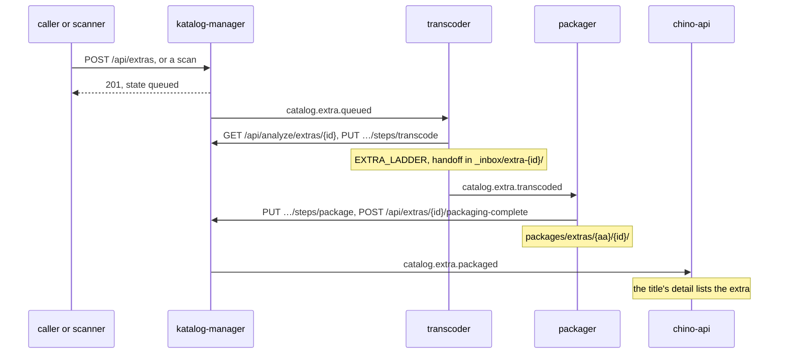

# Extras — a title's trailers and bonus material

A title's **extras** are its bonus material, each a file of its own: a
trailer, a teaser, a featurette, a making-of, a deleted scene. The platform
packages each one apart from its title and plays it from the server, as HLS,
beside the title's links to online videos. An extra is never an item: it is
in no library list and no search, it keeps no progress, and a client finds it
on its title.

An extra comes in through a call or through the scanner. The pipeline does
the rest: the transcoder encodes it, the packager packages it, and the
title's detail lists it once it plays.

## What an extra is

- It belongs to a **movie or a series**, never to an episode: a show's extras
  are the series'. A series' extra may name a **season**, 0 for the specials.
- It has a **kind**, one of ten:

| Kind | What it is | Its title when it is given none |
|---|---|---|
| `trailer` | a trailer that is a file of its own | Trailer |
| `teaser` | a teaser that is a file of its own | Teaser |
| `featurette` | a short piece about the work | Featurette |
| `behind-the-scenes` | footage of its production | Behind the Scenes |
| `making-of` | a documentary of its making | Making Of |
| `deleted-scene` | a scene cut from it | Deleted Scene |
| `interview` | cast or crew talking about it | Interview |
| `gag-reel` | outtakes | Gag Reel |
| `short` | a short work released with it | Short |
| `other` | anything else | Extra |

- It is packaged **on a chain of its own**, keyed by its id, the `extraId`:
  transcode, then package — no analyzer, no trickplay — into
  `packages/extras/<aa>/<extraId>/` in the package store, `<aa>` being the
  id's first two characters. It never goes into its title's package, so
  packaging the title again leaves it alone.
- The catalog keeps it in a table of its own, which katalog-manager's
  migration 039 creates and the service applies at startup. A title's extras
  go with the title.

## Three ways in

| Way | Who | Status |
|---|---|---|
| [The API](#taking-one-in-with-the-api): `POST /api/extras`, GraphQL `addExtra` | an admin, the platform's service account, an addon | ✅ shipped |
| [The scanner's convention](#the-scanners-convention): a file named or filed as an extra of the title beside it | the scanner, behind the setting `extras.scan` | ✅ shipped, off by default |
| The `extras/` folders of the [library record](../library/record.md), read on purpose | an import | 🧭 a later phase |

## Taking one in with the API

### Where the file goes

The file must already be on the storage the platform mounts, at an absolute
path under one of three roots:

| Root | Default | |
|---|---|---|
| The media root | `/var/lib/katalog/media` | The library; the scanner walks it |
| `EXTRAS_ROOT` | `/var/lib/katalog/extras` | Files you take in by hand; the scanner never walks it |
| `LIBRARY_ROOT` | `/var/lib/katalog/library` | The library's records |

It may not lie under the package store (`/var/lib/katalog/packages`), be a
link that leads out of these roots, or be a title's own file. It is a video
by its extension: `.avi`, `.m2ts`, `.m4v`, `.mkv`, `.mov`, `.mp4`, `.mpeg`,
`.mpg`, `.ogv`, `.ts`, `.webm` or `.wmv`.

The platform mounts its whole `media` volume at `/var/lib/katalog` — in the
catalog, the pipeline workers and the streaming origin — so an `extras/`
folder beside `media/` on that volume is `EXTRAS_ROOT`, and every service that
reads the file finds it there. On the appliance, copy it in as you copy the
library ([first run](../self-hosting.md#first-run)):

```bash
vol=$(docker exec zaentrum sh -c 'echo /var/lib/rancher/k3s/storage/pvc-*_zaentrum_media')
docker exec zaentrum mkdir -p "$vol/extras/sintel"
docker cp ./sintel-trailer.mp4 zaentrum:"$vol/extras/sintel/trailer.mp4"
# the catalog sees /var/lib/katalog/extras/sintel/trailer.mp4
```

### The call

In-cluster only, as [ingest](./ingest.md) is: the route is not on the public
route map.

```
POST http://katalog-manager-api/api/extras
Authorization: Bearer <token>
Content-Type: application/json
```

```json
{"itemPath": "/var/lib/katalog/media/Sintel/Sintel.mkv",
 "path": "/var/lib/katalog/extras/sintel/trailer.mp4",
 "kind": "trailer", "title": "Trailer", "language": "en"}
```

| Field | |
|---|---|
| `itemId`, `itemPath`, or `tmdbId` with `itemType` | Required, exactly one way: the title's id; the path of its file as the catalog has it; or its TMDB id with `itemType` `movie` or `series`. A path outlives a reset that changes ids |
| `path` | Required: the extra's file, as above |
| `kind` | Required: one of the ten kinds |
| `title` | What it is called; the kind's name when left out |
| `language` | The language spoken in it, BCP 47 (`en`, `pt-BR`) or an ISO 639-2 code (`eng`); unknown when left out |
| `seasonNumber` | A series' only, for a season it has episodes of; 0 is the specials |

An admin, the platform's service account and an addon's service account (the
`zaentrum-addon` role, see [identity](./identity.md)) may call it; anyone else
gets `403`, and a call without a bearer `401`. An addon that holds bonus
material for a title hands it over this way.

| Answer | When |
|---|---|
| `201` | Taken in: `{"extraId", "itemId", "created": true, "kind", "title", "state"}` |
| `200` | The file is this title's extra already: the same answer with `"created": false`. Nothing changes, not its kind, title or language; to change them, remove it and take the file in again |
| `400` `EXTRA_REFUSED` | A rule is broken: the title is named no way or two ways, or is no movie or series (an episode, say); a season is named for a movie, or for a season with no episodes; the kind or the language is none of the above; or the file is missing, no video, outside the roots or a title's own |
| `404` `NOT_FOUND` | No such title. A Job that runs beside the scan may ask again |
| `409` `EXTRA_CONFLICT` | The file is another title's extra, named in `extraId` and `itemId`; or the title is not one, as when more than one item has the `itemPath` or the TMDB id |
| `503` `UNAVAILABLE` | The catalog has no extras table: migration 039 is missing |

A refusal says why:

```json
{"error": "/var/lib/katalog/extras/sintel/trailer.mp4 is extra 1b5c2a8e-… of item ea886f9b-… already",
 "code": "EXTRA_CONFLICT", "extraId": "1b5c2a8e-…", "itemId": "ea886f9b-…"}
```

One file is one extra while that extra lives, so a retry is safe. A removed
extra's file may be taken in again, as a new extra.

### Step by step with curl

With bundled identity, from a machine where `kubectl` reaches the platform's
namespace. The token is the platform's own service account, the confidential
client `zaentrum-manager`, as the pipeline workers use it; its secret is in
the Secret `zaentrum-keycloak`.

```bash
NS=zaentrum   # the platform's namespace
kubectl -n $NS port-forward svc/keycloak 8080:80 &
kubectl -n $NS port-forward svc/katalog-manager-api 8081:80 &

SECRET=$(kubectl -n $NS get secret zaentrum-keycloak -o jsonpath='{.data.client-secret}' | base64 -d)
TOKEN=$(curl -s http://localhost:8080/auth/realms/zaentrum/protocol/openid-connect/token \
  -d grant_type=client_credentials -d client_id=zaentrum-manager -d client_secret="$SECRET" | jq -r .access_token)

curl -s -X POST http://localhost:8081/api/extras \
  -H "Authorization: Bearer $TOKEN" -H 'Content-Type: application/json' \
  -d '{"itemPath": "/var/lib/katalog/media/Sintel/Sintel.mkv",
       "path": "/var/lib/katalog/extras/sintel/trailer.mp4",
       "kind": "trailer", "language": "en"}'
# 201 {"extraId":"1b5c2a8e-…","itemId":"ea886f9b-…","created":true,"kind":"trailer","title":"Trailer","state":"queued"}

# follow it with the same token until "state" says "ready"
curl -s http://localhost:8081/api/analyze/extras/1b5c2a8e-… -H "Authorization: Bearer $TOKEN"
```

Keycloak issues every token for the instance's public issuer, whichever
address it is asked at, so a token minted through the port-forward is one the
catalog takes. With external identity, use the client your deployment gives
the pipeline workers, or an addon's service account. On the appliance the
port-forwards run inside the container, which needs their ports published, as
[the admin console](../self-hosting.md#the-admin-console) does; the scanner's
convention below needs no call at all.

### With GraphQL

An admin can do the same with GraphQL `addExtra`. It takes the same arguments
and answers `{created, extra}`; a refusal is an error whose `extensions.code`
is one of the codes above. katalog-manager answers GraphQL at
`/api/manage/query` on the instance's public host, and at
`http://katalog-manager-api/query` in-cluster. Every field is an admin's.

```graphql
mutation {
  addExtra(itemPath: "/var/lib/katalog/media/Sintel/Sintel.mkv",
           path: "/var/lib/katalog/extras/sintel/trailer.mp4",
           kind: "trailer", language: "en") {
    created
    extra { id state playable }
  }
}
```

An item's `extras` lists them in the order a viewer sees them, each with its
state, its last error, its package and whether it plays (`playable`);
`removed: true` adds the removed ones:

```graphql
{ item(id: "ea886f9b-…") { extras(removed: true) { id kind title state error playable removedAt } } }
```

## The scanner's convention

Behind the setting `extras.scan`, the scanner takes files in as extras by
their names and folders. It is off by default, so a library does not start
packaging its bonus material by itself. To turn it on, open **settings** in
Catalog Management and add a **new setting** with the key `extras.scan` and
the value `true` (`on`, `yes` and `1` work too). The next scan applies it.

The scanner walks the media root only, so it never finds a file in
`EXTRAS_ROOT`. A file it walks is an extra of a title when it:

| The file | Example |
|---|---|
| is named as the title's file beside it, then a kind, then a label maybe: `<stem><sep><kind>[<sep><label>].<ext>` | `Sintel-trailer.mkv`, `Sintel - Behind the Scenes - Music.mkv` beside `Sintel.mkv` |
| lies in a folder of extras beside the one title's file | `Sintel/trailers/teaser.mp4` beside `Sintel/Sintel.mkv` |
| is named by a kind alone, beside the one title's file | `trailer.mkv`, `teaser-2.mp4`, `Making Of.mkv` |
| ends in `trailer`, as the scanner always took a trailer, beside the one title's file | `Official - trailer.mkv` |
| lies in a show's folder of extras | `series/<Show>/trailers/` for the series, `series/<Show>/Season 01/extras/` for its first season |

- **Separators** are `-`, `.`, `_` and space, and runs of them. Letter case
  does not matter, and the longest stem a name begins with wins.
- **Kinds in a name:** `trailer`, `teaser`, `featurette`, `behind the scenes`
  or `behindthescenes`, `making of` or `makingof`, `deleted`, `deleted scene`
  or `deleted scenes`, `interview`, `gag reel` or `bloopers`, `short`, and
  `other` or `extra`. A file named by a kind alone may not be called
  `interview`, `short`, `other` or `extra`: those may be titles of their own.
- **Folders of extras:** `trailers/`, `teasers/`, `featurettes/`,
  `behind the scenes/`, `making of/`, `deleted scenes/`, `interviews/`,
  `gag reels/`, `bloopers/`, and `extras/` for the kind `other`. The folder
  that holds one must hold one title's file and no other.
- **Titles:** the label when it says something (`Music`), the kind's name and
  the label when the label is a number (`Trailer 2`), else the kind's name.
- **Shows** are folders under `series/`, `tv/`, `shows/` or `tvshows/`. A
  season's folder is `Season 01`, `S01` or `Specials` (season 0). The series
  is the one the episodes under the show's folder belong to. A file named as
  an episode (`S01E02`) is an episode, even in a folder called `extras/`.

Anything ambiguous, such as a flat folder of many titles or two series under
one show's folder, is skipped and said in the log; such a file becomes no
title either. A file found at a new path, with the size and quick hash of one
of its title's extras whose file is gone, is that extra moved: it keeps its id
and its package. After a walk that went through, an extra the scanner took in
whose file is gone is `missing` and hidden until the file is back. A trailer
an older scan took for a title of its own becomes an extra of its film, and
the title left without a file is removed, in the deletion log.

With the setting off, a file named like a trailer is still never made a
title: it is skipped, and no extra is taken in.

## The chain



| State | |
|---|---|
| `pending` | Taken in, or due to be sent again: its trigger waits to go |
| `queued` | Its trigger is sent; it waits for the transcoder |
| `transcoding` | The transcoder encodes it |
| `transcoded` | Encoded; it waits for the packager |
| `packaging` | The packager packages it |
| `ready` | Packaged: it plays |
| `failed` | Its runs failed and no attempt is left; [packaging it again](#packaging-it-again) starts afresh |
| `missing` | The scanner found its file gone; hidden until the file is back |

An extra plays from its first package on, also while it is packaged again,
until it is removed, unless it is hidden or its file is missing.

- **What it is encoded to.** The transcoder encodes an extra with its extras
  ladder, `EXTRA_LADDER`, by default `720p:h264,480p:h264`; the platform chart
  sets no value for it. An extra plays as H.264 and stereo AAC, which every
  client decodes, so nothing is made on the fly. A browser-friendly H.264
  source at a rung's size is copied, not encoded again.
- **It needs the pipeline.** Without an event bus (`features.kafka`) an extra
  waits, `pending`. Without the media pipeline (`features.pipeline`) no worker
  takes its trigger, and the sweep fails it once its attempts are spent.
- **It heals.** Every `KATALOG_RETRY_INTERVAL` (30s), katalog-manager's sweep
  applies the pipeline's retry policy (`KATALOG_RETRY_*`) to extras:
  - a failed run sends the extra back to `pending`, to be sent again a backoff
    later, until it has failed `KATALOG_RETRY_MAX_ATTEMPTS` (3) times in a
    row; then it is `failed`;
  - one `queued` that no transcoder started within 24h, or `transcoding` or
    `packaging` with its worker silent for 2h, counts as a failed run, and its
    chain runs again from the transcode;
  - one `transcoded` that no packager started within 24h has the transcoder
    announce it again;
  - each trigger is sent once, however many instances run.

The topics, their envelopes and their consumer groups are on
[the event bus](./events.md#a-titles-extras). The workers' protocol — the
extra's record, its steps and packaging-complete — is in
[katalog-manager's README](https://github.com/zaentrum/katalog-manager#extras).

### Packaging it again

`packageExtra(id)` packages one extra again, and `packageExtras(itemId)` every
extra of a title, with the pipeline's current settings: after a change of
`EXTRA_LADDER`, say. Each goes back to `pending` with its failures cleared,
and its trigger goes; the package it has plays until the new one is in place.
One in its packaging within its timeout is left alone, and so is one whose
file is missing, until the file is back. The answer counts the extras packaged
again (`queued`), left alone (`busy`) and not sent (`notSent`), and says why:

```graphql
mutation { packageExtras(itemId: "ea886f9b-…") { queued busy notSent message } }
```

Encoding a title again (`reencodeItem`) leaves its extras alone, and so does
re-matching it (`identify`).

### Removing one

`removeExtra(id, reason)` removes an extra. It stays in the catalog, removed —
who, when and why — and plays no more, and its file may be taken in again. A
day later the sweep deletes its package and the transcoder's handoff in
`_inbox/extra-<id>/`. Removing it again changes nothing, and an id there is
not answers `null`.

```graphql
mutation { removeExtra(id: "1b5c2a8e-…", reason: "the wrong cut") { id removedAt } }
```

Deleting a title deletes its extras. With `deleteFiles`, their files under the
media root or `EXTRAS_ROOT` go too; with `deletePackages`, their packages.

## What a client sees

The item detail, `GET /api/v1/items/{id}` on chino-api, lists a movie's or a
series' extras that play, beside `trailers`:

```json
{
  "id": "9c4e7a12-…", "type": "movie", "title": "A Film",
  "trailers": [{"url": "https://…", "title": "Official Trailer"}],
  "extras": [
    {"id": "1b5c2a8e-…", "kind": "trailer", "title": "Trailer", "language": "en",
     "duration_ms": 33000, "local": true,
     "play_path": "/api/v1/items/9c4e7a12-…/extras/1b5c2a8e-…/play/master.m3u8"}
  ]
}
```

- **`extras`** holds the extras that play, in the order a viewer sees them:
  today, the order they were taken in. Each has `id`, `kind`, `title` and,
  when known, `language` and `duration_ms`; a season's extra has
  `season_number`. `local` is always `true`. `extras` is left out when none
  plays, and while the catalog has no extras table. A client skips a kind it
  does not know.
- **`play_path`** is the extra's HLS master. A client asks for it as for a
  title's master, with `?stream=<stream token>&caps=<what it decodes>`, and
  `q=<rung id>` for one rung; the URIs in the master carry the query on. Its
  routes hold a viewer to the title's rating cap, as every route of the title
  does, and answer `404` for an extra that is not the title's or not packaged.
- **`trailers`** is unchanged: the title's links to online videos, each with
  its `url`, which a client opens outside the app. Installed clients read
  every entry that way, so a trailer the server plays is never in it: it is
  an extra.
- **No progress.** An extra has no progress, watched, segments, trickplay,
  `/play/info` or `/play/prewarm`. Playing one leaves Continue Watching as it
  was.
- **Live refresh.** When an extra is packaged, `GET /api/v1/events` sends its
  title a note, and the detail lists the extra on the next fetch:
  `{"type": "catalog.updated", "itemId": "<the title>", "itemType": "movie", "phase": "extra.packaged"}`.

Beneath the detail, chino-api reads the list from katalog-api
(`include=extras`) and adds `local` and `play_path`, and chino-stream serves
the package at `/api/play/{itemId}/extras/{extraId}/…`, only under the title
its manifest's `parentId` names. katalog-api reads the
catalog with a read-only role: a role granted its tables before migration 039
needs `SELECT` on the extras table too
([katalog-api's README](https://github.com/zaentrum/katalog-api#extras) gives
the grant), and until then lists no extras rather than failing.

### The Trailer button — what a client does

Every client picks the same trailer:

1. **A trailer the server plays.** Of `extras`, a `trailer` before a `teaser`,
   whatever their seasons: a season's trailer still comes before the whole
   title's teaser. Within one kind, the whole title's before a season's; among
   equals, the first in the server's order.
2. **Else the title's link** to an online video, from `trailers`, opened
   outside the app as before.
3. **Else no Trailer button.**

The trailer screen plays the extra at its `play_path` on the client's own
player, and never writes progress or watched, so Continue Watching is
untouched.

## Honest status

| Capability | Status |
|---|---|
| Taking an extra in with `POST /api/extras` and `addExtra` | ✅ shipped |
| The scanner's convention, behind `extras.scan` | ✅ shipped, off by default |
| A chain of its own: transcode, package, retries, packaging again, removal | ✅ shipped |
| `extras` and `play_path` on chino-api, and the `extra.packaged` note | ✅ shipped |
| Featurettes, making-ofs and the other kinds shown in the apps | 🧭 not yet: the API lists every kind; the Trailer button takes trailers and teasers only |
| An extra ordered, hidden or relabelled by hand | 🧭 not yet: the catalog has the fields, and no call sets them |
| Extras taken in from the library's `extras/` folders | 🧭 a later phase: no service reads or writes the [v2 record](../library/record.md) yet |
