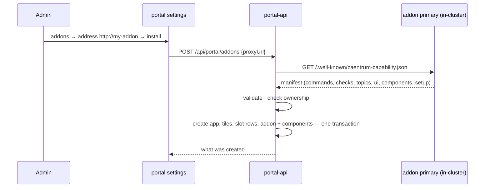

# Installing addons

Installing an addon is **pull, not push**. The addon never registers itself
and needs no identity to appear. It *declares* what it contributes in its
[capability manifest](./cli.md#descriptor-schema-v1), and an admin adds it in
the portal's settings by its in-cluster address. portal-api fetches the
manifest and creates what it declares — an app, launchpad tiles, slot rows —
and records the addon with the [components](./cli.md#components-and-setup) it
consists of, all owned by the addon's key. Removing the addon deletes
everything by that key. The core learns nothing about the addon except what
the manifest said.



Two steps, and the second one is a click. An addon is often several
containers — one **primary** that serves the manifest and the console, plus
the components it declares — and all of them are deployed in step 1 the way
you deploy anything else. The portal shows them and whether the addon is
configured ([ADR-0010](../adr/0010-addon-component-groups-and-setup.md)); it
never deploys them.

## 1. Deploy the components

Plain Kubernetes, applied next to the platform through your own deployment
channel. The operator never touches workloads it did not render, so an addon
deployed into the platform namespace survives every reconcile, is never
pruned, and does not cascade-delete with the CR. No Ingress or Route: the
[portal proxy](./console.md) is the addon's front door.

| Piece | Who provides it | Notes |
|---|---|---|
| Deployment + Service per addon component | the addon's manifests | Both named by the component's `workload`; applied into the platform namespace |
| The grouping labels | the addon's manifests (or you, via kustomize) | See below — they drive the operator console grouping |
| Secrets the addon itself needs (DB URL, an encryption key for its settings) | you | Addon manifests reference them by name; settings an admin edits later live in the addon, see [configuration](./configuration.md) |
| A database/schema, if the addon has state | you | Addons own their schema; the platform DB server may host it |
| Media volume mount | you | Required if the addon produces files for [ingest](./ingest.md) |
| A service account | only if the addon *calls* platform APIs | See [identity](./identity.md) — not needed to install |

### Labels

Every Deployment of an addon carries two labels in its **metadata**:

```yaml
apiVersion: apps/v1
kind: Deployment
metadata:
  name: example-worker               # = the component's workload
  labels:
    zaentrum.io/addon: example       # the addon's key — its manifest's service
    zaentrum.io/component: worker    # the component's name in the manifest
spec:
  selector:
    matchLabels:
      app: example-worker            # selectors stay the addon's own
```

They are metadata only — **never** in `spec.selector`, a pod template's
matching labels or a Service selector. Selectors are immutable: a label added
to one makes an already-deployed addon fail to apply, and nothing that groups
workloads reads a selector. The addon's own manifests should carry both labels,
since both are facts about the addon rather than the instance.

The namespace-wide addons label from earlier installs keeps working — stamp it
from your kustomization, not by hand per file:

```yaml
# kustomization.yaml
namespace: <platform-namespace>
labels:
  - pairs:
      app.kubernetes.io/part-of: <platform-namespace>-addons
    # default includeSelectors: false — selectors are immutable; adding to
    # them would make an already-installed addon fail to apply
resources:
  - my-addon.yaml
```

The portal's operator console groups workloads with them:

1. platform services — what the operator renders;
2. **one section per installed addon**, listing its declared components in
   order, each matched to the Deployment whose name equals its `workload`; a
   component with no such Deployment shows as *not deployed*;
3. workloads labelled as addon workloads (`zaentrum.io/addon`, or the
   `-addons` part-of label) that no installed addon declares — deployed ahead
   of the install, or dropped from a manifest;
4. everything else, under *unclaimed*.

Labels group what is shown; the manifest is what claims a workload. An addon
that skips the labels still shows its declared components, and its undeclared
workloads look like something nobody owns.

## 2. Install it in the portal

Settings → **addons** → the address of the addon's **primary** component (its
Service name, e.g. `http://my-addon`) → **check**, then **install**.
Optionally pick the space its tiles go into; the default is the first space,
and an addon may bring its own.

**check** runs the whole install without writing anything: it shows what
would be created, each declared component with the live state of its
workload — a worker you forgot to deploy shows up here as *not deployed* —
and whatever install would refuse.

What the platform creates from the manifest:

| Manifest | Created | Owned by |
|---|---|---|
| `service` (always) | An **app** with key `service`, `proxyUrl` = the address you typed, base URL `/portal/app/<service>` | the app key |
| `ui.app` | The app's title, description and icon | |
| `ui.console: true` | A **tile** `addon.<service>` in the chosen space, opening the [hosted console](./console.md) | the `addon.` prefix |
| `ui.space` | A **launchpad section** of the addon's own, which its tiles go into instead of the chosen space | it is removed with the addon, once empty |
| `ui.tiles[]` | One tile per entry, keyed `addon.<service>.<key>`, each opening a path inside the addon's console. Replaces the single `console` tile | the `addon.<service>.` prefix |
| `ui.slots[]` | One [slot row](./slots.md) per entry, keyed `<service>.<key>`, `addon = service` | the `addon` column |
| `components[]` | An **addon record** — address, version, the manifest it was installed from — and one row per component: name, workload, role, summary. Without `components`, one implicit primary at the address | the app key |
| `setup` | Nothing but the declaration, kept with the manifest. The checklist is read live from the addon | |
| `commands[]`, `checks[]` | Nothing to create — registering the app is what puts the addon on the [CLI discovery](./cli.md) list | |

All of it is written in **one transaction**: an install that fails leaves
nothing half-created. No configuration value is stored anywhere in the portal
— the addon record holds the manifest, not what an admin later enters in the
addon's console.

Relative slot URLs (`/portal/app/my-addon?q={q}`) are absolutised against the
portal's public origin at install time, because product apps may live on
other hosts and render rows as plain links. An addon does not need to know
where it is installed.

Scripted, with an admin bearer:

```sh
# check: the plan and each component's workload state, nothing written
curl -X POST https://<instance>/api/portal/addons \
  -H "Authorization: Bearer $TOKEN" -H 'Content-Type: application/json' \
  -d '{"proxyUrl":"http://my-addon","dryRun":true}'

curl -X POST https://<instance>/api/portal/addons \
  -H "Authorization: Bearer $TOKEN" -H 'Content-Type: application/json' \
  -d '{"proxyUrl":"http://my-addon"}'
# {"key":"my-addon","app":{…},"space":null,"tiles":1,"slots":1,"commands":2,"checks":1}
```

`space`, `publicBase`, `dryRun` and `replaceAddress` are optional fields of
that body; `publicBase` overrides the origin used for absolutising when the
call is made from inside the cluster rather than through the public route, and
`replaceAddress` confirms moving an installed addon to a new address (see
below). A check answers with `previousAddress` when the install would move the
addon, and `adopt` when it records an app from an earlier install as the addon.

The address is validated the same way the embed proxy validates its targets:
in-cluster names only. portal-api will not fetch a manifest from the internet.
Its host must also name the primary's Service — `http://my-addon`,
`http://my-addon:8080` or `http://my-addon.<namespace>.svc.cluster.local` —
because that name is the workload the portal matches; an IP address is
refused with `422`.

### What install refuses

Beyond a manifest that breaks the [component and setup
rules](./cli.md#components-and-setup), install answers `409` when the addon
would take something it does not own. **check** shows the same, except where a
case below says otherwise:

- **The service name is an app nobody installed.** An admin registered an app
  with that key by hand under settings → apps; installing would take it over.
  Remove or rename that app first. The one app that is not refused is what an
  earlier install left behind: an app with the base URL
  `/portal/app/<service>` whose proxy address is the address you install from.
  Installing adopts it as the addon, and **check** says so.
- **The addon moves to another address.** The addon is installed, but from a
  different address than the one you typed. Installing would point its proxy,
  and every token it forwards, at the new address, so it needs your
  confirmation. **check** shows the old and new address, and its install button
  confirms the move. A scripted install sends `"replaceAddress": true`.
  **refresh** uses the recorded address and never moves anything.
- **A component's workload is a platform service.** An addon cannot claim a
  Deployment the operator renders. The portal can only check this when it can
  list the namespace's workloads. If the apiserver refuses that list, install
  answers `503` and writes nothing. **check** still shows the plan, with every
  component *unknown*. Outside a cluster there are no platform workloads, and
  the check does not apply.
- **A component's workload belongs to another addon.** One workload, one
  owner: two installed manifests cannot both declare it.

### What settings → addons shows

Each installed addon — including one with no console, tiles or slot rows —
is a row with its **version**, its **containers** (running against declared,
e.g. *2/2 running*) and its **setup** state. Expanding the row shows:

- **Components** — name, role and workload, with the workload's phase,
  ready and desired replicas, restarts and the reason when something is wrong.
  *not deployed* when no Deployment has that name; *unknown* when the operator
  service cannot be reached.
- **Setup checklist** — the manifest's sections in order, each with the state
  and summary the addon reports. The browser fetches
  `/api/portal/apps/<key><setup.path>` with the admin's own token; the
  [status document](./cli.md#the-setup-status-document) is the addon's, and a
  failed call shows the checklist as *unknown*. Summaries are rendered as plain
  text. **configure** opens `/portal/app/<key><target>` — the view in the
  addon's console where that section is edited.

`GET /api/portal/addons` returns the same: `version`, `components` with
`phase`, `ready`, `desired`, `restarts` and `reason` (`null` when not
deployed), `setup`, and `refreshAvailable`.

Addons installed before component groups existed are listed with one implicit
primary at their address. **refresh** reads what their manifest declares now.
The exception is an addon that created neither a tile nor a slot row. Nothing
in the portal identifies such an app as an addon, so it is not listed after
the upgrade. Install it again from the same address: install adopts the
existing app instead of refusing it.

### Declaring a layout, not just a console

An addon with real internal structure — a backlog, a queue, a settings area —
can place several tiles instead of one, in a section of its own:

```json
"ui": {
  "app": { "title": "acquire", "icon": "download" },
  "console": true,
  "space": { "key": "acquire", "title": "acquire", "ord": 30 },
  "tiles": [
    { "key": "requests",  "title": "requests",  "description": "who asked for what", "icon": "download", "target": "#/requests",  "ord": 10 },
    { "key": "downloads", "title": "downloads", "description": "the queue, live",    "icon": "gauge",    "target": "#/downloads", "ord": 20 }
  ]
}
```

A tile `target` opens a view **inside the addon's own console** — a hash route
or a path, never another origin, and never a path that climbs out with `..`,
whether spelled out or percent-encoded. That keeps this a curated set of entry
points rather than a second navigation model competing with the addon's own:
place the few views an operator starts from, not every tab the console has.
Setup section targets follow the same rule.

Tiles without an `icon` inherit the app's. Without a `space`, they land in
the space the admin picked at install.

## Upgrades

Deploy the new version through your channel first, then refresh. The portal
keeps the manifest it installed from; when the descriptor CLI discovery last
read from the addon differs — the normal state shortly after a deploy that
changed it — the addon's row shows **refresh available**.

Settings → addons → **refresh** is the same call as install. Tiles, slot rows
and components are **replaced, not merged**, so a card, button or component
the addon dropped disappears instead of lingering, and the ownership checks run
again. Commands and checks need nothing — the CLI reads the live descriptor on
every discovery.

## Uninstall

Subtraction, in order:

1. Settings → addons → **remove** (or `DELETE /api/portal/addons/<key>`):
   deletes the slot rows, every tile the addon owns, the addon record with its
   components, and the app by key — plus the addon's own space, once nothing
   else is left in it. The core shows no trace; `zae discover` no longer lists
   it. The answer says what was removed and lists `remainingWorkloads`: the
   addon's workloads that are still deployed, which the remove dialog names.
   The portal does not delete them — it did not create them.
2. Delete those workloads and the addon's other Kubernetes objects through the
   channel that deployed them; the `zaentrum.io/addon` label finds them.
3. Drop its database if you are done with the data. The addon's configuration
   lives there, and nowhere else.

## Where this is going

> 🧭 Declarative install — an `addons` entry on the `Zaentrum` CR that the
> operator reconciles like everything else — is roadmap. It will call the
> same endpoint this page describes, so nothing an addon declares today
> changes when it lands.

> 🧭 Platform-managed deploys are conditional, not scheduled. If the platform
> ever deploys addon workloads itself, it will be one namespaced custom
> resource per addon, reconciled by the operator — not the portal creating
> Deployments ([ADR-0010](../adr/0010-addon-component-groups-and-setup.md)).
> Components and setup stay as they are.

The runtime write API on `/api/portal/extensions` remains for addons that
change their contributions **while running** (see [identity](./identity.md)).
It is no longer the install path.
