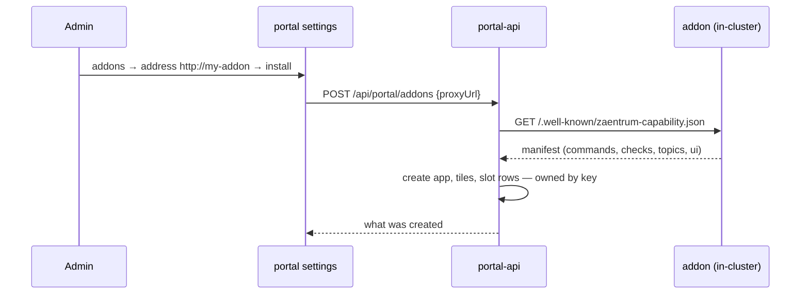

# Installing addons

Installing an addon is **pull, not push**. The addon never registers itself
and needs no identity to appear. It *declares* what it contributes in its
[capability manifest](./cli.md#descriptor-schema-v1), and an admin adds it in
the portal's settings by its in-cluster address. portal-api fetches the
manifest and creates what it declares — an app, launchpad tiles, slot rows —
all owned by the addon's key. Removing the addon deletes everything by that
key. The core learns nothing about the addon except what the manifest said.



Two steps, and the second one is a click.

## 1. Deploy the workload

Plain Kubernetes, applied next to the platform. The operator never touches
workloads it did not render, so an addon deployed into the platform namespace
survives every reconcile, is never pruned, and does not cascade-delete with
the CR. No Ingress or Route: the [portal proxy](./console.md) is the addon's
front door.

| Piece | Who provides it | Notes |
|---|---|---|
| Deployment + Service per addon component | the addon's manifests | Applied into the platform namespace |
| The addons label | you, via kustomize | See below — it drives the operator console grouping |
| Secrets the addon itself needs (DB URL, third-party keys) | you | Addon manifests reference them by name |
| A database/schema, if the addon has state | you | Addons own their schema; the platform DB server may host it |
| Media volume mount | you | Required if the addon produces files for [ingest](./ingest.md) |
| A service account | only if the addon *calls* platform APIs | See [identity](./identity.md) — not needed to install |

Stamp every addon object with

```yaml
labels:
  app.kubernetes.io/part-of: <namespace>-addons
```

— from your kustomization, not by hand per file:

```yaml
# kustomization.yaml
namespace: <platform-namespace>
labels:
  - pairs:
      app.kubernetes.io/part-of: <platform-namespace>-addons
    # default includeSelectors: false — selectors are immutable; adding to
    # them would make an already-installed addon fail to apply
resources:
  - my-addon.yaml
```

The portal's operator console groups workloads by this label: platform
services (operator-rendered) in one section, **addons** in their own, and
anything unlabelled under *unclaimed*. An addon that skips the label looks
like something nobody owns.

## 2. Install it in the portal

Settings → **addons** → the addon's in-cluster address (the Service name,
e.g. `http://my-addon`) → **install**. Optionally pick the space its tiles
go into; the default is the first space, and an addon may bring its own.

What the platform creates from the manifest's `ui` section:

| Manifest | Created | Owned by |
|---|---|---|
| `service` (always) | An **app** with key `service`, `proxyUrl` = the address you typed, base URL `/portal/app/<service>` | the app key |
| `ui.app` | The app's title, description and icon | |
| `ui.console: true` | A **tile** `addon.<service>` in the chosen space, opening the [hosted console](./console.md) | the `addon.` prefix |
| `ui.space` | A **launchpad section** of the addon's own, which its tiles go into instead of the chosen space | it is removed with the addon, once empty |
| `ui.tiles[]` | One tile per entry, keyed `addon.<service>.<key>`, each opening a path inside the addon's console. Replaces the single `console` tile | the `addon.<service>.` prefix |
| `ui.slots[]` | One [slot row](./slots.md) per entry, keyed `<service>.<key>`, `addon = service` | the `addon` column |
| `commands[]`, `checks[]` | Nothing to create — registering the app is what puts the addon on the [CLI discovery](./cli.md) list | |

Relative slot URLs (`/portal/app/my-addon?q={q}`) are absolutised against the
portal's public origin at install time, because product apps may live on
other hosts and render rows as plain links. An addon does not need to know
where it is installed.

Scripted, with an admin bearer:

```sh
curl -X POST https://<instance>/api/portal/addons \
  -H "Authorization: Bearer $TOKEN" -H 'Content-Type: application/json' \
  -d '{"proxyUrl":"http://my-addon"}'
# {"key":"my-addon","app":{…},"space":null,"tiles":1,"slots":1,"commands":2,"checks":1}
```

`space` and `publicBase` are optional fields of that body; `publicBase`
overrides the origin used for absolutising when the call is made from inside
the cluster rather than through the public route.

The address is validated the same way the embed proxy validates its targets:
in-cluster names only. portal-api will not fetch a manifest from the internet.

### Declaring a layout, not just a console

An addon with real internal structure — a backlog, a queue, a settings area —
can place several tiles instead of one, in a section of its own:

```json
"ui": {
  "app": { "title": "acquire", "icon": "download" },
  "console": true,
  "space": { "key": "acquire", "title": "acquire", "ord": 30 },
  "tiles": [
    { "key": "requests",  "title": "requests",  "description": "who asked for what", "icon": "download", "target": "#/requests",  "ord": 10 },
    { "key": "downloads", "title": "downloads", "description": "the queue, live",    "icon": "gauge",    "target": "#/downloads", "ord": 20 }
  ]
}
```

A tile `target` opens a view **inside the addon's own console** — a hash route
or a path, never another origin. That keeps this a curated set of entry
points rather than a second navigation model competing with the addon's own:
place the few views an operator starts from, not every tab the console has.

Tiles without an `icon` inherit the app's. Without a `space`, they land in
the space the admin picked at install.

## Upgrades

An addon whose new version declares different contributions: settings →
addons → **refresh**. It is the same call as install; tiles and slot rows are
**replaced, not merged**, so a card or button the addon dropped disappears
instead of lingering. Commands and checks need nothing — the CLI reads the live
descriptor on every discovery.

## Uninstall

Subtraction, in order:

1. Settings → addons → **remove** (or `DELETE /api/portal/addons/<key>`):
   deletes the slot rows, every tile the addon owns, and the app by key — plus
   the addon's own space, once nothing else is left in it. The core shows no
   trace; `zae discover` no longer lists it.
2. Delete the addon's Kubernetes objects.
3. Drop its database if you are done with the data.

## Where this is going

> 🧭 Declarative install — an `addons` entry on the `Zaentrum` CR that the
> operator reconciles like everything else — is roadmap. It will call the
> same endpoint this page describes, so nothing an addon declares today
> changes when it lands.

The runtime write API on `/api/portal/extensions` remains for addons that
change their contributions **while running** (see [identity](./identity.md)).
It is no longer the install path.
