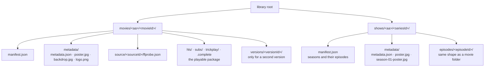
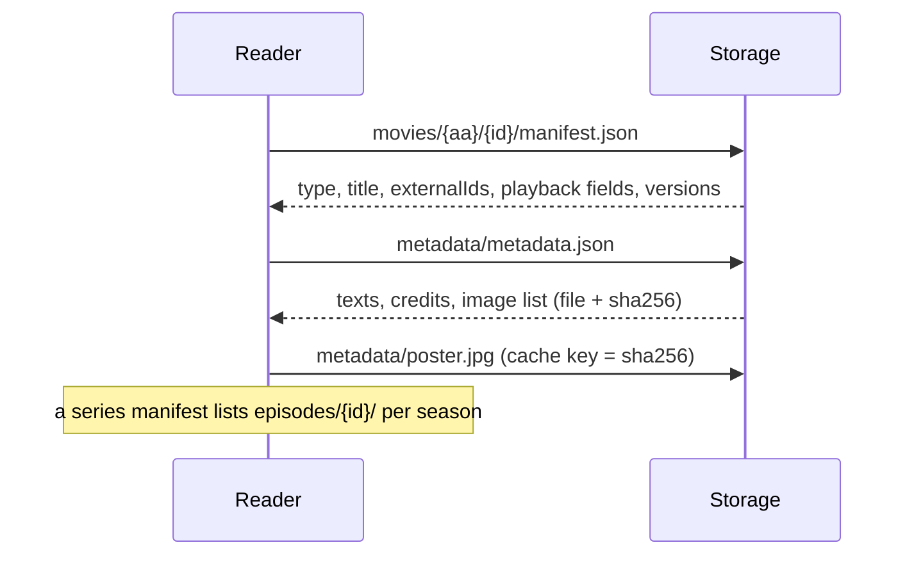

# The library format

The library format is how zaentrum keeps a media library **on storage**: every
movie, series and episode is a folder that describes itself completely — what
it is, every text and image about it, what is playable, and what the original
file contained. Storage is the source of truth. Databases are caches that can be
thrown away and rebuilt by reading the folders.

> **Status — format ahead of the code.** Schema v1 is published and a migrated
> sample library validates against it. Platform services do not read the format
> yet: the catalog still keeps its truth in a database, and the streaming origin
> still finds packages at `shows/<aa>/<episodeId>/` rather than inside a series
> folder. This section documents the format so tools and services can adopt it.

## Why storage, not a database

- **A library outlives its software.** Folders with JSON and images can be read
  by any tool, backed up with any tool, and moved to object storage (S3 and
  compatible) as keys, without an export step.
- **One place to lose, one place to back up.** When the database is a cache, a
  lost or corrupted database is an inconvenience, not data loss.
- **Nothing is invented.** A value the source never held stays empty and is
  reported, so a later re-sync can fill it and the gap stays visible.

Per-user state — watch progress, history, lists — is not library data and stays
in a database.

## Layout



`<aa>` is the first two hex characters of the id, which keeps any one folder's
child count small. Folders are named only by stable ids, never by titles or
numbers, so renaming a title, renumbering an episode or switching to a DVD
ordering never moves a file.

| File | Holds | Written by |
|---|---|---|
| `manifest.json` | The entry point: type, primary title, reference ids, the playback fields a streaming origin reads, and every version with what its original contained and what its package lost. See [manifest.json](./manifest.md). | The media pipeline (scan, analyze, package) and people deciding editions |
| `metadata/metadata.json` | Every text — localised titles, overviews, credits, dates, series and season details — and the list of images in the same folder. See [metadata.json](./metadata.md). | Enrichment from a reference database, and people editing texts |
| `metadata/*.jpg`, `*.png` | The images, named by what they are: `poster.jpg`, `still.jpg`, `season-02-poster.jpg`. | Same as metadata.json |
| `source/<sourceId>/ffprobe.json` | The verbatim probe of the original file, kept after the original is gone. | The media pipeline |
| `hls/`, `subs/`, `trickplay/`, `.complete` | The package: HLS/CMAF segments, WebVTT subtitles, scrub thumbnails. See [ADR-0002](../adr/0002-prepackaged-playback.md). | The packager |

Two files per item, split by writer: the pipeline never touches texts, and a
re-sync from a reference database never touches what is playable.

## Reading an item



1. Read `manifest.json`. `type` says what follows: a movie or episode has
   `versions` and (when packaged) playback fields; a series has `series.seasons`
   listing its episode folders.
2. Read `metadata/metadata.json` for everything shown to a viewer.
3. Fetch images by the file names in `images[]`. Cache them by their `sha256`,
   so a replaced image never serves stale. A missing kind falls back to the
   parent: an episode without a `still` shows its season poster, then the series
   poster.

A cache builder does exactly this for every folder under `movies/` and `shows/`.

## Schemas and validation

The format is defined by JSON Schema (draft 2020-12), published with stable URLs:

| Schema | URL |
|---|---|
| `manifest.json` | <https://zaentrum.github.io/schemas/library/v1/manifest.schema.json> |
| `metadata/metadata.json` | <https://zaentrum.github.io/schemas/library/v1/metadata.schema.json> |
| Shared definitions | <https://zaentrum.github.io/schemas/library/v1/defs.schema.json> |

Every document names its schema in a `schema` field
(`zaentrum.library.manifest/1`, `zaentrum.library.metadata/1`).

The validator in the [schemas repository](https://github.com/zaentrum/schemas)
checks the schemas and the rules that span files: every `itemId` equals its
folder name, every listed image exists with the recorded hash and size, a series
lists exactly the episode folders it contains, and probe files match their hashes.

```sh
pip install "jsonschema>=4.23" referencing
python tools/validate-library.py /path/to/library                 # documents and cross-file rules
python tools/validate-library.py --check-media /path/to/library   # also every playback path
```

Worked examples — an open movie, and a fictional series whose episode exists in
two versions — are in
[`library/v1/examples`](https://github.com/zaentrum/schemas/tree/main/library/v1/examples).

## In this section

| Page | Covers |
|---|---|
| [manifest.json](./manifest.md) | Every field of the entry point, and how it stays readable by version 2 readers |
| [metadata.json](./metadata.md) | Texts, images and their naming, credits, locks, and how a re-sync works |
| [Versions, audio and quality](./versions.md) | Director's cuts, black-and-white and colour presentations, stereo and 5.1, quality ladders, and when an original may be deleted |
| [Migrating a library](./migrating.md) | Building item folders from an existing catalog and applying them on storage safely |
