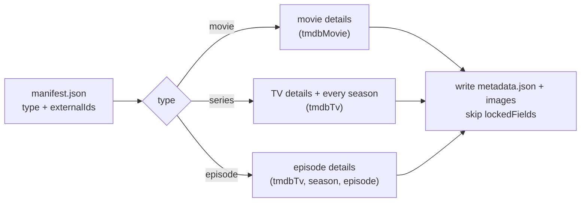

# metadata.json

Every text and image of an item, in the item's `metadata/` folder. Schema:
<https://zaentrum.github.io/schemas/library/v1/metadata.schema.json>.

The images sit in the same folder as `metadata.json`, so the folder is complete
on its own: copy it and you have everything a viewer sees about the item.

## Fields

| Field | Meaning |
|---|---|
| `schema` | Always `zaentrum.library.metadata/1`. |
| `itemId`, `type` | Equal the manifest's; the validator checks both. |
| `rev`, `createdAt`, `updatedAt` | `updatedAt` is when the texts last changed. |
| `titles` | `primary` (display title; may differ from the manifest title when a person edited it), `original`, `sort`, `qualifier` (`US`, `UK`, `2009` — disambiguates remakes and local versions), and `localized` keyed by BCP 47 language with `title`, `sortTitle`, `tagline`, `overview`. |
| `releaseDate`, `genres`, `tags`, `rating`, `contentRating` | As published. |
| `reference.runtimeMs` | The runtime the reference database lists. It lists one runtime for every cut, which is why the manifest's measured runtime is kept separately. |
| `credits[]` | `personId` (stable, keys person pages), `name`, `role`, `character`, `order`, and `tmdbPerson`. |
| `collection` | Franchise membership of a movie. |
| `series` | Series only: `status`, `firstAirDate`, `lastAirDate`, `network`, and `seasons[]`. |
| `episode.airDate` | Episode only. An episode's own name and overview are in `titles`. |
| `images[]` | Every image file in this folder. |
| `curation` | What a person decided: `metadataLocked`, `lockedFields`, `notes`. |
| `fieldOrigins` | Where each set value came from (`tmdb`, `legacy-catalog`, `filename`, `file-tags`, `manual`), keyed by field path. |

## Images

| Field | Meaning |
|---|---|
| `kind` | `poster`, `backdrop`, `logo`, `still`, `banner`, `thumb`. |
| `file` | A plain file name in this folder — no subfolders. |
| `season` | On a series: the season the image belongs to, or `null` for the series itself. |
| `language` | For posters and logos with text, the language of that text. |
| `sha256`, `sizeBytes`, `contentType`, `width`, `height` | Checked by the validator. Caches key on `sha256`. |
| `sourceUrl`, `fetchedAt`, `origin` | Where the image came from, so the exact chosen image can be fetched again. |

File names say what the image is:

| Item | Files |
|---|---|
| Movie | `poster.jpg`, `backdrop.jpg`, `logo.png` |
| Series | `poster.jpg`, `backdrop.jpg`, `logo.png`, and one `season-NN-poster.jpg` per season (`season-00-poster.jpg` for specials) |
| Episode | `still.jpg` |
| Any, localised | `poster.de.jpg`, `logo.fr.png` |

A missing kind falls back to the parent when read: an episode without a `still`
shows its season poster, then the series poster. Nothing is copied to fill a gap.

## Series and seasons

A series' `metadata.json` describes the series as a whole and **every season the
reference database lists**, whether or not its episodes are on storage — so a
viewer can see which seasons are missing:

```json
"series": {
  "status": "ended",
  "firstAirDate": "2011-01-09",
  "lastAirDate": "2021-04-11",
  "network": "Example Network",
  "seasons": [
    { "number": 0, "name": "Specials", "overview": null, "airDate": "2011-01-09", "episodeCountReference": 4 },
    { "number": 1, "name": "Season 1", "overview": "…", "airDate": "2011-01-09", "episodeCountReference": 12 }
  ]
}
```

The episodes that are on storage are listed by the series'
[manifest](./manifest.md#series); compare `episodeCountReference` with that list
to show gaps.

## Re-syncing from a reference database

Because the manifest carries explicit reference ids, the metadata of any item
can be fetched again:



1. Read `type` and `externalIds` from the manifest. On an episode, `tmdbTv` is
   the parent series; the episode is fetched through the series with its aired
   season and episode numbers (or `tmdbEpisode`).
2. Build the new texts and download the chosen images.
3. Keep every field listed in `curation.lockedFields` — and everything, if
   `metadataLocked` — exactly as it was.
4. Write the images first, then `metadata.json` (see
   [writing safely](./migrating.md#writing-safely)).

A re-sync never touches `manifest.json`: identity, versions and playback belong
to the media pipeline.
