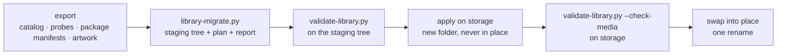

# Migrating a library

How to turn an existing catalog and package store into item folders, write them
to storage without risking what is already there, and what has to change before
a running platform can use the result.

> **Status — reference tooling.** The migrator below builds and validates
> sample libraries from an export of the legacy catalog. There is no
> in-platform migration job.

## The tools

| Tool | Does |
|---|---|
| [`tools/library-migrate.py`](https://github.com/zaentrum/schemas/blob/main/tools/library-migrate.py) | Builds a staging tree of `manifest.json`, `metadata/` and `source/` for every item, a plan of storage operations for the large files, and a report. |
| [`tools/validate-library.py`](https://github.com/zaentrum/schemas/blob/main/tools/validate-library.py) | Validates a tree against the schemas and the cross-file rules. |
| [`tools/test-validate-library.py`](https://github.com/zaentrum/schemas/blob/main/tools/test-validate-library.py) | The broken trees the validator must reject. |
| [`tools/package-checksums.py`](https://github.com/zaentrum/schemas/blob/main/tools/package-checksums.py) | Writes each package's `checksums.sha256` and records it in the manifest, or verifies them with `--verify`. Runs where the package files are readable. |
| [`tools/make-library-examples.py`](https://github.com/zaentrum/schemas/blob/main/tools/make-library-examples.py) | Regenerates the published examples. |

## Steps



### 1. Export

The migrator reads one folder of inputs. The export that produces them is
specific to the legacy catalog and is not published; the migrator's docstring
defines each file.

| Input | Content |
|---|---|
| `paths.tsv` | One row per item: id, type, parent id, season, episode, original file path, size, package manifest path. |
| `catalog.json` | Rows of the legacy catalog tables: items, external ids, people, genres, tags, artwork, chapters, segments, playback, subtitles, trailers, processing steps. |
| `probes.jsonl` | Per original: the `ffprobe` JSON and a file stat (size, mtime, owner, mode) with `qh1` fixity — sha256 of the first and last 64 KiB plus the size. The migrator refuses an original without `qh1`. |
| `fetched.jsonl` | Per item: the existing package manifest, its sha256, whether `.complete` exists, the package folder, and sidecar files next to the original. |
| `artwork.jsonl` | Artwork bytes per item and kind. |
| `colour.tsv` | Per item: peak chroma at sampled times (`sec:satmax,…`). Without it every `presentation.colour` is `unknown`. |
| `tmdb.json`, `tmdb_images.json` + `images/` | Optional: reference-database data the catalog never stored — release dates, season details, season posters, episode stills, logos, person ids. |

### 2. Build

```sh
python tools/library-migrate.py --inputs export/ --out staging/ \
  --library-root /var/lib/katalog/media --packages-root /var/lib/katalog/packages
```

`--library-root` and `--packages-root` are the path prefixes the export's paths
start with. `--items id,id` builds only those movies or series. `--originals leave`
keeps originals in the source library (their `file.path` stays null), so the
version folders hold only their packages — the end state once originals are
deleted; the default `place` plans each original into its version folder. The run
writes:

| Output | Content |
|---|---|
| `staging/library/` | The item folders: `movies/` and `series/`. Validate this folder: `python tools/validate-library.py staging/library`. |
| `staging/plan.tsv` | The storage plan: an `original` row per original file (the file in the source library, and where it goes in its version folder) and a `package` row per package (the existing package folder, and the item folder it belongs in). |
| `staging/report.json` | What needs a person or blocks deleting originals, below. |

Report entries:

| Report entry | Meaning |
|---|---|
| `unmatched-needs-review` | No reference id. |
| `package-checksums-to-compute` | Every package: its checksums can only be computed where its files are. |
| `segments-beyond-runtime` | A detected intro or credits range that ends after the measured runtime — a detector error, kept as found. |
| `disc-image-not-probed` | A disc image whose streams, runtime and colour were never measured. |
| `episode-match-disputed` | The original filename names a different episode of the season than the one the catalog matched. |
| `edition-needs-review` | Runtime far beyond the reference with no edition wording. |
| `colour-needs-review` | Black-and-white from sparse samples. |
| `mixed-masters` | A series whose episodes come from different masters. |
| `lost-if-original-deleted` | Every version whose package lacks something its original has. |
| `package-forced-flag-missing` | A forced or signs-and-songs track, recognised by its title or content, that the package does not flag forced. Only version 2 readers are affected; the migration does not change the hint. |
| `forced-track-flagged-default` | A forced or signs-and-songs track the package flags default. |
| `rendition-title-overclaims` | A package audio rendition whose title names more channels or another format than it carries, e.g. "TrueHD 7.1 Atmos" on two-channel AAC. |
| `interchangeable-audio-renditions` | Renditions of one language and purpose that are identical and titled only by their former format; a menu offers them once. |
| `indistinguishable-audio-renditions` | Renditions that look identical without such titles and may differ in content; name them by hand. |
| `commentary-subtitles-without-commentary-audio` | Commentary subtitles, but no audio track recognisable as the commentary: set its purpose by hand. |
| `empty-in-legacy-catalog` | Movie release date or content rating missing. |
| `credits-without-tmdb-person` | Credits that could not be tied to a reference-database person. |
| `episode-identity-differs-from-package` | An episode's series title or code in the old package manifest differs from the catalog; the package's value is kept. |
| `episode-art-kept-as-two-images` | An episode whose catalog poster and backdrop were different images. |
| `created-at-missing` | An item without a catalog creation time; it gets the migration time. |

A staging tree is always `rev` 1. The migration time is recorded as such
(`provenance.migratedAt`, decision times). A probe's `at` and a fetched image's
`fetchedAt` are the modification times of `probes.jsonl` and `tmdb_images.json`,
so keep file times when copying an export (`cp -p`, `rsync -t`). Catalog times
without a time zone are taken as UTC.

### 3–6. Validate, apply, check, swap

Validate `staging/library`, apply it on storage into a new folder next to the
live one, compute the package checksums there with `tools/package-checksums.py`
(on storage, or in a pod that mounts it — the staging tree has no media), validate
that folder with `--check-checksums`, then swap it into place with one rename and
keep the old folder until the new one has been read back.

## Applying on storage

The library is read by machines. It holds nothing but `<category>/<aa>/<id>` item
folders — no browsing views, no symbolic links, no hard links — so it can be
copied anywhere, including object storage, and read back unchanged.

The documents and images are small and are copied. Originals and packages are
large: the plan **moves** each into its version folder. On the same filesystem a
move is a rename — instant, no extra space, and nothing is left behind at the
old path. Across filesystems it is a copy followed by removing the source once the
copy is verified. Either way every file in the library is an ordinary, independent
file. The existing package's `manifest.json` is not moved: the item folder gets
the new manifest instead.

When applying over an existing library rather than into a new folder, carry each
document's `rev` forward and increment it, so a cache that keys on `rev` sees the
change.

### Writing safely

- **Build next to the live tree, then rename.** A half-applied tree is never
  visible to readers.
- **Replace a document by writing a new file next to it and renaming it over the
  old name**, as `package-checksums.py` does with `manifest.json`: a reader sees
  either the old or the new file, never a partial one.
- **Verify before removing anything:** compute the package checksums in the new
  folder and check them (`validate-library.py --check-checksums`); only then
  remove the old package folder or original.
- **No hard links.** A test library may be filled faster with hard links, but a
  hard link ties a library file to another path — a write through either name
  changes both, and a copy of the tree duplicates the data. `--check-media`
  rejects any package or original file that is a hard link.

## Before a platform uses the format

The migrated tree can be built, validated and inspected today. Serving from it,
or deleting the old package folders or any original, needs these changes first:

| Component | Today | Needed |
|---|---|---|
| Streaming origin, catalog manager | Find a package in today's package store at `{movies,shows}/<aa>/<itemId>/`; episode packages are flat. | Resolve an episode through its series manifest, or an index built from the manifests. Until then, keep the flat episode folders. |
| Packager | Re-packaging empties the whole item folder and writes a version 2 manifest; it flags a subtitle `forced` only from the stream flag. | Replace only package artifacts (`hls/`, `subs/`, `trickplay/`, markers) and merge the version 2 playback fields into the existing version 3 manifest, keeping or recomputing the version 3 track fields (`purpose`, `purposeFrom`, `variant`, `original`) and incrementing `rev`. Until then, do not point it at a migrated library. |
| Players (web, TV, mobile) | Read only the version 2 `forced` and `default` hints. | Derive forced display and defaults from `purpose`, language and the viewer's settings, and build the track menu from language, `variant` and `purpose`. |
| Streaming origin, unpackaged items | Plays an original from the path the catalog stores, in the source library. | Play it from the version folder named by `sources[].file.path`. |
| Catalog | Keeps its truth in a database. | A cache builder that reads the folders, and writers that update the documents. |
| Stream manifest reader | Documents a policy of rejecting unknown versions, not implemented. | Accept version 3 explicitly, with a test on a version 3 manifest. |

Do not delete an original while the version's `lostIfOriginalDeleted` is not
empty, while its match is `disputed` or `unmatched`, or before the readers above
can find its package.

## Building a cache

A catalog database becomes a cache of the library: walk
`movies/*/*/manifest.json` and `series/*/*/manifest.json` (and each series'
episodes), read each item's `metadata/metadata.json`, and upsert. Store each
document's `rev` together with its file hash; on a rebuild skip items where both
are unchanged. A lost cache is rebuilt the same way.
