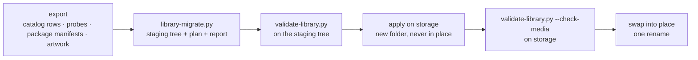

# Migrating a library

How to turn an existing catalog and package store into item folders, and write
them to storage without risking what is already there.

> **Status — reference tooling.** The migrator below is a reference
> implementation used to build and validate sample libraries. It reads an export
> of the legacy catalog; there is no in-platform migration job yet.

## The tools

| Tool | Does |
|---|---|
| [`tools/library-migrate.py`](https://github.com/zaentrum/schemas/blob/main/tools/library-migrate.py) | Builds a staging tree of `manifest.json`, `metadata/` and `source/` for every item, plus a plan of storage operations for the large files and a report of gaps. |
| [`tools/validate-library.py`](https://github.com/zaentrum/schemas/blob/main/tools/validate-library.py) | Validates a tree against the schemas and the cross-file rules. |
| [`tools/make-library-examples.py`](https://github.com/zaentrum/schemas/blob/main/tools/make-library-examples.py) | Regenerates the published examples. |

## Steps

1. **Export** the catalog rows, an `ffprobe` of every original, the existing
   package manifests, and artwork bytes. Optionally fetch what the catalog never
   stored — season posters, episode stills, logos, person ids — from the
   reference database.
2. **Build** the staging tree. Nothing is invented: a value the export does not
   hold stays empty and is listed in the report (`empty-in-legacy-catalog`,
   `edition-needs-review`, `mixed-masters`, `lost-if-original-deleted`).
3. **Validate** the staging tree.
4. **Apply** it on storage into a new folder next to the live one (below).
5. **Validate with `--check-media`** on storage: every rendition directory,
   subtitle file and trickplay index named by a manifest must exist.
6. **Swap** the new folder into place with one rename, and keep the old one
   until the new one has been read back.

## Applying on storage

The documents and images are small and are copied. The packages are large and
are **hard-linked** from the existing package store into the new item folders,
which is instant and uses no space when both are on one filesystem.

The plan lists one operation per package: link every file of the existing
package folder into the item folder **except its `manifest.json`** — the item
folder gets the new manifest instead.

### Writing safely

A hard link is the same file under two names. Writing into it changes both.

- **Never write through a hard link.** Replace a file by writing a new file next
  to it and renaming it over the old name; the other name keeps the old content.
- **Set ownership and permissions on new files before creating any link.** A
  recursive `chown` or `chmod` afterwards changes the linked originals too.
- **Build next to the live tree, then rename.** A half-applied tree is never
  visible to readers.
- **Check afterwards** that every linked file has the same inode and size as its
  source, that the new manifests are not linked to the old ones, and that the
  old manifests are byte-for-byte unchanged.

Once every item is migrated and verified, the old package folders can be
removed; the linked files live on under the new names.

## Moving episodes into series folders

An existing package store keeps episodes flat, one folder per episode id. The
format nests them under their series (`shows/<aa>/<seriesId>/episodes/<episodeId>/`).
On one filesystem that is a rename per episode. Readers that locate packages by
item id need to follow the series manifest, or an index built from it, instead
of probing a fixed path.

## Building a cache

A catalog database becomes a cache of the library: walk `movies/*/*/manifest.json`
and `shows/*/*/manifest.json` (and each series' episodes), read each item's
`metadata/metadata.json`, and upsert. Store each document's `rev`; on a rebuild
skip items whose `rev` has not changed. A lost cache is rebuilt the same way.
