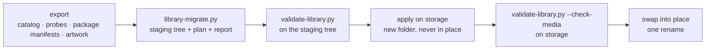

# Migrating a library

How to turn an existing catalog and package store into item folders, write them
to storage without risking what is already there, and what has to change before
a running platform can use the result.

> **Status — reference tooling.** The migrator below builds and validates
> sample libraries from an export of the legacy catalog. There is no
> in-platform migration job.

## The tools

| Tool | Does |
|---|---|
| [`tools/library-migrate.py`](https://github.com/zaentrum/schemas/blob/main/tools/library-migrate.py) | Builds a staging tree of `manifest.json`, `metadata/` and `source/` for every item, a plan of storage operations for the large files, and a report. |
| [`tools/validate-library.py`](https://github.com/zaentrum/schemas/blob/main/tools/validate-library.py) | Validates a tree against the schemas and the cross-file rules. |
| [`tools/test-validate-library.py`](https://github.com/zaentrum/schemas/blob/main/tools/test-validate-library.py) | The broken trees the validator must reject. |
| [`tools/make-library-examples.py`](https://github.com/zaentrum/schemas/blob/main/tools/make-library-examples.py) | Regenerates the published examples. |

## Steps



### 1. Export

The migrator reads one folder of inputs. The export that produces them is
specific to the legacy catalog and is not published; the migrator's docstring
defines each file.

| Input | Content |
|---|---|
| `paths.tsv` | One row per item: id, type, parent id, season, episode, original file path, size, package manifest path. |
| `catalog.json` | Rows of the legacy catalog tables: items, external ids, people, genres, tags, artwork, chapters, segments, playback, subtitles, trailers, processing steps. |
| `probes.jsonl` | Per original: the `ffprobe` JSON and a file stat (size, mtime, owner, mode) with `qh1` fixity — sha256 of the first and last 64 KiB plus the size. The migrator refuses an original without `qh1`. |
| `fetched.jsonl` | Per item: the existing package manifest, its sha256, whether `.complete` exists, the package folder, and sidecar files next to the original. |
| `artwork.jsonl` | Artwork bytes per item and kind. |
| `colour.tsv` | Per item: peak chroma at sampled times (`sec:satmax,…`). Without it every `presentation.colour` is `unknown`. |
| `tmdb.json`, `tmdb_images.json` + `images/` | Optional: reference-database data the catalog never stored — release dates, season details, season posters, episode stills, logos, person ids. |

### 2. Build

```sh
python tools/library-migrate.py --inputs export/ --out staging/ \
  --library-root /var/lib/katalog/media --packages-root /var/lib/katalog/packages
```

`--library-root` and `--packages-root` are the path prefixes the export's paths
start with. The run writes:

| Output | Content |
|---|---|
| `staging/library/` | The item folders: `movies/` and `shows/`. Validate this folder: `python tools/validate-library.py staging/library`. |
| `staging/links.tsv` | The storage plan, one row per package: `linkpkg`, the existing package folder, the item folder it belongs in. |
| `staging/browse.tsv` | Optional human-readable view: kind, `Title (Year)`, item folder. |
| `staging/report.json` | What needs a person or blocks deleting originals, below. |

Report entries:

| Report entry | Meaning |
|---|---|
| `unmatched-needs-review` | No reference id. |
| `disc-image-not-probed` | A disc image whose streams, runtime and colour were never measured. |
| `episode-match-disputed` | The original filename names a different episode of the season than the one the catalog matched. |
| `edition-needs-review` | Runtime far beyond the reference with no edition wording. |
| `colour-needs-review` | Black-and-white from sparse samples. |
| `mixed-masters` | A series whose episodes come from different masters. |
| `lost-if-original-deleted` | Every version whose package lacks something its original has. |
| `subtitle-default-kept-on-package` | A curated default subtitle that maps to several original streams. |
| `empty-in-legacy-catalog` | Movie release date or content rating missing. |
| `credits-without-tmdb-person` | Credits that could not be tied to a reference-database person. |
| `episode-identity-differs-from-package` | An episode's series title or code in the old package manifest differs from the catalog; the package's value is kept. |
| `episode-art-kept-as-two-images` | An episode whose catalog poster and backdrop were different images. |
| `created-at-missing` | An item without a catalog creation time; it gets the migration time. |

A staging tree is always `rev` 1. The migration time is recorded as such
(`provenance.migratedAt`, decision times). A probe's `at` and a fetched image's
`fetchedAt` are the modification times of `probes.jsonl` and `tmdb_images.json`,
so keep file times when copying an export (`cp -p`, `rsync -t`). Catalog times
without a time zone are taken as UTC.

### 3–6. Validate, apply, check, swap

Validate `staging/library`, apply it on storage into a new folder next to the
live one, validate that folder with `--check-media`, then swap it into place with
one rename and keep the old folder until the new one has been read back.

## Applying on storage

The documents and images are small and are copied. The packages are large and
are **hard-linked** from the existing package store into the new item folders,
which is instant and uses no space when both are on one filesystem.

The plan lists one operation per package: link every file of the existing
package folder into the item folder **except its `manifest.json`** — the item
folder gets the new manifest instead.

When applying over an existing library rather than into a new folder, carry each
document's `rev` forward and increment it, so a cache that keys on `rev` sees the
change.

### Writing safely

A hard link is the same file under two names. Writing into it changes both.

- **Never write through a hard link.** Replace a file by writing a new file next
  to it and renaming it over the old name; the other name keeps the old content.
- **Set ownership and permissions on new files before creating any link.** A
  recursive `chown` or `chmod` afterwards changes the linked originals too.
- **Build next to the live tree, then rename.** A half-applied tree is never
  visible to readers.
- **Check afterwards** that every linked file has the same inode and size as its
  source, that the new manifests are not linked to the old ones, and that the
  old manifests are byte-for-byte unchanged.

## Before a platform uses the format

The migrated tree can be built, validated and inspected today. Serving from it,
or deleting the old package folders or any original, needs these changes first:

| Component | Today | Needed |
|---|---|---|
| Streaming origin, catalog manager | Find a package at `{movies,shows}/<aa>/<itemId>/`; episode packages are flat. | Resolve an episode through its series manifest, or an index built from the manifests. Until then, keep the flat episode folders. |
| Packager | Re-packaging empties the whole item folder and writes a version 2 manifest. | Replace only package artifacts (`hls/`, `subs/`, `trickplay/`, markers) and merge the version 2 playback fields into the existing version 3 manifest, incrementing `rev`. Until then, do not point it at a migrated library. |
| Catalog | Keeps its truth in a database. | A cache builder that reads the folders, and writers that update the documents. |
| Stream manifest reader | Documents a policy of rejecting unknown versions, not implemented. | Accept version 3 explicitly, with a test on a version 3 manifest. |

Do not delete an original while the version's `lostIfOriginalDeleted` is not
empty, while its match is `disputed` or `unmatched`, or before the readers above
can find its package.

## Building a cache

A catalog database becomes a cache of the library: walk
`movies/*/*/manifest.json` and `shows/*/*/manifest.json` (and each series'
episodes), read each item's `metadata/metadata.json`, and upsert. Store each
document's `rev` together with its file hash; on a rebuild skip items where both
are unchanged. A lost cache is rebuilt the same way.
