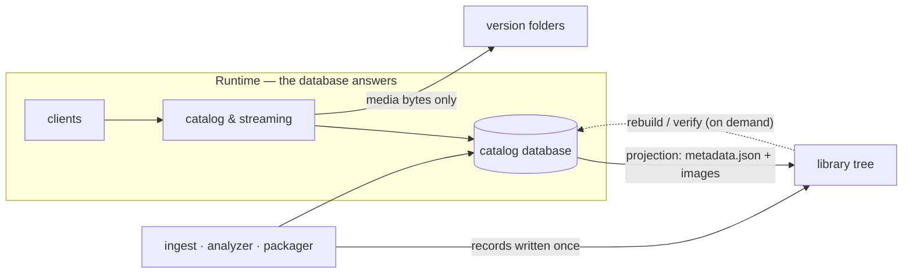

# Database first, storage as the record (v2 design)

> **Status — proposal.** This supersedes the v1 idea that storage is the source
> of truth and databases are caches. Nothing implements it yet; v1 schemas stay
> published until this lands. [Migrating a library](./migrating.md) describes the
> v1 tooling.

## The model

- **The database is the working copy.** Services read and write the catalog
  database at runtime: what exists, what to show, what to play. Nothing reads the
  library tree to answer a request.
- **Storage is the record.** Every item folder holds the facts about itself as
  they were when they were made: the item's identity, each original that entered
  it, each version and package produced from it, and the texts and images the
  database held. It is complete enough to rebuild the database, and nothing else.
- **Files are written by one writer, in one direction.** Either a file is a
  record of something that cannot change (a source, a version, a package), and it
  is written once and never touched again, or it is a projection of the database
  (the metadata document), and it is replaced whole by the service that owns the
  item. There is no merging, so there is no conflict to resolve.
- **No crawler.** Nothing walks the tree on a schedule. The tree is read on two
  occasions only: a deliberate rebuild, and a deliberate verification.

Why this way round: the database answers queries and playback fast and
predictably, while the storage record survives it. A record that describes bytes
lives next to those bytes, so it can never end up describing a different package,
and a restore is a local read with no network and no external service.



## The folder

The categories, the id-based folders and the shard stay as they are: an item is
`movies/<aa>/<itemId>/`, a series is `series/<aa>/<seriesId>/` with
`episodes/<episodeId>/` inside it, and `<aa>` is the first two characters of the
id.

```
movies/<aa>/<itemId>/
  item.json                       identity, written once
  metadata.json                   the database's texts, projected
  metadata/<name>.jpg             images named by content hash, written once
  sources/<sourceId>.json         one original as it was found, written once
  sources/<sourceId>/ffprobe.json raw probe + copied sidecars, written once
  versions/<versionId>/
    version.json                  what this version is, written once
    package.json                  what the package contains, written once
    <original file>               the original, when it lives here
    hls/  subs/  trickplay/       the package
    checksums.sha256              every package file, sha256sum -c format
    .complete                     the package is finished
  events/<timestamp>-<kind>.json  facts that arise later, written once
```

Two changes against v1 carry the model:

- **`manifest.json` is gone.** It was a living document: identity, playback and
  every version in one file that had to be rewritten on every change. Its parts
  are now separate records, each written when the thing it describes is made.
- **Every version is a folder.** There is no longer a version that lives in the
  item folder itself. A re-package is a new version folder, never an edit of one.

## The files

| File | Written by | When | Changes later |
|---|---|---|---|
| `item.json` | ingest | once, when the item is created | never |
| `metadata.json` | the catalog service | after every database change to this item | replaced whole |
| `metadata/<hash>.jpg` | the catalog service | when an image is first stored | never |
| `sources/<id>.json` | analyzer | when an original is taken in | never |
| `versions/<id>/version.json` | analyzer | when a version is established | never |
| `versions/<id>/package.json` | packager | when the package completes | never |
| `events/…json` | whoever acts | when an original is deleted, a package superseded | never |

**`item.json`** — the id, the type (`movie`, `series`, `episode`), the series id
and numbering for an episode, the reference ids (TMDB and friends) it was created
with, the title at creation for human orientation, and who created it when. Small
and stable: everything here is either true forever or the item is a different
item.

**`metadata.json`** — the texts and image list exactly as the database holds
them, plus the moment it was projected. Titles and localized titles, release
date, genres, ratings, credits, collection and season texts, the image and video
lists, which fields a human locked, and where each field came from. A rebuild
restores these as they were at the last projection.

**`sources/<id>.json`** — an original file as it was found: name, size, hashes,
where it came from in the old library, its container, every stream it contained,
what that means in terms of fidelity, and what it holds that a package cannot
(the essence used for the deletion gate). Copied sidecars and the raw probe sit
in the folder beside it, so they survive the original's deletion.

**`versions/<id>/version.json`** — what this version is: edition and
presentation, runtime, chapters and segments, and which sources it was made from.

**`versions/<id>/package.json`** — what the packager produced: its renditions,
subtitles, trickplay and trailers, its size and peak bandwidth, the recipe, what
it lost against the source, the checksums file that covers it, and what would be
lost if the original were deleted.

**`events/…`** — the few facts that appear after the record was written. The
important one is the deletion of an original, which the loss record depends on:
when, by whom, and what was accepted as lost.

## Writing

Whoever creates something writes its record first and the database second. The
record is the durable part; a failed database write is repaired by restoring that
item, and a failed record write is retried. Records are written to a temporary
file in their own folder and renamed into place, so a reader never sees half a
file. A version folder is finished by its `.complete` marker: without it, the
package is incomplete and neither the database nor a rebuild will use it.

Deleting an item deletes its folder, so the tree always shows what exists.
Deleting the original inside a version that is kept writes one event.

## Rebuilding and verifying

**Rebuild** reads a tree and restores the database: every item, its metadata as
last projected, its sources, versions and packages. It needs no network, no TMDB
and no other service, it can run against a copy, and running it twice gives the
same result.

**Verify** compares a tree with the database and reports both directions: records
on storage that the database does not know, and rows that point at files that are
not there. It is the basis for self-healing, and it stays a deliberate job with a
report — never a background scan that feeds the database on its own.

## What belongs where

| | Database | Storage record |
|---|---|---|
| What exists, what to show, what to play | authoritative | restorable copy |
| Per-user state: progress, watchlists, settings | authoritative | not stored |
| Behaviour: default audio, subtitle rules, quality selection | authoritative | not stored |
| What an original contained, what a package lost | copy | authoritative |
| Checksums of package files | copy | authoritative |

Behaviour stays out of the record, as it always has: the record describes data,
not what a player should do with it.

## Getting there

1. Freeze v1: keep the published schemas, stop extending them.
2. Publish v2 schemas for the records above, and a reference example.
3. Teach the analyzer and packager to write records, next to what they write
   today, and the catalog service to project `metadata.json`.
4. Build rebuild and verify, and prove a full round trip: a tree restores a
   database that matches the one it came from.
5. Move playback reads to the database, so no request touches the tree.
6. Stop writing the v1 `manifest.json`, and migrate existing libraries by
   rebuilding the records from the database.
