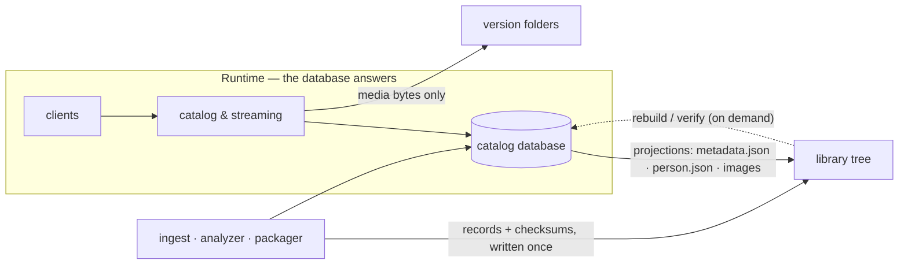
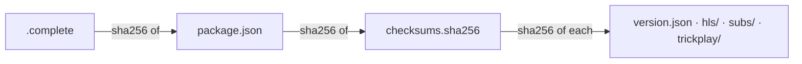
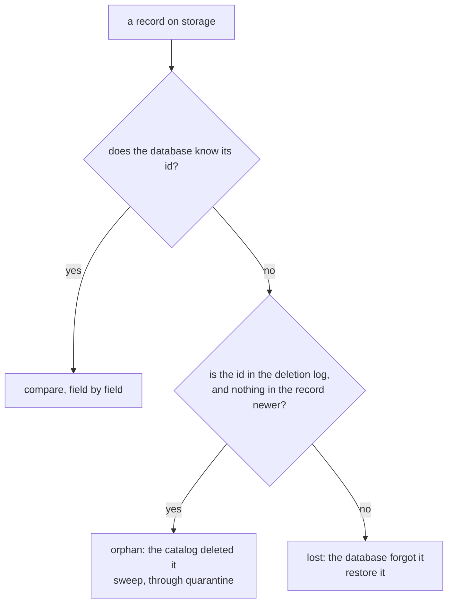

# Database first, storage as the record (v2 design)

> **Status — proposal.** This supersedes the v1 idea that storage is the source
> of truth and databases are caches. Nothing implements it yet; v1 schemas stay
> published until this lands. [Migrating a library](./migrating.md) describes the
> v1 tooling.

## The model

- **The database is the working copy.** Services read and write the catalog
  database at runtime: what exists, what to show, what to play. Nothing reads the
  library tree to answer a request.
- **Storage is the record.** Every item folder holds the facts about itself as
  they were when they were made: the item's identity, each original that entered
  it, each version and package produced from it, and the texts and images the
  database held. People, whom many items share, have folders of their own. The
  record is complete enough to rebuild the database, and nothing else.
- **Files are written by one writer, in one direction.** Either a file is a
  record of something that cannot change (a source, a version, a package), and it
  is written once and never touched again, or it is a projection of the database
  (`metadata.json`, and `person.json` for a person), and it is replaced whole by
  the service that owns it. There is no merging, so there is no conflict to
  resolve.
- **A record proves itself.** Every folder that is written once carries the
  checksums of what it holds, so a tree can be checked against its own hashes,
  with no database and no network.
- **The catalog remembers what it deleted.** A deletion log in the database
  tells a folder the catalog deleted from one it lost, so nothing on storage is
  removed, or restored, on a guess.
- **No crawler.** Nothing walks the tree on a schedule. The tree is read on two
  occasions only: a deliberate rebuild, and a deliberate verification, whose
  report a sweep may act on.

Why this way round: the database answers queries and playback fast and
predictably, while the storage record survives it. A record that describes bytes
lives next to those bytes, so it can never end up describing a different package,
and a restore is a local read with no network and no external service.


```mermaid
flowchart LR
  subgraph runtime["Runtime — the database answers"]
    C["clients"] --> API["catalog & streaming"] --> DB[("catalog database")]
  end
  API -->|"media bytes only"| M["version folders"]
  DB -->|"projections: metadata.json · person.json · images"| REC
  W["ingest · analyzer · packager"] -->|"records + checksums, written once"| REC["library tree"]
  W --> DB
  REC -.->|"rebuild / verify (on demand)"| DB
```

## The folder

The categories, the id-based folders and the shard stay as they are: an item is
`movies/<aa>/<itemId>/`, a series is `series/<aa>/<seriesId>/` with
`episodes/<episodeId>/` inside it, and `<aa>` is the first two characters of the
id. People are a third category, `people/<aa>/<personId>/`, sharded the same way.
A person is shared by every item that credits them, so no item folder can hold
them, and without a folder of their own a lost database would take every
biography and portrait with it.

```
movies/<aa>/<itemId>/
  item.json                       identity, written once
  checksums.sha256                covers item.json, written with it
  metadata.json                   the database's texts, projected
  metadata/<hash>.jpg             images named by content hash, written once
  sources/<sourceId>/
    source.json                   one original as it was found, written once
    ffprobe.json                  the raw probe, written once
    <sidecar files>               copied from beside the original, written once
    checksums.sha256              covers the files above, written with them
  versions/<versionId>/
    version.json                  what this version is, written once
    <original file>               the original, when it lives here
    hls/  subs/  trickplay/       the package
    checksums.sha256              version.json and every package file
    package.json                  what the package contains, and the hash of checksums.sha256
    .complete                     the hash of package.json: the version is finished
  events/<timestamp>-<kind>/
    event.json                    a fact that arose later, written once
    checksums.sha256              covers event.json, written with it

people/<aa>/<personId>/
  person.json                     the database's person, projected
  <hash>.jpg                      images named by content hash, written once
```

These changes against v1 carry the model:

- **`manifest.json` is gone.** It was a living document: identity, playback and
  every version in one file that had to be rewritten on every change. Its parts
  are now separate records, each written when the thing it describes is made.
- **Every version is a folder.** There is no longer a version that lives in the
  item folder itself. A re-package is a new version folder, never an edit of one.
- **Every record carries its checksums.** v1 checked package files only. Now each
  folder that is written once carries a checksums file of its own, so damage
  shows anywhere in the tree, not only in a package.
- **People have folders.** In v1 a person was a credit in an item's metadata: an
  id, a name, a role. Who they are lived only in the database.

## The files

| File | Written by | When | Changes later |
|---|---|---|---|
| `item.json`, `checksums.sha256` | ingest | once, when the item is created | never |
| `metadata.json` | the catalog service | after every database change to this item | replaced whole |
| `metadata/<hash>.jpg` | the catalog service | when an image is first stored | never |
| `sources/<id>/`: `source.json`, probe, sidecars, `checksums.sha256` | analyzer | when an original is taken in | never |
| `versions/<id>/version.json` | analyzer | when a version is established | never |
| `versions/<id>/`: `checksums.sha256`, `package.json`, `.complete` | packager | when the package completes, in that order | never |
| `events/<…>/`: `event.json`, `checksums.sha256` | whoever acts | when an original is deleted, a package superseded | never |
| `people/<aa>/<id>/person.json` | the catalog service | after every database change to this person | replaced whole |
| `people/<aa>/<id>/<hash>.jpg` | the catalog service | when an image is first stored | never |

**`item.json`** — the id, the type (`movie`, `series`, `episode`), the series id
and numbering for an episode, the reference ids (TMDB and friends) it was created
with, the title at creation for human orientation, and who created it when. Small
and stable: everything here is either true forever or the item is a different
item.

**`metadata.json`** — the texts and image list exactly as the database holds
them, plus the moment it was projected. Titles and localized titles, release
date, genres, ratings, credits, collection and season texts, the image and video
lists, which fields a human locked, and where each field came from. Credits name
people by id; who a person is lives in their own folder. A rebuild restores these
as they were at the last projection.

**`sources/<id>/source.json`** — an original file as it was found: name, size,
hashes, where it came from in the old library, its container, every stream it
contained, what that means in terms of fidelity, and what it holds that a package
cannot (the essence used for the deletion gate). The raw probe and the copied
sidecars sit in the same folder, so they survive the original's deletion, and the
folder's checksums cover all of them.

**`versions/<id>/version.json`** — what this version is: edition and
presentation, runtime, chapters and segments, and which sources it was made from.

**`versions/<id>/package.json`** — what the packager produced: its renditions,
subtitles, trickplay and trailers, its size and peak bandwidth, the recipe, what
it lost against the source, the hash of the checksums file that covers it, and
what would be lost if the original were deleted.

**`checksums.sha256`** — in `sha256sum -c` format, the hash of every file it
covers, written in the same step as those files; a version's is written when its
package completes. It covers `version.json` and every package file there; the
original is not listed, because its source record holds its hashes, so deleting
it later leaves the version's checksums true. `.complete` holds the hash of
`package.json`, which holds the hash of the checksums file: one hash proves the
whole version.

**`events/…/event.json`** — the few facts that appear after the record was
written. The important one is the deletion of an original, which the loss record
depends on: when, by whom, and what was accepted as lost. Each event is a folder
of its own, so that its checksums file can be written once, with it.

**`person.json`** — what the database holds about a person, plus the moment it
was projected: names, biography, dates and places, reference ids, and the images
that sit beside it. It is a projection like `metadata.json` and keeps no list of
credits: which items credit a person is what those items' `metadata.json` says.

## Writing

Whoever creates something writes its record first and the database second. The
record is the durable part; a failed database write is repaired by restoring that
item, and a failed record write is retried. Records are written to a temporary
file in their own folder and renamed into place, so a reader never sees half a
file.

A folder that is written once gets its `checksums.sha256` in the same step. A
version is the one folder written in two steps: `version.json` comes first, when
the version is established, and the chain is closed when the package completes —
the packager writes the checksums over `version.json` and every package file,
then `package.json` with the hash of those checksums, then `.complete` with the
hash of `package.json`.


```mermaid
flowchart LR
  DONE[".complete"] -->|"sha256 of"| PKG["package.json"]
  PKG -->|"sha256 of"| SUMS["checksums.sha256"]
  SUMS -->|"sha256 of each"| FILES["version.json · hls/ · subs/ · trickplay/"]
```

A version folder is finished by its `.complete` marker: without it, the package
is incomplete and neither the database nor a rebuild will use it.

Projections carry no checksums, on purpose: `metadata.json` and `person.json`
are replaced whole, so a checksums file beside them would be wrong after the next
projection. Images need none either: each is named by the hash of its bytes, so
the name is the check.

Deleting an item records it in the catalog's deletion log, in the same
transaction as the delete — its id, type and title, when, and by whom — and then
deletes its folder. A folder that outlives its item, because the removal failed
or the storage was away, is then known for what it is. Deleting the original
inside a version that is kept writes one event.

## Rebuilding and verifying

**Rebuild** reads a tree and restores the database: every item, its metadata as
last projected, its sources, versions and packages, and every person as last
projected. It needs no network, no TMDB and no other service, it can run against
a copy, and running it twice gives the same result. It cannot restore the
deletion log: the tree holds what exists, not what was deleted, so a folder that
outlived its delete comes back as an item.

**Verify** compares a tree with the database and reports both directions: records
on storage that the database does not know, and rows that point at files that are
not there. It first checks every record against its own checksums and every
image against its name: a folder whose files do not match is damaged, whatever
the database says. Verify is the basis for self-healing, and it stays a
deliberate job with a report — never a background scan that feeds the database
on its own.

A record the database does not know is one of two things, and the deletion log
tells which:

- **Orphan** — its id is in the log, and nothing in the record is newer than the
  deletion. The catalog deleted the item and the folder outlived it: sweep it.
- **Lost** — its id is not in the log, or the record was written or projected
  after the deletion, because the item was re-created with the same id since.
  The database lost what the record still knows: restore it.

An id that is in the log and in the database again was re-created after its
deletion: the item that exists wins, and the entry in the log describes an
earlier life. The log holds items only, so a person the database does not know is
restored, never swept.


```mermaid
flowchart TD
  R["a record on storage"] --> K{"does the database know its id?"}
  K -->|"yes"| CMP["compare, field by field"]
  K -->|"no"| LOG{"is the id in the deletion log,<br/>and nothing in the record newer?"}
  LOG -->|"yes"| ORPHAN["orphan: the catalog deleted it<br/>sweep, through quarantine"]
  LOG -->|"no"| LOST["lost: the database forgot it<br/>restore it"]
```

**Sweep** removes what a verification proves is garbage, and nothing else: the
folders of orphans, version folders that never finished, and images no
projection lists. Each must be older than a grace period, because a write in
flight looks the same — a record is written before its database row, and an image
before the projection that lists it. A sweep moves what it removes into
quarantine rather than deleting it, so a mistake can be put back until the
quarantine is emptied, and it never touches anything a database row or another
record still references.

## What belongs where

| | Database | Storage record |
|---|---|---|
| What exists, what to show, what to play | authoritative | restorable copy |
| Who a person is: names, biography, portraits | authoritative | restorable copy |
| Per-user state: progress, watchlists, settings | authoritative | not stored |
| Behaviour: default audio, subtitle rules, quality selection | authoritative | not stored |
| What an original contained, what a package lost | copy | authoritative |
| Checksums of package files | copy | authoritative |
| Checksums of the records themselves | not stored | authoritative |
| Which items the catalog deleted | authoritative | not stored |

Behaviour stays out of the record, as it always has: the record describes data,
not what a player should do with it.

## Getting there

1. Freeze v1: keep the published schemas, stop extending them.
2. Publish v2 schemas for the records above, `person.json` among them, and a
   reference example.
3. Teach ingest, the analyzer and the packager to write records and their
   checksums, next to what they write today, and the catalog service to project
   `metadata.json` and `person.json`.
4. Keep the deletion log: every item delete records the item in the same
   transaction. Folders that outlived a delete before the log existed are not in
   it, and are decided once, by hand.
5. Build rebuild, verify and sweep, and prove them: a tree restores a database
   that matches the one it came from, a verification sorts every record the
   database does not know into orphan or lost, and a sweep quarantines provable
   garbage and nothing a row or a record references.
6. Move playback reads to the database, so no request touches the tree.
7. Stop writing the v1 `manifest.json`, and migrate existing libraries by
   rebuilding the records from the database.
