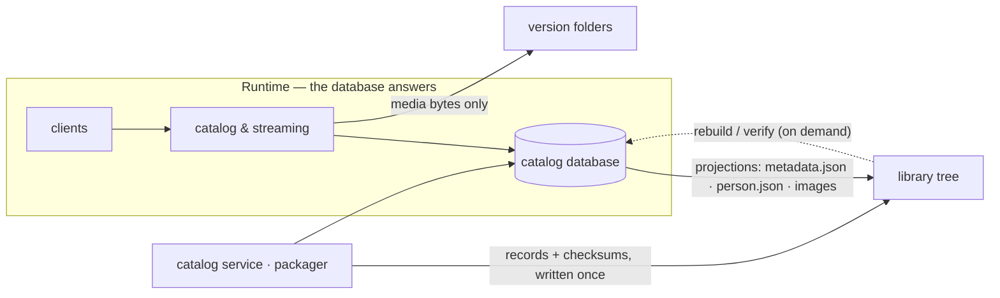
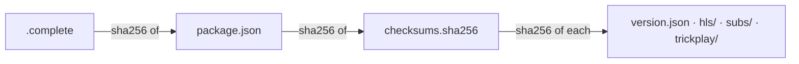
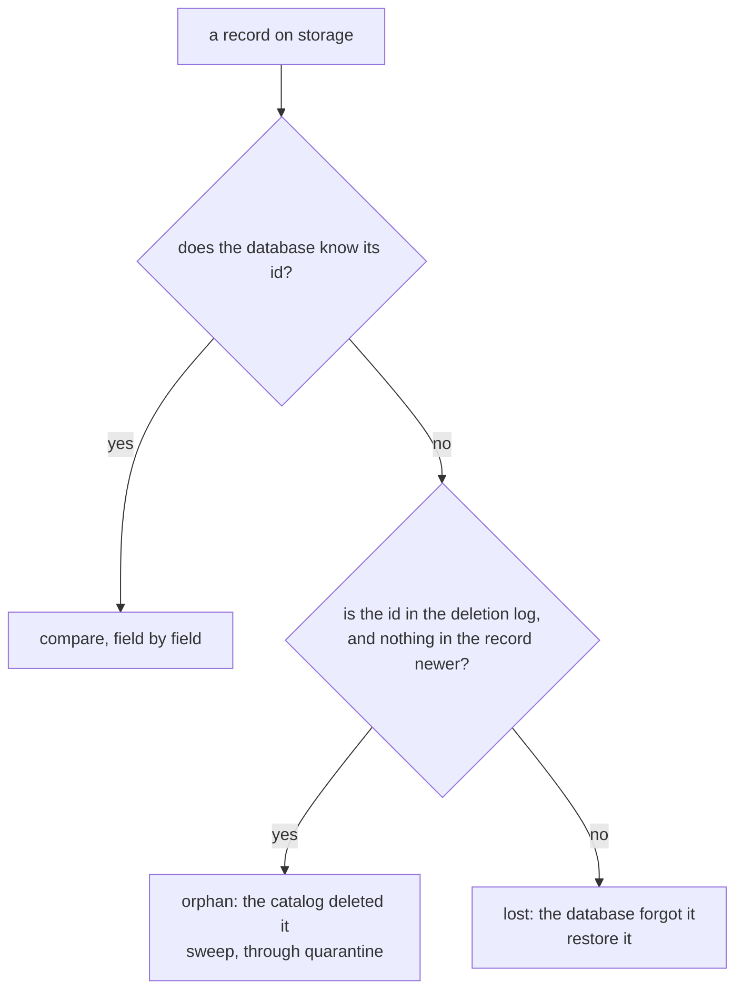

# Database first, storage as the record (v2 design)

> **Status — being built.** This supersedes the v1 idea that storage is the source
> of truth and databases are caches. The platform's services are being changed to
> write and read this layout, and an environment moves to it by a migration, after
> which its catalog's setting `library.layout` is `v2`; until then it keeps the
> layout it has. The v1 schemas stay published. [Migrating a library](./migrating.md)
> describes the migration.

## The model

- **The database is the working copy.** Services read and write the catalog
  database at runtime: what exists, what to show, what to play. Nothing reads the
  library tree to answer a request.
- **Storage is the record.** Every item folder holds the facts about itself as
  they were when they were made: the item's identity, each original that entered
  it, each version and package produced from it, and the texts and images the
  database held. People, whom many items share, have folders of their own. The
  record is complete enough to rebuild the database, and nothing else.
- **Files are written by one writer, in one direction.** Either a file is a
  record of something that cannot change (a source, a version, a package), and it
  is written once and never touched again, or it is a projection of the database
  (`metadata.json`, and `person.json` for a person), and it is replaced whole by
  the service that owns it. There is no merging, so there is no conflict to
  resolve.
- **A record proves itself.** Every folder that is written once carries the
  checksums of what it holds, so a tree can be checked against its own hashes,
  with no database and no network.
- **Originals never enter the library.** An original waits outside the record
  until a version made from it is packaged, verified and recorded, and is
  deleted then. The record keeps what describes it — its source record, the
  probe, copies of the files beside it — and an event that says it was deleted
  and what the package does not carry of it. The package is the record of the
  title from the start.
- **The catalog remembers what it deleted.** A deletion log in the database
  tells a folder the catalog deleted from one it lost, so nothing on storage is
  removed, or restored, on a guess.
- **No crawler.** Nothing walks the tree on a schedule. The tree is read on two
  occasions only: a deliberate rebuild, and a deliberate verification, whose
  report a sweep may act on.

Why this way round: the database answers queries and playback fast and
predictably, while the storage record survives it. A record that describes bytes
lives next to those bytes, so it can never end up describing a different package,
and a restore is a local read with no network and no external service.


```mermaid
flowchart LR
  subgraph runtime["Runtime — the database answers"]
    C["clients"] --> API["catalog & streaming"] --> DB[("catalog database")]
  end
  API -->|"media bytes only"| M["version folders"]
  DB -->|"projections: metadata.json · person.json · images"| REC
  W["catalog service · packager"] -->|"records + checksums, written once"| REC["library tree"]
  W --> DB
  REC -.->|"rebuild / verify (on demand)"| DB
```

## The folder

The categories, the id-based folders and the shard stay as they are: an item is
`movies/<aa>/<itemId>/`, a series is `series/<aa>/<seriesId>/` with
`episodes/<episodeId>/` inside it, and `<aa>` is the first two characters of the
id — an episode's folder is in its series' shard, the series of a season it is
under. People are a third category, `people/<aa>/<personId>/`, sharded the same
way. A person is shared by every item that credits them, so no item folder can
hold them, and without a folder of their own a lost database would take every
biography and portrait with it.

The share's root is the library's: `movies/`, `series/` and `people/`, and one
hidden folder beside them, `.work/`, for everything that is not the record —
the arrivals, the workers' handoffs, the trash. Every tool reads past it.

```
movies/<aa>/<itemId>/
  item.json                       identity, written once
  checksums.sha256                covers item.json, written with it
  metadata.json                   the database's texts, projected
  metadata/<hash>.jpg             images named by content hash, written once
  sources/<sourceId>/
    source.json                   one original as it was found, written once
    ffprobe.json                  the raw probe, written once
    <sidecar files>               copied from beside the original, written once
    checksums.sha256              covers the files above, written with them
  versions/<versionId>/
    version.json                  what this version is, written once
    hls/  subs/  trickplay/       the package
    checksums.sha256              version.json and every package file
    package.json                  what the package contains, and the hash of checksums.sha256
    .complete                     the hash of package.json: the version is finished
  events/<timestamp>-<eventId>-<kind>/
    event.json                    a fact that arose later, written once
    checksums.sha256              covers event.json, written with it
  extras/<extraId>/
    extra.json                    a piece of bonus material, written once
    hls/  subs/  trickplay/       its package
    checksums.sha256              extra.json and every package file
    package.json  .complete       as a version's

people/<aa>/<personId>/
  person.json                     the database's person, projected
  <hash>.jpg                      images named by content hash, written once

.work/                            not the record
  incoming/                       arrivals: originals waiting to be packaged
  extras/                         extras' originals taken in, waiting the same way
  inbox/  staging/                the transcoder's handoff, the packager's folders under construction
  trash/                          deleted originals during a grace period
  quarantine/  migration/         a sweep's quarantine; a migration's staged records and plans
```

The format can also hold an original inside its version or extra folder — a
library built by its tools from a copy may keep one — but the platform never
does: a version it writes keeps none (`originalFiles` is empty) and its package
is canonical, and an extra it writes keeps only its package and says, in
`packagedFrom`, what it was made from.

These changes against v1 carry the model:

- **`manifest.json` is gone.** It was a living document: identity, playback and
  every version in one file that had to be rewritten on every change. Its parts
  are now separate records, each written when the thing it describes is made.
- **Every version is a folder.** There is no longer a version that lives in the
  item folder itself. A re-package is a new version folder, never an edit of one.
- **Every record carries its checksums.** v1 checked package files only. Now each
  folder that is written once carries a checksums file of its own, so damage
  shows anywhere in the tree, not only in a package.
- **People have folders.** In v1 a person was a credit in an item's metadata: an
  id, a name, a role. Who they are lived only in the database.

## The files

| File | Written by | When | Changes later |
|---|---|---|---|
| `item.json`, `checksums.sha256` | the catalog service | once, when the item's identity is settled after enrichment — a series before its first episode | never |
| `metadata.json` | the catalog service's projector | after every database change to this item | replaced whole |
| `metadata/<hash>.jpg` | the catalog service's projector | when an image is first stored | never |
| `sources/<id>/`: `source.json`, probe, sidecar copies, `checksums.sha256` | packager | the first time it packages that original | never |
| `versions/<id>/`: `version.json`, the package, `checksums.sha256`, `package.json`, `.complete` | packager | every package run: built aside, in that order, and renamed into place in one step | never |
| `events/<…>/`: `event.json`, `checksums.sha256` | the catalog service | when a package is superseded, a version removed, an original deleted, an extra retired | never |
| `extras/<id>/`: `extra.json`, the package, its chain | packager | the extra's package run: built aside and renamed into place | never |
| `people/<aa>/<id>/person.json` | the catalog service's projector | after every database change to this person | replaced whole |
| `people/<aa>/<id>/<hash>.jpg` | the catalog service's projector | when an image is first stored | never |

The analyzer and the transcoder write nothing into the library. The catalog
service decides every path in it and hands the workers absolute paths in their
work records, so no worker computes a library path itself. A library that
existed before the platform wrote this layout is recorded once by
`library-v2-from-catalog.py --platform`, and the catalog adopts what it staged
([Migrating a library](./migrating.md)).

**`item.json`** — the id, the type (`movie`, `series`, `episode`), the series id
and numbering for an episode, the reference ids (TMDB and friends) it was created
with, the title at creation for human orientation, and who created it when. Small
and stable: everything here is either true forever or the item is a different
item.

**`metadata.json`** — the texts and image list exactly as the database holds
them, plus the moment it was projected. Titles and localized titles, release
date, genres, ratings, credits, collection and season texts, the image and video
lists, which fields a human locked, and where each field came from. Credits name
people by id; who a person is lives in their own folder. A credit is one person
in one role, and the role is a token from an open vocabulary: actor, creator,
director, writer, producer, composer, cinematographer and editor are the roles
every reader knows, listed in that order, and any other is shown as it is, after
them. Beside the role a credit keeps the job in the source's own words
("Screenplay", or "Story, Teleplay" for two jobs in one role), the character an
actor plays, the billing order within the role and, for a series, how many
episodes credit the person. A rebuild restores these as they were at the last
projection.

**`sources/<id>/source.json`** — an original file as it was found: name, size,
hashes, where it came from in the old library, its container, every stream it
contained, what that means in terms of fidelity, and what it holds that a package
cannot (the essence used for the deletion gate). The raw probe and the copied
sidecars sit in the same folder, so they survive the original's deletion, and the
folder's checksums cover all of them.

**`versions/<id>/version.json`** — what this version is: edition and
presentation, runtime, chapters and segments, and which sources it was made from.

**`versions/<id>/package.json`** — what the packager produced: its renditions,
subtitles, trickplay and trailers, its size and peak bandwidth, the recipe, what
it lost against the source, the hash of the checksums file that covers it, and
what would be lost if the original were deleted.

**`checksums.sha256`** — in `sha256sum -c` format, the hash of every file it
covers, written in the same step as those files; a version's is written when its
package completes. It covers `version.json` and every package file there; the
original is not listed, because its source record holds its hashes, so deleting
it later leaves the version's checksums true. `.complete` holds the hash of
`package.json`, which holds the hash of the checksums file: one hash proves the
whole version.

**`events/…/event.json`** — the few facts that appear after the record was
written. The important one is the deletion of an original, which the loss record
depends on: when, by whom, and what was accepted as lost. Each event is a folder
of its own, so that its checksums file can be written once, with it.

**`extras/<id>/extra.json`** — bonus material: a featurette, a making-of, a
deleted scene, a trailer that is a file of its own. It is never an item and never
an episode's: it sits in the folder of the movie or series it belongs to, and a
series' extra may name its season. The record says what it is — kind, title,
language, runtime — the size and fixity of its original, what the probe found in
it, and the link it was downloaded from when it was; the folder holds that
original, a package made from it, or both — and, as the platform writes one, the
package alone, the record saying what it was made from. It is written once and
whole, so its checksums cover a kept original too and are written last: an extra
kept only as its original is finished when they are there, a packaged one when
its `.complete` is. Packaging one later is a new extra folder, and an event
retires the old one. How
the extras are listed — the order, which are hidden, a label instead of the
title — is a decision the database holds, projected into `metadata.json`. A video
that is only published online stays a reference in `metadata.json`.

**`person.json`** — what the database holds about a person, plus the moment it
was projected: names, biography, dates and places, reference ids, and the images
that sit beside it. It is a projection like `metadata.json` and keeps no list of
credits: which items credit a person is what those items' `metadata.json` says.

## Writing

Whoever creates something writes its record first and the database second — but
an item: it gets its database row when an arrival is found, as a candidate, and
its `item.json` once its identity is settled. The record is the durable part; a
failed database write is repaired by restoring that item, and a failed record
write is retried. Records are written to a temporary file in their own folder and
renamed into place, so a reader never sees half a file.

A folder that is written once gets its `checksums.sha256` in the same step. The
packager builds a version whole in `.work/staging/` — the package, then
`version.json`, then the checksums over `version.json` and every package file,
then `package.json` with the hash of those checksums, then `.complete` with the
hash of `package.json` — checks the chain, and renames the folder into place in
one step, beside a source folder it builds the same way the first time it
packages an original. A re-package is a new version folder; the version it
replaces is marked superseded by an event at once and removed, with another
event, a day later.


```mermaid
flowchart LR
  DONE[".complete"] -->|"sha256 of"| PKG["package.json"]
  PKG -->|"sha256 of"| SUMS["checksums.sha256"]
  SUMS -->|"sha256 of each"| FILES["version.json · hls/ · subs/ · trickplay/"]
```

A version folder is finished by its `.complete` marker: without it, the package
is incomplete and neither the database nor a rebuild will use it.

Projections carry no checksums, on purpose: `metadata.json` and `person.json`
are replaced whole, so a checksums file beside them would be wrong after the next
projection. Images need none either: each is named by the hash of its bytes, so
the name is the check.

Deleting an item records it in the catalog's deletion log, in the same
transaction as the delete — its id, type and title, when, and by whom — and then
deletes its folder. A person no title credits any more is deleted and logged the
same way, with the type `person`. A folder that outlives its item or its person,
because the removal failed or the storage was away, is then known for what it
is. Deleting an original — which the platform does once its version is packaged,
verified against its own checksums by a reader independent of the packager, and
recorded — writes one event first, naming the source and what the package does
not carry of it, and moves the file to the trash for a grace period.

## Rebuilding and verifying

**Rebuild** reads a tree and restores the database: every item, its metadata as
last projected, its sources, versions and packages, and every person as last
projected. An item's extras come back with it — all but those an event retired —
and a trailer link gets back the local copy an extra downloaded from it keeps. It
needs no network, no TMDB and no other service, it can run against a copy, and
running it twice gives the same result. It cannot restore the deletion log: the
tree holds what exists, not what was deleted, so a folder that outlived its
delete comes back as an item, or a person.

**Verify** compares a tree with the database and reports both directions: records
on storage that the database does not know, and rows that point at files that are
not there. It first checks every record against its own checksums and every
image against its name: a folder whose files do not match is damaged, whatever
the database says. Verify is the basis for self-healing, and it stays a
deliberate job with a report — never a background scan that feeds the database
on its own.

A record the database does not know is one of two things, and the deletion log
tells which:

- **Orphan** — its id is in the log, as an item's or as a person's, and nothing
  in the folder is newer than the deletion. The catalog deleted the item or the
  person and the folder outlived it: sweep it.
- **Lost** — its id is not in the log, or the record was written or projected
  after the deletion, because the item or the person was re-created with the
  same id since. The database lost what the record still knows: restore it.

An id that is in the log and in the database again was re-created after its
deletion: what exists wins, and the entry in the log describes an earlier life.
The log holds people as well as items, each entry saying which it deleted; an
entry that does not say is an item's, as in a log from before people were
logged. While an item record on storage still credits a deleted person, that
record is a stale projection, and the person's folder stays until the item is
projected again. A person the log does not name is restored, never swept.


```mermaid
flowchart TD
  R["a record on storage"] --> K{"does the database know its id?"}
  K -->|"yes"| CMP["compare, field by field"]
  K -->|"no"| LOG{"is the id in the deletion log,<br/>and nothing in the record newer?"}
  LOG -->|"yes"| ORPHAN["orphan: the catalog deleted it<br/>sweep, through quarantine"]
  LOG -->|"no"| LOST["lost: the database forgot it<br/>restore it"]
```

A record the database does know can still be out of date. Projections change —
a biography gains a role, a portrait is replaced, a title's texts are corrected —
so `metadata.json` and `person.json` say which database state they reflect
(`databaseUpdatedAt`) and how fresh their reference data is (`sources`, for TMDB
when it was fetched and when TMDB last reported a change). Verify compares that
with the database row: a database newer than the projection is a **stale
projection**, fixed by projecting again and never by editing the file; a
projection newer than the database means the database was restored from an older
state. The database learns about changes from TMDB's daily change lists for
people, movies and series, so it refreshes what changed without re-reading
everything.

**Sweep** removes what a verification proves is garbage, and nothing else: the
folders of orphans — an item's, and a person's once no item record credits them
— version folders that never finished, and images no projection lists. In an
extra only two things ever are: a package that never finished, and the whole
folder of an extra an event retired. Each must be older
than a grace period, because a write in flight looks the same — a record is
written before its database row, and an image before the projection that lists
it. A sweep first moves what it removes into a quarantine folder, checks again
that nothing references it, and only then deletes it — anything that became
referenced in the meantime goes back. It never touches anything a database row
or another record still references.

## What belongs where

| | Database | Storage record |
|---|---|---|
| What exists, what to show, what to play | authoritative | restorable copy |
| Who a person is: names, biography, portraits | authoritative | restorable copy |
| Per-user state: progress, watchlists, settings | authoritative | not stored |
| Behaviour: default audio, subtitle rules, quality selection | authoritative | not stored |
| What an original contained, what a package lost | copy | authoritative |
| Checksums of package files | copy | authoritative |
| Checksums of the records themselves | not stored | authoritative |
| Which items and people the catalog deleted | authoritative | not stored |

Behaviour stays out of the record, as it always has: the record describes data,
not what a player should do with it.

## Getting there

1. Freeze v1: keep the published schemas, stop extending them. Done.
2. Publish v2 schemas for the records above, `person.json` among them, and a
   reference example. Done.
3. Keep the deletion log: every item delete records the item in the same
   transaction, and so does the delete of a person no title credits any more,
   as a person. Folders that outlived a delete before the log existed are not in
   it, and are decided once, by hand.
4. Build rebuild, verify and sweep, and prove them: a tree restores a database
   that matches the one it came from, a verification sorts every record the
   database does not know into orphan or lost, and a sweep quarantines provable
   garbage and nothing a row or a record references. Done, as tools.
5. Teach the catalog service and the packager to write the records — the
   catalog service decides every path, writes `item.json` and the events and
   projects `metadata.json` and `person.json`; the packager writes the sources,
   versions and extras — and the streaming service to find every package through
   the catalog, so no request walks the tree. Behind the setting
   `library.layout`, so the code ships before an environment moves.
6. Migrate an environment: stage its records from the store it has, let the
   catalog adopt them, verify, switch its layout to `v2`, and let it delete the
   originals ([Migrating a library](./migrating.md)).
