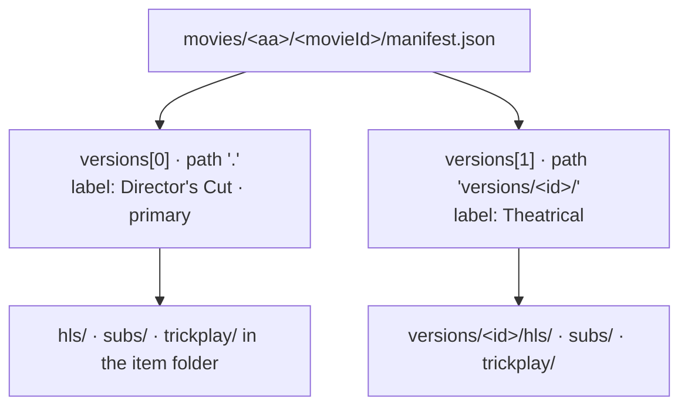
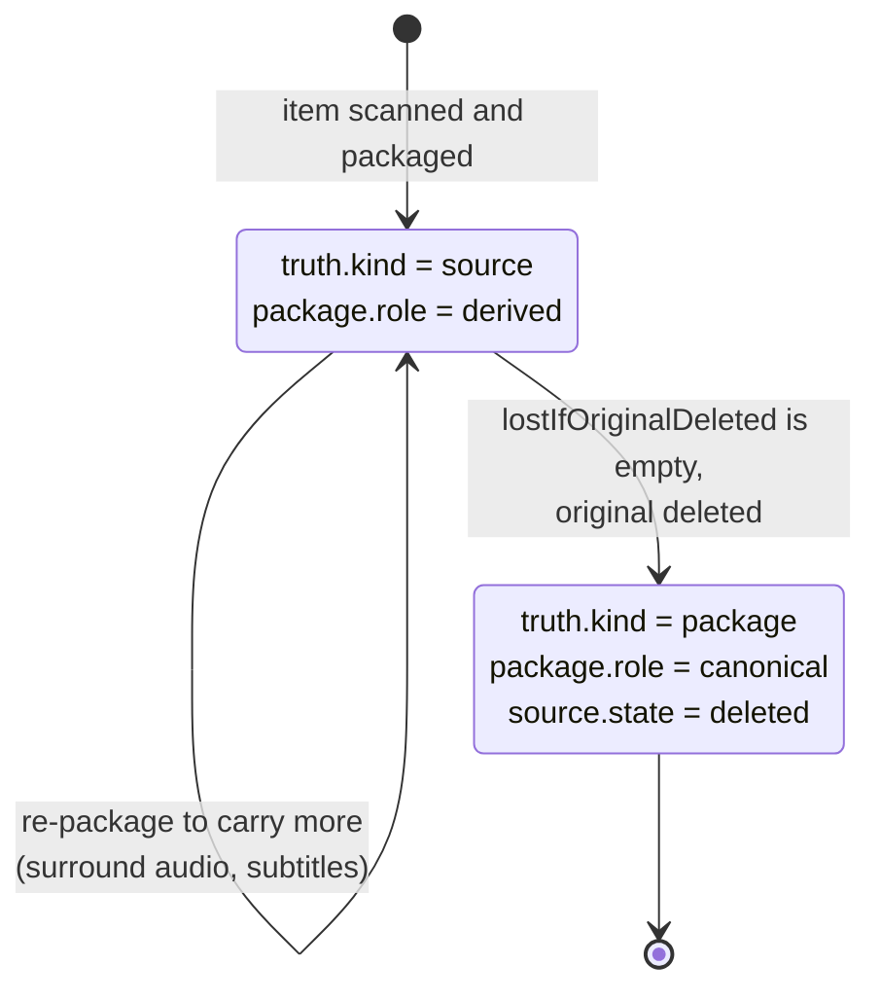

# Versions, audio, subtitles and quality

A reference database gives a film one id, whether you have its theatrical cut,
its director's cut, or a black-and-white presentation. The library format keeps
what makes each copy different, measured from the file itself, so a viewer can
choose and nothing is silently lost.

> **Status — format ahead of the code.** The rules below are what the format
> records and how the [reference migrator](./migrating.md) decides them. No
> platform service makes these decisions or enforces the deletion check yet.

## Audio: stereo, 5.1 and beyond

The manifest records audio twice — as the original had it, and as the package
has it — and links the two:

| Question | Where the answer is |
|---|---|
| What did the original carry? | `versions[].sources[].streams[]` with `type: audio`: `codec`, `profile` (tells DTS-HD MA from its core, or Dolby Digital Plus with Atmos), `channels`, `channelLayout` (`stereo`, `5.1`, `7.1`), `lossless`, `objectAudio` (`atmos`, `dts-x`), language, commentary and audio-description flags. |
| What does a viewer hear? | Top-level `renditions.audio[]`: `channels`, `codec`, `language`, `default`. |
| Which original track was it made from? | `sourceStreamIndex` and `sourceChannels` on each audio rendition. |
| Was anything lost? | `package.fidelity.losses[]`: `audio-downmix` (`6ch -> 2ch`), `audio-codec` (`truehd -> mp4a.40.2`), `audio-dropped`. |

`channels` is always recorded. `channelLayout` is only as good as the probe:
when a probe did not report a layout it is `null`, and six channels cannot be
told apart as 5.1 or 6.0 until the original is probed again.

A track title that names a format the stream no longer has — "TrueHD 7.1" on a
stereo AAC track — is kept as `titleClaim` with `contradictsActual: true`. It is
evidence that the file was re-encoded, and often the only record of what the
original was.

## Subtitles and audio for different viewers

Every subtitle and audio track the migrator writes — in the original's
`streams[]` and in the package's renditions — records what it is for in
`purpose`, and the schema requires it on every rendition:

| Subtitle `purpose` | Contains | Typical title |
|---|---|---|
| `dialogue` | All spoken dialogue; a full track normally includes the forced lines too. | "English" |
| `sdh` | Dialogue plus sound cues ("[door slams]") and speaker names, for deaf and hard-of-hearing viewers. Subtitle tracks marked as closed captions count here; captions embedded in the video are recorded separately as `closedCaptions`. | "English SDH", "CC" |
| `forced` | Only what a viewer of the audio's language would not otherwise understand: an invented or foreign language spoken in a few scenes, signs, letters. | "English Forced" |
| `signs-songs` | On-screen text and song lyrics only — the usual companion of a dubbed audio track. | "Signs & Songs" |
| `commentary` | The text of a commentary. | "Cast Commentary" |
| `lyrics` | Song lyrics only. | |
| `unknown` | A package track that could not be traced to the original's stream. | |

| Audio `purpose` | Contains |
|---|---|
| `main` | The film's soundtrack, in one language. |
| `commentary` | A commentary over the film. |
| `description` | Audio description for blind and partially sighted viewers. |
| `unknown` | A package track that could not be traced to the original's stream. |

`purposeFrom` says what the purpose rests on:

| `purposeFrom` | Meaning |
|---|---|
| `disposition` | The file's own stream flag (forced, hearing impaired, commentary, visual impaired, captions, lyrics, descriptions). |
| `title` | The track title, e.g. "Forced", "SDH", "Signs & Songs", "Commentary" — not "Non-Forced". |
| `content` | The track itself: an untitled, unflagged subtitle with less than a tenth of the events of the full track in its language is a forced track. |
| `human` | A person decided. |
| `assumed` | Nothing marks the track, so it is taken as `dialogue` or `main` — never as anything else. |
| `null` | Only with purpose `unknown`. |

The stream `dispositions` record exactly what the file says; anything inferred
lives in `purpose`. A region or script word anywhere in a title — "Latin
American", "Castilian", "Brazilian", "Canadian", "Simplified", "Traditional" — is
kept in `variant`, on subtitles and on audio, so two Spanish tracks can be told
apart.

### Forced subtitles without full subtitles

A film where characters speak an invented language in a few scenes typically
ships an English audio track, an English forced track that translates only those
scenes, and full English and SDH tracks. The library records what each track
contains, and nothing about when to show it:

```json
"renditions": { "audio": [
  { "id": "a0", "language": "eng", "purpose": "main", "…": "…" },
  { "id": "a1", "language": "eng", "purpose": "commentary", "…": "…" }
] },
"subtitles": [
  { "id": "sub0", "language": "eng", "title": "Forced", "purpose": "forced",   "…": "…" },
  { "id": "sub1", "language": "eng", "title": "",       "purpose": "dialogue", "…": "…" },
  { "id": "sub2", "language": "eng", "title": "SDH",    "purpose": "sdh",      "…": "…" }
]
```

The [example episode](https://github.com/zaentrum/schemas/tree/main/library/v1/examples/shows)
is exactly this.

**Showing them is behaviour, and behaviour is not library data.** Which track a
viewer sees is decided by the player and by the viewer's settings, kept in a
database. A player derives it from `purpose` and language:

1. While subtitles are off, show the forced track of the playing audio's language:
   the invented-language scenes are translated and nothing else is.
2. When the viewer picks a full or SDH track, show that instead.
3. When the audio changes language, switch to that language's forced track.
4. To find "the forced track of a language": take `forced` and `signs-songs`
   tracks of the same primary language (Bokmål and Nynorsk count as Norwegian;
   a matching `variant` wins); prefer `forced` over `signs-songs`, then the track
   with the most events (a forced track that stops early is incomplete), then one
   flagged by the file over one recognised by title or content, then text over
   image — or the first the device can render. Audio of undetermined language
   gets none.

No player implements this yet. In HLS terms it is `FORCED=YES` with
`AUTOSELECT=YES` on the chosen track of each language, derived from `purpose`;
other forced tracks of that language are left out of the automatic choice.
(Today the streaming origin serves subtitles as sidecar files and writes no
subtitle playlist entries.)

**The version 2 `default`, `forced` and `visible` fields are hints, not data.**
The packager writes them into the playback fields so that today's readers keep
working; they are not the library's account of anything. The packager flags a
track `forced` only when the original's stream flag says so, so a forced or
signs-and-songs track recognised by its title or content keeps `forced: false`
and is listed in the migrator's report as `package-forced-flag-missing` — a
version 2 reader will not show it automatically, while a reader of `purpose`
will. The validator only makes sure the hints do not contradict the
descriptions: a `forced` flag only on a forced or signs-and-songs track, and never
a forced track flagged default, which would make a version 2 reader open with a
nearly empty track. It also allows `assumed` only for `dialogue` and `main`.

### Building the track menu

The format does not prescribe a user interface, but these rules turn the
renditions into a menu with no duplicate or misleading entries. No player
implements them yet.

1. **Version.** Offer a choice only when `versions[]` has more than one entry:
   each version's `label`, the primary version first.
2. **Audio.** Leave out renditions with `visible: false`, then group the rest by
   language, `variant` and `purpose` (a commentary also by its title).
   - Within a group, renditions with the same `channels` and codec whose titles only
     name the format they once had — "TrueHD 7.1 Atmos" on a two-channel AAC
     rendition — are one choice: offer the one flagged default, or the first. The
     migrator lists them as `interchangeable-audio-renditions`, and titles that
     claim more than the rendition carries as `rendition-title-overclaims`.
   - Renditions that look identical but have no such titles stay separate: they may
     differ in content, such as an untitled commentary. The migrator lists them as
     `indistinguishable-audio-renditions` for a person to name.
   - Label an entry from the language, `variant` and `purpose`, and from `channels`
     (Stereo, 5.1, 7.1) when a language offers more than one channel count — never
     from the former title, except a commentary's title, which says who is speaking.
3. **Subtitles.** Start with *Off* (the forced track of the audio's language still shows), then
   group by language, `variant` and `purpose` (a commentary also by its title).
   - Within a group, offer one file the device can render: text (`webvtt`) on a
     client that renders text, otherwise an image track (`pgs`, `vobsub`, `dvb`). A TV
     with a bitmap renderer may prefer the image track, often the disc's own.
   - Offer `forced` and `signs-songs` tracks as *forced only* entries of their
     language: choosing one shows that track and nothing else.
   - Label: "English", "English SDH", "English — forced only", "Spanish (Latin
     American)", "English — commentary: …".
4. **Defaults.** Defaults are behaviour, so they come from rules and settings, not
   from the library. Audio: the viewer's preferred language, otherwise the `main`
   track of the original language, otherwise the rendition the version 2 `default`
   hint names. Subtitles: *Off*, with the forced track of the audio's language
   shown (see above).
5. **Viewer preferences.** A preferred audio language, a subtitle mode (off, forced
   only, full, SDH) and a preferred subtitle language are per-user settings kept in a
   database and applied over the defaults. "Forced only" is *Off* plus the forced
   track of the audio's language.

For a film whose package holds five English audio renditions once titled
"TrueHD 7.1 Atmos", "DTS-HD MA 7.1", "DD 5.1" and twice "DD 2.0" (all now stereo
AAC), two titled commentaries, and English subtitles as both WebVTT and PGS files,
the menu becomes:

| Menu | Entries |
|---|---|
| Audio | English · English — commentary: *first title* · English — commentary: *second title* |
| Subtitles | Off · English · English SDH · English — forced only |

## Quality

- **A quality ladder** is several entries in `renditions.video[]` of one package,
  each with its own resolution and `bitrateBps`. The player switches between them.
  The [example movie](https://github.com/zaentrum/schemas/tree/main/library/v1/examples/movies)
  has two rungs.
- **HDR and SDR** of the same cut are either rungs of one ladder
  (`dynamicRange` per rendition) or separate versions when they come from
  different masters.
- **The package as a whole** records `sizeBytes` and `peakBandwidthBps`, the highest bandwidth its master playlist announces.
- **The original's quality** is in its video stream: resolution, bit depth, HDR10
  mastering metadata, Dolby Vision profile. `master.fidelity` says whether that
  original was untouched or already a re-encode.

## Several versions of one item



At most one version lives in the item folder (`path: "."`), and its playback
fields are the manifest's top-level fields. Every further version lives in
`versions/<id>/`, and its playback fields are in its `package.playback` block.
Which version plays by default is `primary`, not location, so changing the
default never moves a file.

What tells versions apart:

| Difference | Recorded as | How the reference migrator decides it |
|---|---|---|
| **Cut** — theatrical, director's cut, extended, unrated | `edition.kind` | Edition words in the folder name, filename, container title or stream title; commentary tracks that identify a disc release; and the measured runtime against the reference runtime. A cut that runs well beyond the reference with no naming evidence stays `unknown`, with `edition.review` asking a person to confirm. |
| **Black-and-white or colour** | `presentation.colour` | Measured from the picture: peak chroma (`signalstats` SATMAX) at sampled frames — the export samples 20, 50 and 80 % of the runtime. A peak of at most 3 is black-and-white, at least 10 is colour; the samples are kept as evidence. A few samples cannot see colour sequences, so every black-and-white result carries `colourDecision.review`, and `partial-colour` is set by a person. |
| **Dynamic range** | `presentation.dynamicRange` | The original's transfer characteristics, HDR10 mastering metadata and Dolby Vision configuration. |
| **3D** | `presentation.stereo3d` | The original's stereo mode. |

`label` is what the viewer picks from, built from these: `Director's Cut`,
`Black & White`, `Dolby Vision`, or a combination.

### Mixed masters in a series

A series can mix sources — some episodes a Dolby Vision master, others an SDR
one; or specials encoded differently from the regular seasons. The series
manifest groups all episodes by their original's fingerprint in
`series.masters[]`. More than one entry means the series mixes masters; compare
each master's episodes with `series.seasons[]` to see which seasons are
affected, and each episode's `presentation` says which it is.

## Deleting an original

Originals are large; packages are what is played. The format lets a library
delete an original **only when it knows exactly what that costs**.



- Every version carries `lostIfOriginalDeleted`: each property of the original's
  `essence` that the package's `essence` lacks — surround channels, lossless or
  object audio, HDR10 metadata, Dolby Vision, a subtitle language, an SDH or
  forced subtitle language, commentary subtitles, audio description, closed
  captions, image or styled subtitles, fonts, commentary tracks, resolution, bit
  depth. Chapter marks and intro/credits ranges are not lost: they are kept on the
  version, not in the file.
  A property the package does not record counts as lost: a version 2 package
  records HDR only as a flag, so HDR10 mastering metadata is listed as lost until
  a package records it.
- **Delete only when that list is empty.** Otherwise re-package first, so the
  package carries what matters, and check again.
- After deletion the source record stays in the manifest with `state: deleted`,
  `deletedAt` and `deletionReason`; `truth.kind` becomes `package` and the
  package's `role` becomes `canonical`, and the validator requires all three to
  agree. The verbatim probe stays in `source/<sourceId>/ffprobe.json`. The library
  still knows what the original was; from then on, every loss the package
  records is permanent.
- Before deleting, compute the package's `checksums` on storage: from then on they
  are the only way to prove that a copy of the package — a backup, a move to
  object storage — is complete and unchanged.
