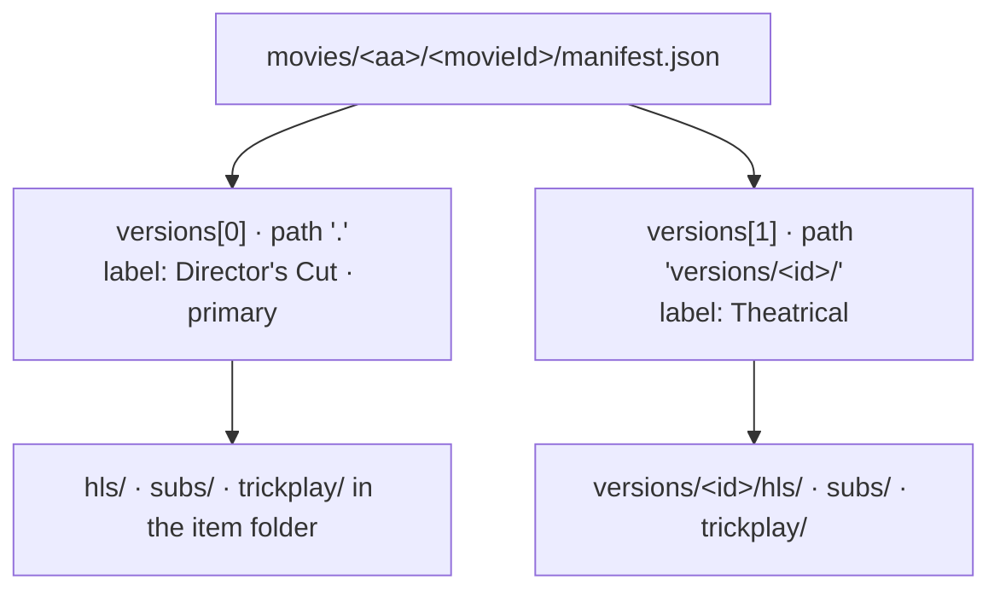
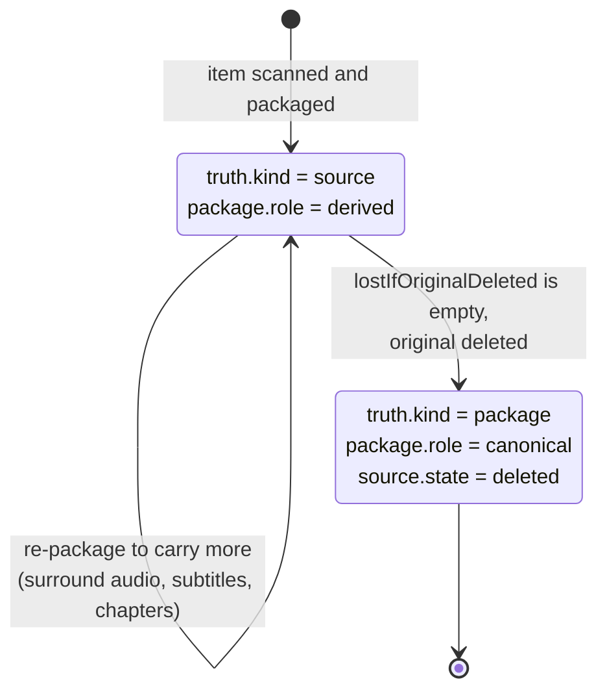

# Versions, audio and quality

A reference database gives a film one id, whether you have its theatrical cut,
its director's cut, or a black-and-white presentation. The library format keeps
what makes each copy different, measured from the file itself, so a viewer can
choose and nothing is silently lost.

## Audio: stereo, 5.1 and beyond

The manifest records audio twice — as the original had it, and as the package
has it — and links the two:

| Question | Where the answer is |
|---|---|
| What did the original carry? | `versions[].sources[].streams[]` with `type: audio`: `codec`, `profile` (tells DTS-HD MA from its core, or Dolby Digital Plus with Atmos), `channels`, `channelLayout` (`stereo`, `5.1`, `7.1`), `lossless`, `objectAudio` (`atmos`, `dts-x`), language, commentary and audio-description flags. |
| What does a viewer hear? | Top-level `renditions.audio[]`: `channels`, `codec`, `language`, `default`. |
| Which original track was it made from? | `sourceStreamIndex` and `sourceChannels` on each audio rendition. |
| Was anything lost? | `package.fidelity.losses[]`: `audio-downmix` (`6ch -> 2ch`), `audio-codec` (`truehd -> mp4a.40.2`), `audio-dropped`. |

A track title that names a format the stream no longer has — "TrueHD 7.1" on a
stereo AAC track — is kept as `titleClaim` with `contradictsActual: true`. It is
evidence that the file was re-encoded, and often the only record of what the
original was.

## Quality

- **A quality ladder** is several entries in `renditions.video[]` of one package,
  each with its own resolution and bitrate. The player switches between them.
- **HDR and SDR** of the same cut are either rungs of one ladder
  (`dynamicRange` per rendition) or separate versions when they come from
  different masters.
- **The original's quality** is in its video stream: resolution, bit depth, HDR10
  mastering metadata, Dolby Vision profile. `master.fidelity` says whether that
  original was untouched or already a re-encode.

## Several versions of one item

The first version packaged lives in the item folder (`path: "."`), and its
playback fields are the manifest's top-level fields. Every further version lives
in `versions/<id>/`, and its playback fields are in its `package.playback` block.
Which version plays by default is `primary`, not location, so changing the
default never moves a file.

What tells versions apart:

| Difference | Recorded as | How it is decided |
|---|---|---|
| **Cut** — theatrical, director's cut, extended, unrated | `edition.kind` | Edition words in the folder name, filename, container title or stream title; commentary tracks that identify a disc release; and the measured runtime against the reference runtime. A cut that runs well beyond the reference with no naming evidence is left `unknown`, with `edition.review` asking a person to confirm. |
| **Black-and-white or colour** | `presentation.colour` | Measured from the picture: peak chroma (`signalstats` SATMAX) sampled across the runtime. A peak of at most 3 is black-and-white, at least 10 is colour. The samples are kept as evidence. A few samples cannot see brief colour accents, so `partial-colour` needs dense sampling or a person. |
| **Dynamic range** | `presentation.dynamicRange` | The original's transfer characteristics, HDR10 mastering metadata and Dolby Vision configuration. |
| **3D** | `presentation.stereo3d` | The original's stereo mode. |

`label` is what the viewer picks from, built from these: `Director's Cut`,
`Black & White`, `Dolby Vision`, or a combination.

### Mixed masters in a season

A season can mix sources — some episodes a Dolby Vision master, others an SDR
one; or a black-and-white presentation for most episodes and colour for a few.
The series manifest groups episodes by their original's fingerprint in
`series.masters[]`; more than one entry means the season is mixed, and each
episode's `presentation` says which it is.

## Deleting an original

Originals are large; packages are what is played. The format lets a library
delete an original **only when it knows exactly what that costs**.

- Every version carries `lostIfOriginalDeleted`: each property of the original's
  `essence` that the package's `essence` lacks — surround channels, lossless or
  object audio, HDR10 metadata, Dolby Vision, a subtitle language, image or
  styled subtitles, fonts, chapters, commentary tracks, resolution, bit depth.
- **Delete only when that list is empty.** Otherwise re-package first, so the
  package carries what matters, and check again.
- After deletion the source record stays in the manifest with `state: deleted`,
  `deletedAt` and `deletionReason`, and the verbatim probe stays in
  `source/<sourceId>/ffprobe.json`. The library still knows what the original
  was; from then on, every loss the package records is permanent.
